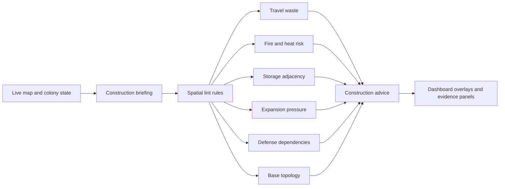

# Base Layout / Construction Tips

Sources:

- [Reddit: "What's your number one tip for base building?"](https://www.reddit.com/r/RimWorld/comments/16xtj79/whats_your_number_one_tip_for_base_building/)
- [Steam Community: "Rimworld Flat Base"](https://steamcommunity.com/sharedfiles/filedetails/?id=2211480986)

This note captures RimWorld community base-building heuristics from the linked
thread and translates them into RimBob-facing ideas for the future Construction
minister. Treat it as research input, not as a finalized implementation
contract.

The main product takeaway is that base layout advice should not be a generic
"build better rooms" memo. It should become a spatial lint system: short,
evidence-backed warnings about travel waste, fire risk, storage adjacency,
expansion pressure, and defensive infrastructure.

## Summary Of Useful Community Heuristics

### 1. Minimize pawn travel before optimizing aesthetics

Players repeatedly framed movement time as the hidden cost in base design.
Important routes should be short, direct, and easy to reason about:

- fields -> freezer
- freezer -> kitchen
- kitchen -> dining room
- storage -> workbench
- material stockpile -> construction site
- bedrooms -> common work areas
- hospital -> main defensive entrance
- prison -> secure access route

The thread's strongest layout idea is not "compact base at all costs." It is
"keep related work loops close while leaving enough space to expand." A compact
work loop can still live inside a spread-out town if the specific high-frequency
edges are short.

RimBob transfer:

- Add layout signals for high-frequency route chains, not one global compactness
  score.
- Score the common routes separately so advice can say which loop is wasting
  time.
- Prefer "move/build the next freezer, shelf, or workroom closer to X" over
  trying to compute a perfect base blueprint.
- Dashboard should show the named route being judged, its rough distance, and
  the concrete consequence.

Candidate signals:

- `field_to_freezer_distance`
- `freezer_to_kitchen_distance`
- `kitchen_to_dining_distance`
- `storage_to_workbench_distance`
- `bedroom_to_primary_work_area_distance`
- `hospital_to_defense_entry_distance`
- `prison_to_secure_entry_distance`

Candidate concerns:

- `base_layout`
- `storage_placement`
- `functional_rooms`

### 2. Put storage where work actually happens

Several comments converged on storage placement: make more storage rooms, keep
storage near production, and avoid making crafters walk across the base for
inputs or outputs. A common pattern is a central or adjacent storage area with
workshops surrounding it.

For RimBob, this is better treated as a material-flow issue than a pure zoning
issue. Construction owns material/component stockpile placement because it
understands build flow and room layout. Industry or Food may own why a material
or bill matters, but Construction can detect whether physical placement is
wasting work time.

RimBob transfer:

- Detect benches without nearby input shelves or stockpiles.
- Detect workshops far from their dominant ingredient storage.
- Detect material/component stockpiles far from active build queues.
- Detect freezer/food stockpile separation from kitchen and butcher work.
- Keep the first advice Suggest-only. Do not write zones automatically.

Candidate signals:

- `bench_has_adjacent_input_storage`
- `bench_to_primary_input_distance`
- `construction_materials_near_build_queue`
- `food_storage_to_kitchen_distance`
- `stone_chunks_to_stonecutter_distance`
- `finished_goods_output_distance`

Candidate advice:

- Place shelves or stockpiles near active workbenches.
- Put stone chunks near stonecutting, but avoid blocking doors and walkways.
- Keep raw food and meals in freezer-adjacent storage.
- Put material stockpiles close enough to repeated construction work.

### 3. Use workbench bills and output handling to reduce hauling waste

The thread raised a subtle operational point: a crafter walking finished goods
to stockpile can waste more expert labor than letting any hauler move the item
later. In RimWorld terms, many production bills can be set to drop products on
the floor.

RimBob should not collapse this into Construction alone. Bill settings belong
closer to the production-owning minister, but Construction can provide the
physical evidence: output stockpile distance, shelf placement, and whether the
bench area is arranged so dropped items are harmless.

RimBob transfer:

- Construction identifies the layout cause.
- Industry/Food owns the bill-operation reason.
- CoS groups them when both are part of the same production bottleneck.
- Dashboard should preserve this split: "layout evidence" vs "bill setting
  action."

Candidate signals:

- `crafter_output_haul_distance`
- `output_stockpile_near_bench`
- `bench_floor_output_safe`
- `dedicated_haulers_available`
- `bill_drop_on_floor_supported`

Candidate advice:

- "Move output storage closer to the bench."
- "Consider drop-on-floor bills when crafter walking time is the bottleneck."
- "Add a shelf beside the bench before changing bill behavior."

### 4. Fire risk is a layout problem, not only a material problem

The thread emphasized nonflammable construction and spacing between structures.
Wood is acceptable as an early bridge, but critical rooms should graduate to
stone or another fire-safe material. Separate buildings also need enough space
that one fire does not heat or ignite the next structure.

RimBob transfer:

- Treat fire risk as both `material risk` and `spacing risk`.
- Flag wooden walls in critical rooms first: freezer, kitchen, hospital, power,
  main storage, and main bedrooms.
- Flag fire spread risk between separate structures when spacing is too tight.
- Recommend stonecutting or material prep only when the colony can plausibly do
  it.

Candidate signals:

- `critical_room_wood_wall_ratio`
- `critical_room_flammable_floor_ratio`
- `nearest_structure_gap_tiles`
- `stone_blocks_available`
- `stonecutting_capacity`
- `firebreaks_present`
- `firefoam_available`

Candidate advice:

- Replace critical wooden walls before luxury upgrades.
- Keep a firebreak between separate structures.
- Maintain stone block production once early survival is stable.
- Prioritize freezer/kitchen/power-room fire safety over cosmetic rooms.

### 5. Thermal systems should be designed as infrastructure

The thread included freezer and heat-management patterns: double-thick freezer
walls, freezer placement near food production, and cooler exhaust rooms that can
vent heat inside during winter or outside during summer.

This is a strong Construction/Food boundary:

- Food owns the spoilage and meal-chain need.
- Construction owns cooler, walls, vents, power, and room placement.

RimBob transfer:

- Food should emit a Construction request when food is at risk from missing
  freezer/cooler infrastructure.
- Construction should detect whether the freezer is fragile, badly placed, or
  power-starved.
- Dashboard should show the thermal dependency chain rather than making Food's
  advice sound like it owns construction.

Candidate signals:

- `freezer_has_cooler`
- `freezer_wall_thickness`
- `freezer_to_field_distance`
- `freezer_to_kitchen_distance`
- `cooler_exhaust_safe`
- `cooler_power_available`
- `summer_heat_risk`
- `winter_heat_reuse_possible`

Candidate advice:

- Build or improve a cooler-backed freezer near the food chain.
- Double-wall freezer storage when materials allow.
- Avoid cooler exhaust that heats critical rooms in summer.
- Consider seasonal venting when the base has enclosed exhaust space.

### 6. Defense and base layout overlap, but Defense should own the combat intent

The thread had a recurring "everything can be defensive" theme. Paths, roads,
doors, walls, hospital placement, and prison placement all influence defense.
It also suggested designing paths as funnels, using 3-wide roads that can pinch
to a 1-wide fight point, and giving defenders good covered positions.

RimBob should not make Construction a killbox planner in the first pass.
Construction should expose build feasibility and layout evidence. Defense owns
whether the base needs a kill corridor, trap line, fallback point, or combat
position.

RimBob transfer:

- Construction can flag missing buildable defensive infrastructure when Defense
  requests it.
- Defense can request Construction for wall, barricade, trap, door, turret, or
  power work.
- CoS should group "weak entrance" and "build wall/door/barricade" as one
  issue, with Defense owning combat need and Construction owning build work.

Candidate signals:

- `main_entry_chokepoint_exists`
- `defensive_cover_positions`
- `unroofed_or_unlit_defense_position`
- `hospital_distance_to_defense_entry`
- `prison_distance_to_secure_control`
- `weak_wall_material_near_entry`
- `trap_or_barricade_requests_from_defense`

Candidate advice:

- Build cover or walls only when Defense has identified the tactical need.
- Keep hospital access close enough for recovery without making it exposed.
- Keep prison access secure and separate from civilian traffic.
- Do not treat "killbox optimization" as first-slice Construction scope.

### 7. Expansion space matters earlier than it feels like it does

Players warned against painting the colony into a corner. Bases need future
space for storage, workshops, bedrooms, hospitals, prison cells, recreation,
power, and food infrastructure. The important nuance is that expansion room
should not destroy high-frequency work loops.

RimBob transfer:

- Detect when the base has no obvious room to expand key subsystems.
- Treat "too cramped" as an early warning before it becomes a rebuild.
- Prefer advice that protects future adjacency: leave room near freezer/kitchen,
  workshops/storage, hospital, and main defense entry.

Candidate signals:

- `free_space_near_food_chain`
- `free_space_near_workshop_core`
- `free_space_near_hospital`
- `bedroom_expansion_capacity`
- `storage_expansion_capacity`
- `future_power_footprint_available`

Candidate advice:

- Preserve space near the food chain before adding low-value rooms.
- Leave expansion room around workshops and storage.
- Add simple temporary rooms before committing to expensive rebuilds.

### 8. Wealth discipline belongs in construction advice

One comment summarized a common RimWorld principle: do not accumulate more
wealth than the colony can defend. In base-building terms, this means do not
overbuild luxury rooms, fancy furniture, or decorative assets before defense,
power, food, and hospital basics are stable.

RimBob transfer:

- Construction should understand build wealth pressure, but Economy and Defense
  should contribute context.
- A base improvement can be "good" locally and still wrong now because it
  increases raid pressure before the colony is ready.
- The dashboard should show when a Construction recommendation is intentionally
  cheap or wealth-disciplined.

Candidate signals:

- `recent_build_wealth_delta`
- `luxury_build_queue_count`
- `defense_readiness_score`
- `critical_infrastructure_unbuilt`
- `room_quality_vs_phase`
- `components_reserved_for_critical_work`

Candidate advice:

- Finish defenses and critical infrastructure before decorative upgrades.
- Prefer low-wealth functional builds during fragile phases.
- Spend components on freezer, power, hospital, or defense before comfort
  luxuries when those systems are missing.

### 9. Early bases should be simple and fast

The thread's early-game advice was pragmatic: do not overdesign day one. Use
temporary shelter, modest food production, and basic work areas first. Save
complex layouts for when the colony has materials, labor, and security.

RimBob transfer:

- Construction should gate advice by colony phase.
- Day-one suggestions should be survival-oriented: beds, roof, table, freezer
  path, power, workbench access.
- Mid-game suggestions can talk about stone replacement, dedicated rooms,
  traffic loops, hospital/prison placement, and expansion.

Candidate signals:

- `colony_phase`
- `colonist_count`
- `days_since_landing`
- `beds_available`
- `shelter_coverage`
- `table_available`
- `refrigeration_available`
- `defense_baseline_available`

Candidate advice:

- Build temporary functional space before optimizing room quality.
- Do not recommend expensive layout rebuilds while basic survival gaps remain.
- Prefer incremental upgrades that preserve future expansion.

### 10. Food chain layout is a first-class Construction dependency

Multiple tips connect food and construction: freezer placement, crop proximity,
butcher/kitchen adjacency, refrigeration timing, and early meal overproduction.
This makes Food the first natural requester for Construction after the Food
minister exists.

RimBob transfer:

- Food can ask for a freezer, cooler, stockpile, campfire/stove, or power
  dependency.
- Construction should answer whether the build side is feasible and where the
  layout bottleneck is.
- Food should not pretend it can solve cooler/wall/power problems directly.

Candidate signals:

- `food_days`
- `raw_food_available`
- `meal_count`
- `refrigeration_status`
- `crop_field_to_freezer_distance`
- `freezer_to_butcher_distance`
- `freezer_to_cooking_distance`
- `cooking_building_available`
- `food_stockpile_capacity`

Candidate advice:

- Build food storage and freezer infrastructure before scaling production.
- Keep butcher/cooking/freezer work close without contaminating room purposes.
- Avoid overproducing meals before refrigeration is stable.
- Use small early farms until storage and labor can support more.

### 11. Flat-base topology is useful spatial lint, not a blueprint

The Steam flat-base guide is useful because it describes a repeatable base
shape rather than a one-off room list: a central circulation cross, four-way
access for logistics, expandable quadrants, layered perimeter walls/doors, and
distributed defensive nodes tied to the main paths. Treat this as a pattern for
detecting whether the current base has coherent topology, not as a template
RimBob should force onto every colony.

RimBob transfer:

- Detect whether the base has named primary paths that connect major work loops
  instead of relying only on one global compactness score.
- Treat quadrants/modules as expansion capacity: bedrooms, storage, workshops,
  hospital, and power can grow without breaking the main paths.
- Measure critical-room depth: freezer, hospital, storage, and power should not
  sit directly on the outer breach layer once materials allow.
- Count defensive/build layers separately from Defense's combat judgment:
  Construction can see walls, doors, and cover; Defense decides whether the
  pattern is tactically sound.
- Flag terrain/roof hazards before flat-base expansion touches hills or
  mountain roof that could undermine the "flat base avoids infestations"
  assumption.

Candidate signals:

- `primary_circulation_spine_present`
- `main_path_branch_count`
- `quadrant_expansion_capacity`
- `critical_room_depth_from_perimeter`
- `perimeter_layer_count`
- `door_layer_count_to_critical_rooms`
- `defensive_node_spacing`
- `terrain_support_risk`
- `mountain_roof_exposure`

Candidate advice:

- Preserve or create a clear main path before adding more disconnected rooms.
- Keep expansion room around the four highest-pressure systems instead of
  filling every interior gap.
- Add an intermediate wall/door layer before critical storage or hospital space
  becomes perimeter-adjacent.
- Move flat-base expansion away from terrain that creates roof/infestation risk.
- Surface bunker/cover feasibility as Construction evidence and let Defense own
  the combat recommendation.

## Suggested Construction Minister Shape

The thread supports the existing repo direction: keep the official minister as
Construction, with Base Layout as one capability inside that minister. A
separate Base Layout minister is not justified yet.

First-slice rule groups:

1. `power_stability`
2. `thermal_control`
3. `basic_shelter`
4. `material_bottleneck`
5. `fire_risk`
6. `base_layout`
7. `storage_placement`
8. `stalled_builds`
9. `base_topology`

Rules-first examples:

- If food is spoiling and no cooler-backed freezer exists, emit
  `thermal_control`.
- If a critical room has mostly wooden walls and stone blocks are available,
  emit `fire_risk`.
- If workshops are far from their input storage, emit `storage_placement`.
- If the food loop is long, emit `base_layout`.
- If the base has no coherent main circulation path and new rooms are being
  added as disconnected pockets, emit `base_topology`.
- If critical rooms are perimeter-adjacent despite available walls/doors, emit
  `base_topology` or `fire_risk` depending on the dominant risk.
- If beds are missing, emit `basic_shelter` before any aesthetic advice.
- If components are too low for visible freezer/power/defense requests, emit
  `material_bottleneck`.

Escalate to LLM for:

- room-program trade-offs
- competing expansion directions
- ambiguous storage/workshop redesign
- power architecture choices
- material substitution trade-offs
- defensive layout when Defense context is incomplete
- flat-base topology trade-offs when terrain, expansion room, and defense pull
  in different directions

Do not implement in the first slice:

- exact base blueprint generation
- autonomous construction placement
- killbox design as Construction-owned strategy
- broad zone writes
- work-priority writes
- pawn assignment
- HTN planning

## Dashboard Implications

Construction advice will be more useful if the dashboard can show spatial
evidence, not just prose.

Recommended dashboard panels:

- `Layout Loops`: named route chains with rough distance and issue severity.
- `Base Topology`: main paths, quadrants/modules, critical-room depth, and
  perimeter layers.
- `Fire Risk`: critical rooms, flammable materials, and firebreak gaps.
- `Storage Flow`: benches, input storage, output distance, and stockpile
  adjacency.
- `Food Infrastructure`: freezer, cooler, power, kitchen, butcher, stockpile
  chain.
- `Build Dependencies`: active requests from Food, Defense, Medical, Industry,
  and Research.
- `Expansion Pressure`: subsystems with no nearby expansion room.
- `Wealth Discipline`: luxury builds competing with critical infrastructure.

The dashboard should make the evidence inspectable:

- show which rooms/buildings were considered
- show the named route or dependency
- show missing data coverage
- preserve backend field names in debug views
- avoid pretending a heuristic is a perfect planner

## RIMAPI / State-Store Needs

Likely live data needed before these ideas become strong rules:

- map things/buildings with def, material, position, room, hitpoints, and power
  state where available
- rooms or inferred enclosures with purpose/category
- terrain support, natural roof/mountain roof, and passability around planned
  expansion areas
- zones and stockpiles with positions and allowed item classes
- workbenches with bills and nearby input/output storage
- power generation, consumption, batteries, conduits, coolers
- temperature and roof data for freezer/heat diagnostics
- blueprint/frame backlog and missing materials
- paths or approximate grid distances between named anchors
- colony wealth and defense-readiness summaries
- active flags/requests from Food and Defense

The first implementation can work with approximate Manhattan/grid distances and
coarse classifications. It does not need a full planner to be useful.

## Open Follow-Ups

- Decide which of the candidate signals are already derivable from current
  RIMAPI responses.
- Add Construction briefing groups for route loops, fire risk, material flow,
  freezer infrastructure, and build dependencies.
- Decide whether `base_topology` is its own first-slice concern or a
  dashboard grouping under `base_layout`.
- Decide where bill-setting advice crosses from Construction evidence into
  Industry/Food ownership.
- Decide how much Defense context Construction needs before surfacing
  fortification/build feasibility advice.
- Build a dashboard Construction `Infographics` or `Rules` panel that can show
  spatial lint output before exact map overlays exist.
