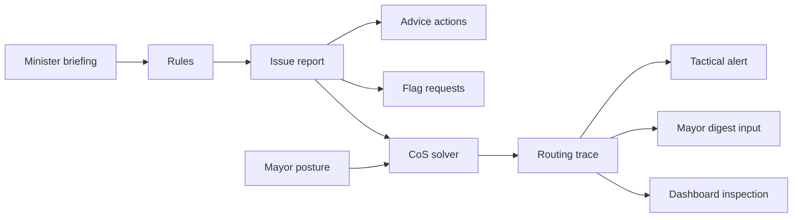
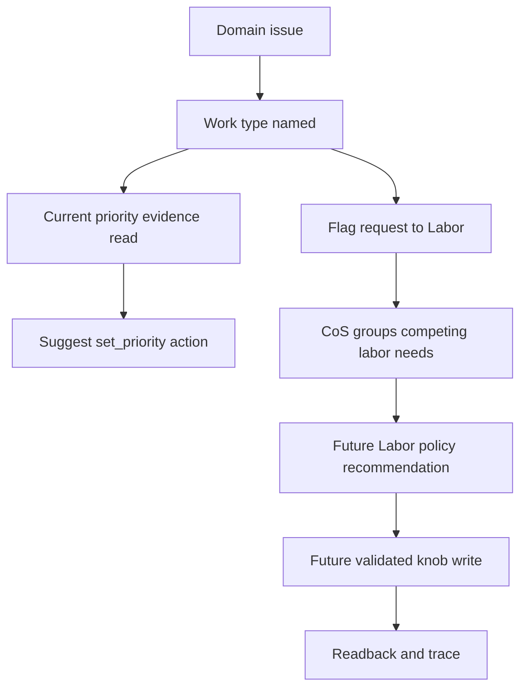
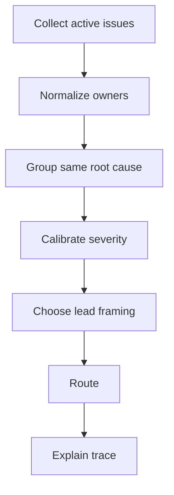

# RimBob - Cabinet Issue Solver

> **Living document.** This spec records durable cabinet issue semantics,
> ownership, and CoS solver behavior. Exact C# records, enum values,
> endpoint payloads, parser repair paths, fixture shapes, and dashboard DTOs
> belong in source and tests.

---

## Purpose

RimBob needs one cabinet-level way to describe "there is a problem or
opportunity" before that problem becomes player advice, a cross-minister flag,
or a future Auto request. This doc defines that design-level issue layer.

The issue solver is data-driven: ministers should derive issue reports from
briefing facts, live-state freshness, known ownership boundaries, and compact
evidence. LLM prose can explain or choose between close options, but it is not
the durable issue contract.

This is not implementation code and not a new player-facing surface by itself.
The player sees `AdviceItem`s, latest minister snapshots, tactical alerts, and
Mayor synthesis. CoS and dashboard inspection can see issue reports and solver
traces when implemented.

---

## Vocabulary

| Term | Meaning |
|---|---|
| Issue report | A structured design-level problem/opportunity emitted or derived by one minister before routing. |
| Issue type | The minister-scoped category of problem, such as food shortage, power deficit, or active threat. Exact enum names live in code. |
| Action | A player-facing operation on `AdviceItem.actions[]`. It says what the player can do. |
| Request | A cross-minister dependency attached to a flag, using `ResourceRequest` semantics. It says what another subsystem must notice. |
| Lead owner | The minister whose framing should lead the grouped issue for the current cycle. |
| Execution owner | The minister or future subsystem that owns the operation if it ever becomes executable. |
| Labor knob | A work-priority or similar pawn-policy setting. In `Suggest`, it is advice only; in future `Auto`, Labor owns the write. |
| Route | CoS routing decision: tactical alert, Mayor digest input, deferred, suppressed duplicate, unresolved, or debug-only. |

---

## Issue Report Model

An issue report is a compact, replayable cabinet fact. The exact record shape is
an implementation detail, but the design-level fields are:

| Field family | Design intent |
|---|---|
| Identity | Stable issue key for dedupe/supersession, source minister, issue type, game-time context. |
| Subject | The thing being evaluated: pawn group, room, resource chain, work type, map area, facility, trade need, threat, or strategic topic. |
| Evidence | Briefing-derived measurements, thresholds crossed, missing facts, state freshness, and relevant guide/context references. |
| Urgency | Severity/priority signal, time horizon, confidence, and what would make the issue worse or resolved. |
| Ownership | Source minister, domain owner, execution owner if known, requested owner for dependencies, and any unresolved owner notes. |
| Actions | Candidate player-facing actions the source minister can legitimately surface as advice. |
| Requests | Cross-domain dependencies that should travel on flags for CoS/Mayor routing. |
| Labor policy | Work-type-qualified labor need, current work-priority evidence when available, and whether a Labor-owned knob change is a candidate. |
| Constraints | Active threat, season, materials, pawn availability, forbidden targets, freshness requirements, autonomy mode, and Assisted Apply eligibility. |
| Lifecycle | Active, resolved, stale, superseded, suppressed, or deferred, with reasons visible to replay/dashboard traces. |

Issue reports should not carry long prose. Put human explanation in advice body,
rationale, Mayor synthesis, or dashboard trace rendering.

---

## Data Flow

The same real problem can produce multiple artifacts:

- Advice action: what the player can do now.
- Flag request: the cross-domain dependency CoS should route.
- CoS route: how the cabinet frames or suppresses the issue this cycle.
- Future Auto request: only after the relevant autonomy gate exists.

---

## Actions Versus Requests

Actions and requests are intentionally separate.

| Surface | Owner | Audience | Can execute in MVP? | Example |
|---|---|---|---|---|
| `AdviceItem.actions[]` | Issuing minister | Player/dashboard | Only if a narrow Assisted Apply handle is validated | "Mark the nearby berry patch for harvest." |
| `AgentFlag.Requests` | Source issue, target owner named when known | CoS/Mayor/routing trace | No | Food requests Construction for a cooler-backed freezer. |
| Labor policy request | Source minister describes need; Labor owns policy decision | CoS/Labor/future Auto | No in MVP | Food needs `Cook` coverage until meals recover. |
| Auto write | Labor or other authorized execution owner after graduation | RIMAPI via Host | Deferred | Labor validates and writes one work-priority knob, then reads back. |

Rules:

- Keep player-facing operations on `actions[]`.
- Put cross-domain dependencies on flags as requests.
- Do not duplicate an action as a request unless another subsystem must notice
  the dependency.
- Requests are not imperative tasks. They do not reserve resources, assign
  pawns, mutate another minister's domain, or call RIMAPI.
- CoS routes and explains. It does not produce routine advice or execute.

---

## Labor And Work-Priority Knobs

Current direction from the work-priority/knob planning notes:

- Near term, `set_priority` advice is `Suggest`-only. It should be emitted only
  when the minister has read-side evidence for current work priorities, the
  relevant RimWorld work type is known, and the recommendation is compact.
- The source minister owns why the work matters. Food owns "we need cooking
  coverage to recover meals"; Construction owns "we need Construct coverage to
  finish beds"; Medical owns "Doctor/Patient coverage is life-critical."
- Labor owns pawn-policy resolution when Auto re-engages. Non-Labor ministers
  can request work-type-qualified labor, but they do not write pawn priorities.
- The future Auto knob-write shim is one validated declarative policy write plus
  readback, not an HTN engine and not direct forced jobs. Labor recommends or
  executes the knob; RimWorld's job system allocates actual jobs.
- Direct job forcing, broad schedule changes, combat orders, medical decisions,
  and prisoner policy remain outside the first knob shim.

Suggested lifecycle for a labor-backed issue:

If current work-priority evidence is missing, the issue may still request
Labor/player attention, but it should not pretend to know which knob is wrong.

---

## Minister Issue Catalogue

This catalogue is design-level. It names likely issue families and the data
that should drive them. Exact concerns, enum members, thresholds, and helper
names live in minister code/tests when each slice ships.

### Mayor

Mayor owns colony-wide strategy and posture, not routine operations.

| Issue family | Evidence | Normal output |
|---|---|---|
| Posture shift | Phase changes, stable food/freezer/defense, wealth velocity, major setbacks | Agenda posture/update notes |
| Strategic tension | CoS grouped issues that compete for scarce materials, labor, or timing | Agenda priority framing |
| Cabinet direction gap | Repeated minister flags without clear strategic ordering | `cabinet_direction` |
| Quiet-day summary | No high-pressure flags, stable state-of-the-union categories | Brief agenda update |

### Chief Of Staff

CoS owns arbitration and routing.

| Issue family | Evidence | Normal output |
|---|---|---|
| Duplicate pressure | Same issue key/root cause across flags or issue reports | Suppression/supersession trace |
| Lead-framing conflict | Multiple ministers have valid perspectives on one problem | Lead owner and grouped issue |
| Severity calibration | Emitted severity exceeds current evidence or is stale | Downgrade with reason |
| Tactical route decision | Critical/high issue likely needs action before next Mayor cycle | Tactical alert route |
| Unresolved owner | Request target is missing, contested, or impossible to infer | Unresolved routing warning |

### Food

Food owns the full nutrition chain.

| Issue family | Evidence | Actions | Common requests |
|---|---|---|---|
| Food buffer low | Days of food, meal/raw counts, colonists, nutrition confidence | Harvest, cook, grow, unforbid, local acquisition | Labor `Cook`/`PlantCut`/`Grow`, Construction freezer/storage, Economy procurement |
| Harvest or forage opportunity | Mature crops, edible plant clusters, distance/proximity, season | `mark_harvest`, forage target advice | Labor `PlantCut`, Defense veto if unsafe |
| Cooking backlog | Raw food available, meals low, bill/workbench state, cook coverage | Cook meals, add/update simple-meal bill, set cook priority | Labor `Cook`, Construction stove/campfire |
| Freezer/storage risk | Spoilage, storage capacity, freezer signal, temperature coverage | Adjust food stockpile, preserve food, build dependency note | Construction cooler/power/room, Labor haul only when urgent |
| Crop choice tradeoff | Season window, terrain/fertility, crop candidates, buffer, guide context | Sow/expand specific food crop | Labor `Grow`, Construction growing space if blocked |
| Hunting ambiguity | Low-risk target summaries, animal health/tame/risk, active threat | Mark hunt only when deterministic | Defense veto/attention, Labor `Hunt` |
| Procurement needed | No local stored/harvest/cook/sow path visible | State local gap; avoid day-one caravan spam | Economy trade/procurement |

### Construction

Construction owns built infrastructure.

| Issue family | Evidence | Actions | Common requests |
|---|---|---|---|
| Power deficit | Generation, storage, load, critical consumers | Build/repair power assets | Labor `Construct`, Industry components |
| Missing basic rooms | Beds, shelter, room quality, colony size, Mayor posture | Build beds/rooms/floors/roofs | Labor `Construct`, Industry furniture/materials |
| Build queue blocked | Blueprints/frames, missing materials, unreachable work, pending requests | Resolve material or layout blocker | Labor `Construct`/`Haul`, Industry goods |
| Material bottleneck | Steel, wood, blocks, components, stone chunks | Prioritize materials or stockpiles | Industry production, Economy purchase |
| Temperature asset need | Freezer, hospital, heat/cold safety, requester need | Build cooler/heater/room shell | Food/Medical/Welfare as reason owners |
| Structural or fire risk | Wood critical structures, breaches, unsafe layouts | Replace/repair critical infrastructure | Defense for active threat context |

### Defense

Defense owns threat response.

| Issue family | Evidence | Actions | Common requests |
|---|---|---|---|
| Active threat | Raid, infestation, breach, spreading fire, hostile location | Draft/position/retreat advice, tactical alert | Medical triage, Construction emergency repair |
| Readiness gap | Colony wealth/phase, combat pawns, weapons, armor, defenses | Prepare weapons/armor/defense posture | Industry weapons/armor, Construction fortifications |
| Fortification gap | Perimeter, chokepoints, traps, turrets, breach history | Build/repair defensive intent | Construction build owner, Industry components |
| Dangerous food/labor action | Hunt target risk, active threat, unsafe map area | Veto or downgrade risky routine advice | Food/Labor attention |
| Post-threat recovery | Injuries, broken walls, damaged power, lost stock | Route recovery pressure | Medical/Construction/Food by root need |

### Industry

Industry owns non-food production chains.

| Issue family | Evidence | Actions | Common requests |
|---|---|---|---|
| Production bottleneck | Missing bench, bill gap, input shortage, output shortage | Add/change production focus in Suggest mode | Construction bench/power, Labor craft/smith/tailor |
| Component or steel pressure | Stock, build queue demand, fabrication/machining capacity | Produce/buy/recover components | Economy purchase, Construction material flow |
| Weapon/armor need | Defense readiness request, current equipment, tech/bench readiness | Produce weapon/armor/apparel | Defense requirement, Labor smith/tailor/craft |
| Apparel/comfort goods | Welfare warmth/comfort request, textile availability | Tailor apparel or comfort goods | Welfare requirement, Labor tailor |
| Drug/chemfuel policy | Medical/Welfare/Economy need, crop/input state, risk posture | Produce or pause policy goods | Food crop opportunity cost, Economy sale strategy |
| Trade-good surplus | Stockpile, marketable outputs, wealth posture | Shift production or liquidate | Economy trade owner |

### Welfare

Welfare owns pawn wellbeing outside direct medical care.

| Issue family | Evidence | Actions | Common requests |
|---|---|---|---|
| Mental-break risk | Mood thresholds, top thoughts, recent events, schedule pressure | Immediate wellbeing advice | Construction rooms/recreation, Medical pain care |
| Recreation gap | Recreation variety, boredom, recreation buildings, schedule | Build/use recreation options | Construction recreation assets, Labor schedule attention |
| Schedule policy problem | Sleep/joy/work balance, avoidable mood loss, current schedule evidence | Suggest schedule or priority review | Labor in future Auto |
| Comfort/beauty/sleep gap | Room impressiveness, beds, comfort, beauty | Improve rooms/furniture/comfort | Construction/Industry |
| Apparel warmth/comfort risk | Temperature exposure, apparel coverage, textiles | Produce/equip apparel advice | Industry apparel |
| Social or ideology pressure | Relationship incidents, ideology mood causes, ritual pressure | Social/ideology recommendation | Mayor for strategic posture if broad |

### Medical

Medical owns health, treatment, and hospital readiness.

| Issue family | Evidence | Actions | Common requests |
|---|---|---|---|
| Urgent treatment | Bleeding, disease, infection, tending windows, pain severity | Tend/triage/player attention | Labor `Doctor`/`Patient`, Welfare mood impact |
| Medicine stock risk | Medicine counts, disease season, surgery plans, biome/trade context | Acquire/conserve medicine | Economy purchase, Industry drug production |
| Hospital readiness | Beds, sterile room, vitals, temperature, access | Build/improve hospital | Construction room/assets, Industry hospital goods |
| Surgery/operation readiness | Operation queue, doctor skill, medicine, bed quality | Delay/perform prep recommendation | Labor doctor availability, Economy supplies |
| Post-combat triage | Defense event, wounded count, bed/medicine pressure | Treat and route recovery needs | Defense/Construction follow-up |

### Research

Research owns the tech path.

| Issue family | Evidence | Actions | Common requests |
|---|---|---|---|
| Queue empty or misaligned | Current research, Mayor posture, unmet domain requests | Set/adjust research target | Mayor strategy, Construction bench |
| Unlock dependency | Food freezer, Defense weapons, Medical hospital, Industry fabrication need | Prioritize prerequisite tech | Requesting minister requirement |
| Bench or capacity gap | Research bench, multi-analyzer, room/power, researcher availability | Build/improve research capacity | Construction bench/power, Labor research |
| Long-term tech fork | Multiple viable strategic paths, guide context, colony phase | Escalate for judgment | Mayor posture input |

### Economy

Economy owns trade, caravans, wealth pressure, and surplus liquidation.

| Issue family | Evidence | Actions | Common requests |
|---|---|---|---|
| Scarce resource purchase | Food/Medical/Defense/Construction shortage, trader availability, silver | Buy or prioritize trade target | Source minister need |
| Surplus liquidation | Stockpile surplus, rot/decay, marketable goods, wealth pressure | Sell or repurpose surplus | Industry production, Mayor posture |
| Wealth pressure | Wealth velocity, defense readiness, idle stockpiles | Reduce idle wealth or slow hoarding | Defense parity, Industry output |
| Caravan readiness | Route purpose, food/medicine/defense provisioning, pawn availability | Prepare or delay caravan | Food/Medical/Defense inputs |
| Trade opportunity conflict | Multiple ministers want silver/carry capacity | Rank trade purpose | CoS/Mayor tension |

### Labor

Labor is deferred until Auto, but its issue vocabulary matters now because other
ministers already request work-type-qualified labor.

| Issue family | Evidence | Normal handling |
|---|---|---|
| Work-priority mismatch | Current work priorities, open domain need, skilled pawn availability | Suggest-mode action now; Labor-owned knob later |
| Labor capacity gap | No available qualified pawn, sickness/combat/schedule constraints | Flag capacity problem; do not invent assignments |
| Critical work starvation | Doctor/Patient/Firefight/Cook/etc. need is urgent and uncovered | CoS routes high; future Labor recommends policy |
| Competing labor needs | Multiple ministers request the same work type or same skilled pawn pool | CoS groups; Labor resolves under Auto |
| Stuck request | Future Auto request did not change observed state after readback window | Visible trace/failure, not silent retries |

---

## CoS Solver

CoS is a deterministic solver over structured cabinet inputs. It is not a
second Mayor and not a minister chat room.

### Inputs

Design-level inputs:

- Active issue reports or active flags from feeder ministers.
- Structured flag requests using `ResourceRequest` semantics.
- Latest minister snapshots for metadata, not prose parsing.
- Mayor posture, ranked priorities, state-of-the-union categories, and
  `cabinet_direction`.
- Ownership map: domain owner, request owner, and known hard cases.
- Live-state freshness and game-time context.
- Labor work-priority read summaries when available.
- Existing tactical-alert or digest routes from the prior cycle when needed for
  stable supersession.

### Pipeline

### Outputs

Design-level outputs:

- Deduped issue groups with contributing ministers and evidence summaries.
- Lead owner and lead framing for each group.
- Route: tactical alert, Mayor digest input, deferred, suppressed duplicate,
  unresolved, or debug-only.
- Requests grouped by target owner.
- Labor policy candidates grouped by work type and urgency.
- Downgrade, suppression, deferral, and unresolved-owner reasons.
- Strategic tensions for Mayor synthesis.
- Dashboard trace rows for inspection.

CoS may downgrade, suppress, defer, or group. CoS should not silently upgrade a
minister's severity; the owning minister emits a new higher-severity issue when
evidence changes.

---

## Routing Defaults

| Condition | Default route |
|---|---|
| Active Critical threat or life-threatening medical issue | Tactical alert |
| High issue requiring action before next Mayor cycle | Tactical alert |
| High issue with no immediate player action | Mayor digest input |
| Medium issue aligned with Mayor posture | Mayor digest input |
| Medium issue blocked by another owner | Digest input with dependency trace |
| Low background opportunity | Deferred unless posture makes it current |
| Duplicate issue already covered by stronger active route | Suppressed duplicate |
| Missing owner or stale evidence | Unresolved/debug until refreshed |

Mayor posture breaks ties; it does not override immediate danger.

---

## Examples

### Food Shortage With Cooking Coverage Gap

Food sees low meals, raw ingredients, a known cooking station, and no current
evidence that cooking coverage is adequate.

- Food issue: food buffer low plus cooking backlog.
- Advice action: cook simple meals or add/update the narrow simple-meal bill if
  the current state supports it.
- If work-priority evidence exists: include a compact `set_priority` suggestion
  for `Cook`.
- Flag request: Labor `Cook` coverage, and possibly Construction if no stove or
  campfire exists.
- CoS route: tactical alert if starvation is near; otherwise Mayor digest with
  Food as lead and Labor as dependency.
- Future Auto: Labor validates and writes one work-priority knob, then reads
  back. Food does not write pawn priorities.

### Freezer Risk Blocked By Infrastructure

Food sees spoilage/freezer risk. Construction sees a power deficit or missing
cooler.

- Food issue: freezer/storage risk.
- Food request: Construction for cooler-backed freezer/power support.
- Construction issue: power or build queue blocker.
- CoS groups the two under one root cause.
- Lead framing: Food leads if the player-facing risk is nutrition loss;
  Construction leads if the actual blocker is infrastructure readiness.
- Route: digest unless spoilage is urgent enough for a tactical alert.

### Raid During Routine Crop Expansion

Defense sees an active raid. Food sees a crop expansion opportunity.

- Defense issue: active threat, Critical.
- Food issue: grow/harvest opportunity, Low or Medium.
- CoS route: Defense tactical alert.
- CoS defers or suppresses routine Food pressure with an explicit reason:
  active threat preempts expansion advice.

### Mood Collapse From Pain And Room Quality

Welfare sees break risk from pain, ugly bedrooms, and recreation gaps. Medical
sees untreated injuries. Construction sees missing room improvements.

- Welfare issue: mental-break risk.
- Medical issue: urgent treatment or pain care.
- Construction issue/request: room or furniture improvement.
- CoS groups by affected pawn group when possible.
- Lead framing: Medical if treatment window is urgent; Welfare if mood risk is
  the broad player-facing concern.
- Route: tactical alert only for immediate break or medical danger; otherwise
  digest with dependencies.

### Research Unlock Blocks A Domain Need

Defense needs better weapons, but Research is still on a low-impact topic.

- Defense issue: readiness gap.
- Research issue: unlock dependency for weapons path.
- Industry request may appear if bench or production capacity is also missing.
- CoS groups as a strategic tension: defense readiness versus research path.
- Mayor receives the tension and can shift `cabinet_direction`.

---

## Dashboard Shape

When implemented, dashboard inspection should expose issue-solver data without
turning it into extra player advice:

- active issue groups,
- contributing issue reports/flags,
- lead owner and route,
- evidence freshness,
- grouped requests by target owner,
- Labor work-type/knob candidates,
- suppression/downgrade/deferral reasons,
- unresolved owner warnings,
- links back to the latest minister snapshots and replay records.

The dashboard should preserve backend contract names in debug views. Friendly
rendering is fine for the player-facing advice view, but raw issue/solver
inspection should remain exact enough for debugging.

---

## Open Questions

- [ ] Which issue families deserve stable semantic ids before their ministers
      ship?
- [ ] Should issue reports be persisted latest-only like minister snapshots, or
      only captured in replay records?
- [ ] How much issue history does CoS need to avoid alert churn?
- [ ] What is the first minimal work-priority read shape needed for reliable
      `set_priority` advice?
- [ ] When Auto re-engages, should Labor policy recommendations be visible as
      their own snapshot or only as CoS trace plus execution logs?
