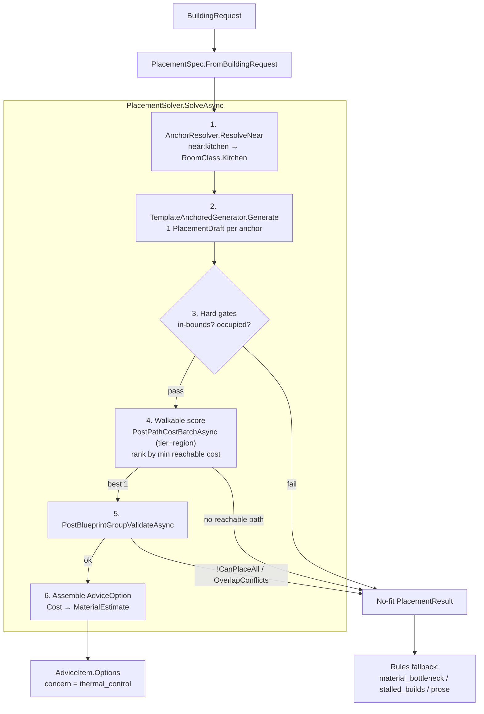
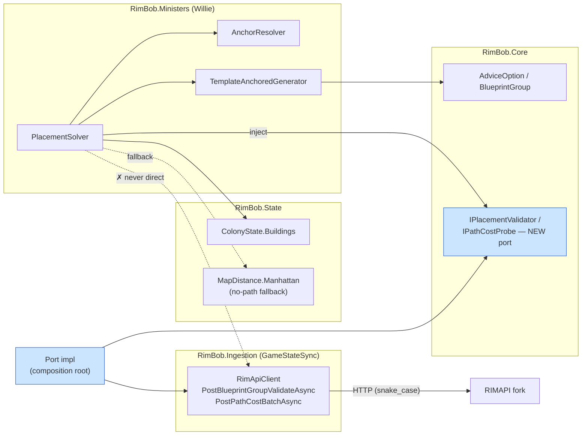

# Placement Solver Solver1 — Implementation Plan

> Implementation plan. Lands **code** in RimBob. No fork work.
>
> Implements the **Solver1 skeleton** slice of the design in [`placement-solver.md`](placement-solver.md) §5, refreshed against the now-landed reality (briefing derivation `3235902`, the rules-only Willie minister `e902e96`, FORK2 group validate/place Slice A, FORK3 reach/path-cost client wrappers).
>
> Sliced by risk — **gimp one slice at a time**, keep build/tests green between. **No compat code; wipe-and-regen on upgrade** for any persisted solver-trace/option shape (AGENTS Coding rule).
>
> **Worktree port** for live runs: `.\run-rimbob.ps1 -ListenUrl http://127.0.0.1:5101` (5000 reserved for the main checkout).

---

## 0. Motivation

The Placement Solver is the deterministic engine that turns a `building_request` into 1–3 validated, pickable layout options for Willie. Solver1 is the smallest end-to-end cut: **one room class (freezer), one anchor (near kitchen), one generator, one candidate, one validated option** — proving the pipeline shape before competition/diversity (Solver2+) is added.

Solver1 is now unblocked: `WillieBriefing.AnchorInventory` ships from the derivation (`3235902`), the FORK2 group-`validate` endpoint exists, schema S1 already landed the dormant `BlueprintGroup` / `AdviceOption` types (`Src/Common/Advice/AdviceOption.cs`, namespace `RimBob.Core.Advice`), and the FORK3 client wrappers exist for Solver1 walkable scoring.

**Refresh deltas vs the `placement-solver.md` design (written pre-landing):**

- Anchor source is the concrete `WillieAnchorInventory` record (`Src/Common/Briefings/WillieRoomAnchor.cs`, namespace `RimBob.Core.Briefings`), **not** an abstract anchor. Solver1 reads `briefing.AnchorInventory.Anchors.Where(a => a.Class == RoomClass.Kitchen)` (`WillieRoomAnchor.Class` is `RoomClass`). `Centroid` is a `MapPosition?` (3-D `X/Y/Z`, `Src/Common/Aggregates/Snapshots.cs`) and is populated when contained building positions exist. `EntryCells` / `RegionId` are empty/null stubs (their fork endpoints have not landed), so Solver1 uses them when present and otherwise uses `Centroid` only as a fallback target cell. Solver1 scoring calls FORK3 `PostPathCostBatchAsync` over candidate access cells → anchor target cells with `tier:"region"` and ranks by minimum reachable path cost. `MapDistance.Manhattan` (`Src/StateStore/Derivations/Common/MapDistance.cs`, namespace `RimBob.State.Derivations.Common`) stays a last-resort fallback when no path-cost result is available; it is not the primary scoring model.
- The FORK2 group-`validate` endpoint exists fork-side, but **RimBob has no client method for it yet** (`3235902` added only the FORK3 reach/path-cost wrappers `PostPathCostAsync` / `PostPathCostBatchAsync`). Solver1 must add `PostBlueprintGroupValidateAsync` + its DTOs.
- The solver lands in the **existing** minister directory `Src/Ministers/Willie/` (namespace `RimBob.Ministers.Willie`, project `RimBob.Ministers.csproj`). The rules-only Willie minister already landed (`e902e96`): `Rules.cs`, `MinisterOfWillie.cs`, `WillieFlagRequests.cs`, `WillieStateSummary.cs` all exist and are tested, so the AGENTS minister-dir convention ("`Rules.cs` first; compiles + tested before the LLM is wired") is **already satisfied**. Solver1 **adds** files to this dir — it does not create it and does not touch `Rules.cs` beyond the eventual wire-in. The integration seam is live now: `Rules.cs` already carries the solver-wire TODOs at `Rules.cs:125` (`freezer_request_active`) and `Rules.cs:170` (missing-room prose). The older design text's `Src/Ministers/Construction/` is stale (`Construction → Willie` rename `8f21699`).

Per-slice motivation:

- **Solver1a** — Contract + I/O boundary. Without `PlacementSpec` + the group-validate client method, there is nothing for a generator to target and no way to validate a draft.
- **Solver1b** — Anchor resolution + the one generator. The `near:kitchen` → map-location resolution is the hard sub-problem; Solver1 does the simplest correct version against the landed anchor inventory.
- **Solver1c** — Gates + score + validate + assemble. Produces the single `AdviceOption` the dashboard can render, proving the full path.
- **Solver1d** — Determinism tests. Same spec + same snapshot + same seed → same draft, per the design's test discipline.

### Shape

`SolveAsync` pipeline (Solver1c §1c steps 1–7), with the three no-fit exits:



Project layering + the §1c port decision (Ministers must **not** depend on `RimBob.Ingestion`; a port in `RimBob.Core` breaks the boundary):



---

## 1. Slices (gimp independently, in order)

Naming: solver types are persona-named (`Willie*`) where they are Willie-owned; the generic packing helpers stay neutral. Minister namespace `RimBob.Ministers.Willie`.

### Solver1a — `PlacementSpec` + group-validate client  *(CONTRACT — gimp first)*

Files (new):

- `Src/Ministers/Willie/PlacementSpec.cs` (namespace `RimBob.Ministers.Willie`)
  - `PlacementSpec` record — the normalized solver input ([`placement-solver.md`](placement-solver.md) §2), mapped from the landed `BuildingRequest` (`Src/Common/Advice/FlagRequests.cs`): `TargetClass` (`BuildingClass`), `RoomClass?`, `CapacityNeed?` (`{ CapacityMeasure Measure, double? Amount, string? Unit }`), `IReadOnlyList<AdjacencyHint>? Adjacency` (each `{ AdjacencyRelation Relation, string Target }`), `PowerNeed? Power`, `TempNeed? Temperature`, `MaterialsOnHand` (`IReadOnlyList<MaterialHint>?`), `Deadline?`, `AdvicePriority? Priority`, `string? Source`.
    - `// TODO: BuildingRequest has no Constraints[] field today; derive constraints (double_wall, fire_safe_material) from RoomClass/intent when self-intent feeds the solver (placement-solver.md §2). Solver1 leaves it empty.`
    - `Source` maps from `BuildingRequest.RequestedFrom` (used for cross-link + `concern` mapping); there is no `source_minister` flag on the request.
  - `static PlacementSpec FromBuildingRequest(BuildingRequest req)`.
- `Src/GameStateSync/Dtos/BlueprintGroupDto.cs` (namespace `RimBob.Ingestion.Dtos`, matching `MapReachDto.cs`; use `[property: JsonPropertyName("snake_case")]` on every field like the other DTOs in that folder). Field names below are the **confirmed** fork shapes from `C:\dev\RIMAPI-for-RimBob\Source\RIMAPI\RimworldRestApi\Models\BuilderDtos.cs` (`BlueprintGroupValidateRequestDto`, `BlueprintGroupItemDto`, `BlueprintGroupValidateResultDto`, `BlueprintGroupValidateItemResultDto`, `BlueprintCostDto`, `BlueprintGroupOverlapConflictDto`):
  - Request:
    - `BlueprintGroupValidateRequestDto { int MapId, IReadOnlyList<BlueprintGroupItemDto> Items }`.
    - `BlueprintGroupItemDto { string? Role, string DefName, string? StuffDefName, MapCellDto Cell, int Rotation }` — note the fork item carries `role`; reuse `MapCellDto` (`{ int X, int Z }`, `x`/`z`) from `Src/GameStateSync/Dtos/MapReachDto.cs`.
  - Response (envelope `data`):
    - `BlueprintGroupValidateResponseDto { bool CanPlaceAll, IReadOnlyList<BlueprintGroupValidateItemResultDto> Items, IReadOnlyList<BlueprintCostDto> Cost, IReadOnlyList<BlueprintGroupOverlapConflictDto> OverlapConflicts }` — fork names this `BlueprintGroupValidateResultDto`; RimBob mirrors it with the `...ResponseDto` suffix per the landed `MapReachResponseDto` / `MapPathCostResponseDto` convention.
    - `BlueprintGroupValidateItemResultDto { int Index, BlueprintGroupItemDto Item, bool CanPlace, string? Reason, string? DefType, IReadOnlyList<MapCellDto> OccupiesCells, IReadOnlyList<BlueprintCostDto> Cost, float WorkToBuild, bool AlreadyBlueprinted, bool AlreadyBuilt }`.
    - `BlueprintCostDto { string DefName, int Count }` — the fork uses `Count` (not `qty`); aggregate `Cost` maps to `AdviceOption`'s `IReadOnlyList<MaterialEstimate>` (`{ def_name, count }`) at assemble.
    - `BlueprintGroupOverlapConflictDto { MapCellDto Cell, int FirstItemIndex, int SecondItemIndex }` — the fork returns conflict triples here, **not** a flat `OverlapItemIndices` int list.
    - `// TODO: the place response (BlueprintGroupPlaceResultDto) and its require_all/placement_order request fields are out of scope until the Apply path lands.`

Files (modified):

- `Src/GameStateSync/RimApiClient.cs` (class `RimApiClient`, namespace `RimBob.Ingestion`) — add `public Task<BlueprintGroupValidateResponseDto> PostBlueprintGroupValidateAsync(BlueprintGroupValidateRequestDto request, CancellationToken ct = default)` delegating to the existing `private async Task<TResponse> PostEnvelopedAsync<TRequest, TResponse>(string path, TRequest body, CancellationToken ct)` helper, exactly like the landed FORK3 `PostPathCostAsync`. POST path `api/v1/builder/blueprint-group/validate` (FORK2 A.1). Place it next to the reach/path-cost reads under the "Map / Colony state" region.
  - `// TODO: add PostBlueprintGroupPlaceAsync when the Apply path lands (group place is the player-click write, separate from Solver1 validate).`

Tests (new):

- `Src/Tests/Ingestion/RimApiClientBlueprintGroupTests.cs` (namespace `RimBob.Tests.Ingestion`) — copy the mock-HTTP harness from the landed `Src/Tests/Ingestion/RimApiClientFork3Tests.cs` (`PathRouter` / `CaptureHandler` / `Envelope<T>` helpers): happy-path validate deserializes the response DTO, asserts snake_case request body, and envelope `success:false` throws `RimApiException`.

Docs to touch: `Docs/design/RimAPI.md` — register the new group-validate client wrapper.

Risk: **low.** Additive contract + one HTTP wrapper.

### Solver1b — anchor resolution + `TemplateAnchoredGenerator`  *(CORE)*

Files (new) — all under namespace `RimBob.Ministers.Willie` (or a `.Placement` / `.Generators` sub-namespace):

- `Src/Ministers/Willie/Placement/AnchorResolver.cs`
  - `IReadOnlyList<ResolvedAnchor> ResolveNear(PlacementSpec spec, WillieBriefing briefing)` — for each `AdjacencyHint` with `Relation == AdjacencyRelation.Near`, parse its free-string `Target` (e.g. `"kitchen"`) into a `RoomClass` and filter `briefing.AnchorInventory.Anchors` by `anchor.Class` (Solver1: `near kitchen` → `RoomClass.Kitchen`). Returns 0..N **typed** `ResolvedAnchor`s (not bare `WillieRoomAnchor`), each carrying the resolved target cell + how it was derived — see the `ResolvedAnchor` type below.
  - **Contract:** stable ordering (by `RoomId`, then `CellsCount` desc) for determinism. Target cell = first `EntryCells` entry if present, else `Centroid` fallback, else **skip the anchor** with `AnchorMatchReason.NoTargetCell` (never emit an unanchored draft). Pure over the briefing — no I/O.
  - `// TODO: AdjacencyHint.Target is a free string; Solver1 does a simple case-insensitive RoomClass parse. Replace with a shared alias map when more room classes land (Solver3).`
  - `// TODO: WillieRoomAnchor.EntryCells/RegionId are empty/null until rimapi-room-entry-cells / rimapi-map-region-at land; Solver1 records the EntryCells-vs-Centroid choice in ResolvedAnchor.MatchReason so the score trace can surface missing_data_coverage.`
- `Src/Ministers/Willie/Placement/FreezerTemplate.cs`
  - Pure footprint math, no I/O — unit-testable in isolation. Two pieces:
    - `static RectSize? SizeFor(CapacityNeed need)` — sizing as a documented **monotonic step table** (food_units range → interior dims), round up, prefer near-square (minimizes wall/floor ratio = cheaper + tighter temp). Total + safe: only `CapacityMeasure.FoodUnits` in Solver1 → return `null` on any other measure (never silently mis-size beds as food); `Amount == null` → default interior. No magic `200 → 5×5` constant baked inline.
    - `static RoomShell BuildShell(RectSize interior, DoorSide door)` — interior dims + 2 per axis for the wall shell; enumerate shell cells (floor + walls + door) + 1 cooler fixture cell. **Canonical order** (row-major z-then-x; walls CW from origin; door fixed slot; cooler fixed wall slot) — no RNG, determinism req (§6). Emits cells as `MapCell` (`x`/`z`) plus the door's access cell.
  - `// TODO: FreezerTemplate is the only IRoomTemplate impl in Solver1; hospital/bedroom/workshop templates land in Solver3 behind the same seam (see refactor note).`
- `Src/Ministers/Willie/Generators/IPlacementGenerator.cs`
  - `string Id { get; }` — generator id for the registry + score/dashboard trace (design §3.1 requires `generator_id`).
  - `IReadOnlyList<PlacementDraft> Generate(PlacementSpec spec, PlacementEvidence evidence, GenerationBudget budget)` — `budget` is a typed `GenerationBudget` (`{ int MaxDrafts, int MaxSearchRadius }`), not a bare int, so per-generator caps (design §3, open Q) have a home.
  - **Determinism contract (XML-doc it):** same `(spec, evidence, budget)` → identical **ordered** list; no ambient RNG. If a future generator needs randomness, the seed is an explicit field threaded from a spec/snapshot hash — never `new Random()`. Generators never call the validator/scorer/port.
- `Src/Ministers/Willie/Generators/TemplateAnchoredGenerator.cs`
  - `Id => "template_anchored"`.
  - Solver1 emits **one** `PlacementDraft` per resolved anchor via a **bounded placement search**: scan outward from `anchor.TargetCell` in deterministic ring order (increasing Chebyshev radius, fixed angular start, capped at `budget.MaxSearchRadius`); the first position where the template AABB is in-bounds (`evidence.InBounds`) and non-overlapping (`evidence.IsOccupied`) becomes the draft. Not "adjacent to centroid" — a real first-fit search.
  - **Orientation:** door on the anchor-facing edge (shortens the freezer→kitchen path the scorer measures); cooler centered on the opposite/exterior wall (hot side vents outside the cold room). Deterministic heuristic only — the generator uses it to *seed* a good draft but never *scores* (design §3.1: generators are proposal sources, not authorities).
  - **Placement-constraint vs hard gate:** the generator reads `evidence` occupancy to *skip* doomed positions during the scan; the shared hard gate in Solver1c step 3 stays the final authority. Distinct concerns — keep both.
  - Builds a `BlueprintGroup` (`RimBob.Core.Advice` — `{ Label, MapId, Assets }`, `BlueprintAsset` `{ Role, DefName, StuffDefName?, Cell, Rotation }`) and wraps it in a `PlacementDraft` (below) carrying `GeneratorId`, `SourceAnchor`, the door `AccessCells`, `Assumptions`, and a reason summary. This is generation seeding; final ranking is the FORK3 path-cost score in Solver1c step 4.
- `Src/Ministers/Willie/Generators/PlacementDraft.cs` (+ `ResolvedAnchor`, `GenerationBudget`, `RectSize`, `RoomShell`, `DoorSide`, `AnchorMatchReason` — group the small generation types here or in `Placement/GenerationTypes.cs`)
  - `PlacementDraft { string GeneratorId, BlueprintGroup Group, ResolvedAnchor SourceAnchor, IReadOnlyList<MapCell> AccessCells, IReadOnlyList<string> Assumptions, string ReasonSummary }` — design §3.1 needs `generator_id` + assumptions for the trace/dashboard (§7); the plan's earlier "group + anchor + reason" shape dropped both. Define wide now (pre-landing → no compat cost; AGENTS wipe-and-regen).
  - `AccessCells` (door cell + outward neighbour) is emitted here so the Solver1c scorer builds path-cost pairs without re-deriving the door.
  - `ResolvedAnchor { WillieRoomAnchor Anchor, MapPosition TargetCell, AnchorMatchReason MatchReason }`; `AnchorMatchReason { EntryCells, CentroidFallback, NoTargetCell }`.
- `Src/Ministers/Willie/PlacementEvidence.cs`
  - `static PlacementEvidence Build(MapInfoSnapshot map, BuildingRegistry buildings, IReadOnlyList<ResolvedAnchor> anchors)` — pure factory, **no client**. Solver1c builds it **once** before the generator loop (design §3.4) and passes it read-only to every generator (Solver2 has many generators → no per-generator recompute).
  - Solver1-minimal precompute: map bounds, occupied cells from `BuildingRecord.Position` (`MapPosition?`), resolved anchors.
  - **Query API (single source of truth):** `bool InBounds(MapCell)` + `bool IsOccupied(MapCell)` — both the Solver1c hard gate AND the generator placement-scan call these, so bounds/occupancy logic lives in one place.
  - Surface the occupancy approximation as a typed field (e.g. `OccupancyIsPointApprox = true`), not a silent assumption.
    - `// TODO: BuildingRecord.Position is a single cell, not a footprint; occupancy is approximate until per-building footprints land.`
    - `// TODO: terrain affordance + reachability evidence when rimapi-buildability-layers-read / FORK3 ingestion land.`
- `Src/StateStore/.../MapBounds.cs` (or `RimBob.Core`) — extract `static (int W, int H)? Parse(string? size)` from `MapInfoSnapshot.Size` (`"250x250"`). Null/malformed-safe, testable, single source — gates, evidence, and other ministers all need it; do not inline the regex in `PlacementEvidence`.

**Generation refactor notes (apply while building Solver1b):**

- **Pure/impure split (design §4):** `FreezerTemplate`, `SizeFor`, shell enumeration, `AnchorResolver`, and the generator are all **pure** given their inputs — zero deps on `RimApiClient`/port. Path-cost scoring stays in Solver1c step 4. Result: Solver1b is fully unit-testable with no mocks (only the fork `validate` call in Solver1c needs mocking, design §6).
- **`IRoomTemplate` seam:** keep freezer assumptions out of the generator. `FreezerTemplate` implements an `IRoomTemplate` (`RoomShell Build(RectSize, DoorSide)` + fixtures); Solver3 adds hospital/bedroom/workshop templates without editing `TemplateAnchoredGenerator`. Ship one impl, shape the seam — do not build the other templates now.
- **Cell-type sprawl (tech-debt flag):** three cell shapes now coexist — `MapCell` (`RimBob.Core.Advice`, x/z), `MapCellDto` (`RimBob.Ingestion.Dtos`, x/z), `MapPosition` (`RimBob.Core.Aggregates`, x/y/z). Generation crosses all three (emit `MapCell`, evidence `MapPosition`, validate DTO `MapCellDto`). Can't unify (wire shapes differ) but centralize the `ToCell`/`ToPosition` converters in one helper instead of scattering ad-hoc `new MapCell(p.X, p.Z)` at every boundary.

Tests (new), under `Src/Tests/Willie/` (namespace `RimBob.Tests.Willie`):

- `Src/Tests/Willie/FreezerTemplateTests.cs` — `SizeFor` step table (200 food → 5×5 interior; monotonic across ranges; non-food measure → `null`; null amount → default); `BuildShell` canonical cell enumeration + access cell; identical output across repeated calls (deterministic).
- `Src/Tests/Willie/AnchorResolverTests.cs` — one kitchen anchor → one `ResolvedAnchor` (`MatchReason == CentroidFallback` when only `Centroid` set; `EntryCells` when present); no kitchen → empty; `Centroid == null` + no `EntryCells` → skipped (`NoTargetCell`); stable ordering across runs.
- `Src/Tests/Willie/TemplateAnchoredGeneratorTests.cs` — first-fit spiral picks nearest non-overlapping in-bounds position; door faces the anchor; occupied scan-position is skipped; `budget.MaxSearchRadius` caps the search (no fit beyond radius → no draft); draft carries `GeneratorId` + `AccessCells` + assumptions.

Risk: **medium.** The anchor/footprint/placement-search logic is the substance of Solver1.

### Solver1c — gates + score + validate + assemble  *(PIPELINE)*

Files (new) — namespace `RimBob.Ministers.Willie`:

- `Src/Ministers/Willie/PlacementSolver.cs`
  - `public async Task<PlacementResult> SolveAsync(PlacementSpec spec, WillieBriefing briefing, ColonyState colonyState, CancellationToken ct = default)`. (`ColonyState` is the live aggregate root in `RimBob.State`; read `colonyState.Buildings.Value.Buildings` for occupancy. The Ministers project already references State — see `Chef.cs`.)
  - **Dependency + layering decision (resolve before coding Solver1c):** `PostBlueprintGroupValidateAsync` and `PostPathCostBatchAsync` live on `RimApiClient` in `RimBob.Ingestion` (`Src/GameStateSync/RimBob.Ingestion.csproj`). `RimBob.Ministers.csproj` does **not** reference Ingestion today, and **no minister touches `RimApiClient`** — ministers consume derived briefings / `ColonyState`, not the raw HTTP client. Do **not** wire `RimApiClient` straight into `PlacementSolver`: that crosses the layer boundary and forces `PlacementSolverTests` to mock HTTP. Instead define a narrow port interface (e.g. `IPlacementValidator` / `IPathCostProbe` in `RimBob.Core` or a State-side service), implement it over `RimApiClient` in the composition root, and inject the port. Then tests mock the port and Ministers stays off the wire. If a direct `RimBob.Ministers → RimBob.Ingestion` project ref is chosen instead, call it out explicitly and justify the boundary break.
  - Pipeline (Solver1 subset of [`placement-solver.md`](placement-solver.md) §3):
    1. `AnchorResolver.ResolveNear`.
    2. `TemplateAnchoredGenerator.Generate` → drafts.
    3. **Hard gates:** out-of-bounds (vs `MapInfoSnapshot.Size` bounds), occupied-cell overlap (from `PlacementEvidence`). Reject before any fork call.
    4. **Walkable score:** build path-cost pairs from each surviving draft's `AccessCells` to each `ResolvedAnchor.TargetCell` (the EntryCells-vs-Centroid choice and the `NoTargetCell` skip were already made in Solver1b). Call `PostPathCostBatchAsync` with `tier:"region"`, `mode:"pass_doors"`, and `pe_mode:"on_cell"`; rank by minimum reachable `cost`. Keep `MapDistance.Manhattan` only as a no-RIMAPI/no-valid-path fallback trace. Pick best 1.
    5. **Validate:** `PostBlueprintGroupValidateAsync` on the single survivor; drop on `!CanPlaceAll` or any `OverlapConflicts`.
    6. **Assemble:** aggregate the response `Cost` (`BlueprintCostDto` `{ DefName, Count }`) into `IReadOnlyList<MaterialEstimate>` (`{ def_name, count }`); build one `AdviceOption` (`{ Id, Label, Summary, BlueprintGroup, EstimatedMaterials, TradeoffNote? }`) and attach it to an `AdviceItem` (`Src/Common/Advice/AdviceItem.cs`, `RimBob.Core.Advice`) via its `Options` list, with the concern derived from `WillieConcern.ThermalControl` through the existing `ToSnakeCase` helper in `Rules.cs` (→ `"thermal_control"`) — reuse the enum, do not hardcode the wire string.
    7. **No-fit fallback:** return a `PlacementResult` flagged no-fit so the caller emits `material_bottleneck` / `stalled_builds` / prose instead (Rules owns that branch; Solver1 just signals it).
- `Src/Ministers/Willie/PlacementResult.cs`
  - `{ IReadOnlyList<AdviceOption> Options, PlacementTrace Trace, NoFitReason? NoFit }`. Keep `Draftable` / `PlacementValid` / `MaterialsReady` / `ApplyReady` as typed status fields per the design §3.2.

Tests (new):

- `Src/Tests/Willie/PlacementSolverTests.cs` (namespace `RimBob.Tests.Willie`) — fixture map + spec → one validated option (mock the group-validate call); occupied-anchor → no-fit; `!CanPlaceAll` → no-fit.

Docs to touch: none beyond Solver1a (design stays in `placement-solver.md`).

Risk: **medium.** Orchestration + the one fork call.

### Solver1d — determinism + trace tests  *(VERIFICATION)*

Files (new), namespace `RimBob.Tests.Willie`:

- `Src/Tests/Willie/PlacementDeterminismTests.cs`
  - Same spec + same snapshot + same seed → identical draft set + identical option ranking (design §6).
  - Score trace carries `raw_value` + `unit` (`path_tiles` for FORK3 path-cost, `tiles` only for Manhattan fallback) + `normalized` for `freezer_to_kitchen_distance` (design §3.3).
- `Src/Tests/Willie/Fixtures/` — canned map-grid + spec JSON (AGENTS: fixtures live under `Src/Tests/<MinisterName>/Fixtures/`).

Risk: **low.** Pure test addition.

---

## 2. Keep-green (every slice)

- Sync worktree with `master` before any verification build.
- `dotnet build Src/RimBob.sln`; `dotnet test Src/Tests/RimBob.Tests.csproj`.
- `.\run-rimbob.ps1 -ListenUrl http://127.0.0.1:5101` for any live smoke; verify `/api/system/health` + the `RimBob.Host.exe` process path.

---

## 3. Out of scope (separate plans / later Solver slices)

- **Willie Rules wiring** that *calls* the solver on an active `building_request` — owned by [`willie-rules-slice-a.md`](willie-rules-slice-a.md), which **already landed** (`e902e96`). Solver1 exposes `SolveAsync`; the wire-in points already exist as TODOs in the landed `Rules.cs` — `Rules.cs:125` (`freezer_request_active`, `// TODO: call PlacementSolver.SolveAsync after placement-solver-1 lands…`) and `Rules.cs:170` (missing-room `// TODO: replace prose-only place_blueprint actions with PlacementSolver options…`). Replacing those TODOs with real `SolveAsync` calls is Rules-slice follow-up, not Solver1.
  - **AGENTS minister-dir convention** ("`Rules.cs` first; compiles + has tests before the LLM is wired") is **already satisfied** — `Rules.cs` landed with the rules-only minister. Solver1 adds only deterministic, non-LLM files (`PlacementSpec`, generators, `PlacementSolver`) to the existing dir. Do not scaffold or rewrite `Rules.cs` here.
- **Group `place` (the Apply write)** — `place_blueprint_group` executor; bundles with the Assisted Apply path, not Solver1.
- **Solver2 competition / diversity / multiple options** — design §5.
- **Anchor-quality upgrade** — replace centroid fallback target cells with `EntryCells` and `RegionId` once `rimapi-room-entry-cells` / `rimapi-map-region-at` land. Solver1 already uses FORK3 path-cost batch when it has target cells; the later upgrade improves target quality and pre-clustering without changing the solver contract.
- **Solver3 room classes beyond freezer**, reuse-existing-footprint, richer evidence (terrain/reachability ingestion).
- **Dashboard solver-trace panel** — needs the minister registered (`willie-rules-slice-a.md` WR3); Solver1 only produces the trace.

---

## 4. Verification (per slice, before commit)

- Solver1a: client unit test green; manual `curl` of group-validate against a live RIMAPI (port 5101) matches the DTO.
- Solver1b: template + resolver tests green; footprint deterministic.
- Solver1c: solver test green — one path-cost-ranked, validated option on the happy path; no-fit on occupied anchor, no reachable path, and `!CanPlaceAll`.
- Solver1d: determinism test green (same inputs → same ranking); trace carries units.

---

## 5. HumanTodo capture (append in same commit as this plan)

```
- [ ] placement-solver-1 [2026-05-28] #construction #willie #solver Implementation plan for Placement Solver Solver1 skeleton: PlacementSpec + group-validate client (Solver1a), anchor resolution + TemplateAnchoredGenerator (Solver1b), gates/path-cost score/validate/assemble (Solver1c), determinism tests (Solver1d). Freezer/near-kitchen/one-option; FORK3 walkable scoring with centroid fallback target cells. [plan](.plans/placement-solver-1.md)
```
