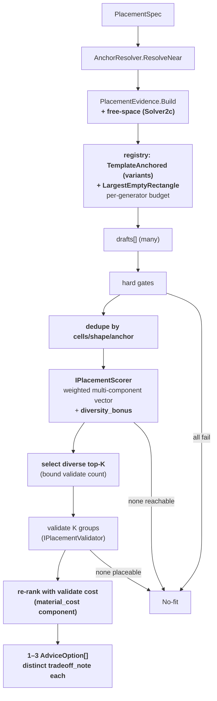

# Placement Solver Solver2 — Implementation Plan

> Implementation plan. Lands **code** in RimBob. No RIMAPI work.
>
> Implements the **Solver2 options** slice of the design in [`placement-solver.md`](placement-solver.md) §5, on top of the **landed Solver1 skeleton** (`5a8e6c9 feat(willie): add placement solver skeleton`). Solver1 detail: [`placement-solver-1.md`](placement-solver-1.md).
>
> Sliced by risk — **gimp one slice at a time**, keep build/tests green between. **No compat code; wipe-and-regen on upgrade** for any persisted solver-trace/option shape (AGENTS Coding rule).
>
> **Worktree port** for live runs: `.\run-rimbob.ps1 -ListenUrl http://127.0.0.1:5101` (5000 reserved for the main checkout).

---

## 0. Motivation

Solver1 ships **one** generator, **one** candidate, **one** score component, **one** option. Solver2 turns that into **bounded competition**: several generators propose drafts, a shared scorer ranks them on a multi-component vector, a diversity-aware selector picks a small validated set, and Willie sees **1–3 meaningfully different** `AdviceOption`s each with its own `tradeoff_note` (design §5, §3.1, §3.2).

The Solver1 pipeline already has the shape Solver2 extends — this plan is mostly *widening* existing seams, plus one correctness fix and one new generator.

### Landed Solver1 reality Solver2 builds on (and must fix)

- **Generator registry seam exists.** `PlacementSolver(IPathCostProbe, IPlacementValidator, IReadOnlyList<IPlacementGenerator>? generators)` defaults to `[new TemplateAnchoredGenerator()]` ([`PlacementSolver.cs:17-27`](../Src/Ministers/Willie/PlacementSolver.cs)). Solver2 injects more generators + raises the budget; the composition root (`Src/ApiHost/Program.cs`) registers the list.
- **Budget is hardcoded** `new(MaxDrafts: 1, MaxSearchRadius: 32)` ([`PlacementSolver.cs:51`](../Src/Ministers/Willie/PlacementSolver.cs)). Solver2 needs `MaxDrafts > 1` and **per-generator** budgets.
- **Scoring is inline in `PlacementSolver`** (`ScoreByPathCostAsync` / `ScoreDraft`, [`PlacementSolver.cs:127-206`](../Src/Ministers/Willie/PlacementSolver.cs)) — single component `freezer_to_kitchen_distance`, fixed `PathCostWeight = 16`, `normalized = 1/(1+rawCost)`. The `-1` design promised an `IPlacementScorer` / `PathCostLookup` seam ("Solver2 swaps the weighted multi-component vector behind this seam without editing `SolveAsync`"); it **did not land** — it was folded inline. Extracting it is Solver2a, before the solver bloats.
- **⚠ Path-cost results are reverse-matched by cell**, not index-aligned ([`PlacementSolver.cs:139-145`](../Src/Ministers/Willie/PlacementSolver.cs): `draft.AccessCells.Contains(result.From) && result.To == draft.SourceAnchor.TargetCell.ToMapCell()`). The `-1` scoring design **explicitly warned against this**: "Results match drafts **by index**, never by reverse-matching cell coordinates (the same access cell can recur across drafts)." Benign at `MaxDrafts:1`/single-anchor; **breaks under Solver2 competition** when two drafts share an access cell or target the same anchor — the wrong cost can bind to the wrong draft. Solver2a fixes this with an index-aligned `PathCostLookup`. **HIGH — correctness.**
- **No dedupe; picks `.First()`; validates 1; emits 1.** ([`PlacementSolver.cs:96-118`](../Src/Ministers/Willie/PlacementSolver.cs)). `PlacementResult.Options` is already `IReadOnlyList<AdviceOption>` — it just only ever holds one today.
- **Evidence precompute = bounds + occupied-cell set + anchors only** ([`PlacementEvidence.cs`](../Src/Ministers/Willie/PlacementEvidence.cs)). No free-space structure → `LargestEmptyRectangleGenerator` (Solver2c) needs new evidence.
- **`MetricValue` landed Ministers-side, string-typed** (`PlacementResult.cs:26-33`, namespace `RimBob.Ministers.Willie`, `string? Unit` / `string Better`), **not** the Core enum-typed primitive the design §3.3 / `-1` Solver1a described. Solver2's multi-component trace builds on the landed string shape; see refactor note R2.

### Shape (Solver2 pipeline — diffs from Solver1 in **bold**)



---

## 1. Slices (gimp independently, in order)

### Solver2a — extract scorer seam + index-aligned path costs  *(REFACTOR — gimp first, behaviour-identical)*

Pays the design-promised seam debt **and** fixes the reverse-match bug before any new behaviour rides on top. Output must be byte-identical to Solver1 for the single-generator/single-draft case (characterization test).

Files (new) — namespace `RimBob.Ministers.Willie`:

- `Src/Ministers/Willie/Placement/IPlacementScorer.cs`
  - `string Id { get; }` (`"walkable_path_cost"`) + `IReadOnlyList<ScoredDraft> Score(IReadOnlyList<PlacementDraft> gatedDrafts, PathCostLookup pathCosts)`.
  - **Pure** — no I/O, no port (mirrors `IPlacementGenerator`). Design §3.2: scorer is the shared authority; generators never score.
- `Src/Ministers/Willie/Placement/WalkablePathCostScorer.cs` — move `ScoreDraft` + the per-draft min-over-reachable logic here verbatim. Keep `freezer_to_kitchen_distance`, weight 16, `1/(1+rawCost)`, `Better=lower`.
- `Src/Ministers/Willie/Placement/PathCostLookup.cs`
  - Pure value wrapping probe results **index-aligned to the request pairs**, plus `bool ProbeAvailable` and a `pairIndex → draftKey` map. Built by `SolveAsync` from `IPathCostProbe.GetPathCostsAsync`; the scorer reads it with **no** cell reverse-matching. **This is the bug fix** — results bind to drafts by index, not by `From`/`To` coordinate equality.
- `Src/Ministers/Willie/Placement/ScoreWeights.cs` — replace the inline `const double PathCostWeight = 16` with a small named weights record (one field now; grows in 2b/2c). No magic constant inline.

Files (modified):

- `Src/Ministers/Willie/PlacementSolver.cs` — `SolveAsync` keeps the probe I/O (builds pairs, calls `GetPathCostsAsync`, wraps into `PathCostLookup` index-aligned), then delegates ranking to the injected `IPlacementScorer`. Remove inline `ScoreByPathCostAsync` / `ScoreDraft` / the cell reverse-match. `ScoredDraft` moves to a shared type (co-locate with the scorer). Ctor gains `IPlacementScorer? scorer = null` → default `WalkablePathCostScorer`.
- `Src/ApiHost/Program.cs` — register `IPlacementScorer` (Singleton) if the default-null ctor path is not used.

Tests (new/updated), `Src/Tests/Willie/`:

- `WalkablePathCostScorerTests.cs` — min over **reachable** pairs; unreachable `cost=0` does **not** win; `!ProbeAvailable` → Manhattan fallback (`tiles`); singleton normalize; **two drafts sharing an access cell get their own index-aligned cost** (the reverse-match regression guard).
- `PlacementSolverTests.cs` — unchanged assertions still pass (characterization: same single option as Solver1).

Risk: **low** (pure extraction) — except the index-align change, which is the point; the regression guard test covers it.

### Solver2b — competition: variants + dedupe + diverse top-K + 1–3 options  *(CORE)*

Files (new):

- `Src/Ministers/Willie/Placement/DraftDedupe.cs`
  - `static IReadOnlyList<PlacementDraft> ByCellsShapeAnchor(IReadOnlyList<PlacementDraft> drafts)` — collapse near-identical footprints (same sorted cell set OR same shape+origin+anchor) keeping the first by a deterministic key. Design §3.4 `dedupe_by_cells_shape_anchor`.
- `Src/Ministers/Willie/Placement/DiverseSelector.cs`
  - `IReadOnlyList<ScoredDraft> SelectTopK(IReadOnlyList<ScoredDraft> ranked, int maxValidate)` — greedy: take best by score, then prefer drafts unlike the chosen set (different `SourceAnchor.RoomId` / orientation / footprint-origin distance) via a `diversity_bonus` re-score. Caps the set handed to validation (`maxValidate`, default 3) so validate-call count is bounded (design §3 open-Q "bound the call count").
  - Emits a `diversity` reason chip per pick (`different_anchor` / `different_orientation` / `only_candidate`).

Files (modified):

- `TemplateAnchoredGenerator.cs` — emit **variants** per anchor, not just first-fit: keep the spiral first-fit, then also yield up to `budget.MaxDrafts` distinct valid placements (different orientation / a few ring offsets), each a separate `PlacementDraft`. Still deterministic ring order, no RNG.
- `PlacementSolver.cs` — `SolveAsync`:
  - per-generator `GenerationBudget` (e.g. `MaxDrafts: 4` template) — pass a budget map, not the single `(1,32)`.
  - insert `DraftDedupe.ByCellsShapeAnchor` after hard gates, before scoring.
  - after scoring, `DiverseSelector.SelectTopK(..., maxValidate)`; **validate each** survivor (loop `IPlacementValidator.ValidateAsync` ≤ K times); drop `!CanPlaceAll`/overlap; **re-rank** survivors (now with `material_cost` from validate `Cost`); take best **1–3**; assemble an `AdviceOption` per survivor.
  - `MaxValidateCount` named constant (bound).
- `WalkablePathCostScorer.cs` → generalize to a **weighted multi-component** vector behind the same `IPlacementScorer` seam: components `adjacency_distance` (existing path-cost), `generator_confidence` (static per generator), `diversity_bonus` (relative to selected set). Each emits a `MetricValue` into the draft trace (design §3.2/§3.3). `material_cost` is added at the post-validate re-rank.
- `PlacementResult.cs` / `PlacementDraftTrace` — allow multiple `Selected` drafts + carry the diversity reason chip. Pre-landing trace shape → **wipe-and-regen, no compat**.

Tests (new):

- `DraftDedupeTests.cs` — identical footprints collapse; distinct tradeoffs survive; deterministic keep order.
- `DiverseSelectorTests.cs` — picks different anchors/orientations over near-duplicates; respects `maxValidate` cap; singleton → `only_candidate`.
- `PlacementSolverTests.cs` — multi-generator fixture → **1–3 distinct** options; validate called ≤ `MaxValidateCount`; all-overlap → no-fit; one valid → one option (Solver1 parity).

Risk: **medium-high.** Diversity + dedupe + bounded validation is the substance of Solver2.

### Solver2c — second generator: `LargestEmptyRectangleGenerator` + free-space evidence  *(BREADTH)*

Files (new):

- `Src/Ministers/Willie/PlacementEvidence.cs` (modified) — add free-space precompute: largest-empty-rectangle / maximal-rectangles over the occupancy+bounds grid (deterministic, pure). Surface `IReadOnlyList<FreeRect> FreeRects { get; }` (or a query `LargestFreeRectNear(MapCell, RectSize min)`). Keep `Build` pure, no client. Cap the scan (map can be 250×250) — document the bound.
  - `// TODO: terrain affordance still absent (rimapi-buildability-layers); free-space is occupancy-only.`
- `Src/Ministers/Willie/Generators/LargestEmptyRectangleGenerator.cs` — `Id => "largest_empty_rect"`. Finds viable rectangular footprints for the room from `evidence.FreeRects`, anchored toward the resolved anchor; emits drafts behind the existing `IPlacementGenerator` seam. Pure given evidence.
- `Src/Ministers/Willie/Placement/ScoreWeights.cs` (modified) — add `expansion_room` weight.

Files (modified):

- `WalkablePathCostScorer.cs` — add `expansion_room` component (free-tiles around the footprint, from evidence), `Better=higher`.
- `Src/ApiHost/Program.cs` — register `LargestEmptyRectangleGenerator` in the injected generator list.

Tests (new):

- `LargestEmptyRectangleGeneratorTests.cs` — fixture grid → finds the largest valid rectangle; respects occupancy; deterministic.
- `PlacementEvidenceFreeSpaceTests.cs` — maximal-rectangle math on canned grids; scan bound honored.
- `PlacementSolverTests.cs` — template vs LER **compete**; the diverse set can contain one of each with different `tradeoff_note`s.

Risk: **medium.** Free-space math is the new substance; the generator rides the existing seam.

> `PatternMatchGenerator` (cooler wall-slot / door-side patterns, §3.1 "Solver2/Solver3") is **optional** for Solver2 — fold a minimal cooler-placement pattern into `FreezerTemplate` variants if cheap, else defer to Solver3.

### Solver2d — multi-option assembly, tradeoff notes, determinism + diversity tests  *(VERIFICATION + ASSEMBLY)*

Files (modified):

- `PlacementSolver.AssembleOption` — derive a **distinct** `tradeoff_note` per option from its **winning** score component (e.g. "Closest to kitchen", "Most room to expand", "Cheapest — fewest materials"). Today the note is a single hardcoded path-cost string ([`PlacementSolver.cs:254`](../Src/Ministers/Willie/PlacementSolver.cs)).

Files (new), `Src/Tests/Willie/`:

- `PlacementDiversityTests.cs` — same spec+snapshot+seed → identical **ordered** 1–3 option set incl. the canonical tie-break total order (pick ONE and doc it; see refactor note R3); emitted options are pairwise distinct (anchor/orientation/origin); each carries its own `tradeoff_note` + winning-component metric.
- `Src/Tests/Willie/Fixtures/` — multi-room / multi-free-rect canned grids.

Risk: **low-med.** Mostly assertions + note wording.

---

## 2. Refactor notes (apply while building; CLAUDE.md "suggest refactors")

- **R1 — scorer seam (Solver2a, required):** inline scoring in `PlacementSolver` is the debt; extract per the `-1` design before adding components. Already the first slice.
- **R2 — `MetricValue` is Ministers-side + string-typed:** design §3.3 / `-1` Solver1a wanted it in `RimBob.Core.Advice` as the generic dashboard primitive with `MetricUnit`/`BetterDirection` enums; it landed in `PlacementResult.cs` (Ministers) with `string? Unit`/`string Better`. **Do not** churn it in Solver2 (no dashboard consumer yet) — flag for the dashboard-panel slice (design §7) to move it to Core + enum-type the unit/direction. Note in plan, don't fix.
- **R3 — tie-break order drift:** landed solver ranks `RawCost → GeneratorId → minX → minZ` ([`PlacementSolver.cs:96-101`](../Src/Ministers/Willie/PlacementSolver.cs)); design §3.4 / `-1` said `cost → RoomId → origin → GeneratorId`. With multi-anchor competition the order matters for determinism. Pick **one** canonical total order in Solver2b, doc it in `IPlacementScorer`, assert it in 2d.
- **R4 — `MaxSearchRadius: 32` on a 250×250 map:** fine for first-fit near an anchor; revisit once LER provides better seeding so the template scan does not dominate cost.

---

## 3. Keep-green (every slice)

- Sync worktree with `master` before any verification build.
- `dotnet build Src/RimBob.sln`; `dotnet test Src/Tests/RimBob.Tests.csproj`.
- `.\run-rimbob.ps1 -ListenUrl http://127.0.0.1:5101` for any live smoke; verify `/api/system/health`.

---

## 4. Out of scope (later slices / separate plans)

- **Willie Rules wiring** that *calls* `SolveAsync` on an active `building_request` — Rules-slice follow-up (TODOs at `Rules.cs:125` / `Rules.cs:170`), not Solver2.
- **Group `place` (Apply write)** — bundles with the Assisted Apply path.
- **Solver3** — more room classes (hospital/bedroom/workshop), `ReuseExistingFootprintGenerator`, `ConstrainedGrowthGenerator`, richer build-order safety, terrain/reachability evidence, full `PatternMatchGenerator`.
- **Dashboard solver-trace panel** + the `MetricValue`→Core move (R2) — design §7.
- **Anchor-quality upgrade** (`EntryCells`/`RegionId` once their RIMAPI endpoints land) — improves target cells, not a Solver2 contract change.

---

## 5. Verification (per slice, before commit)

- 2a: scorer/solver tests green; **single-generator output identical to Solver1** (characterization); reverse-match regression guard green.
- 2b: multi-generator fixture → 1–3 distinct options; dedupe + diversity + validate-count cap proven; Solver1 single-option parity preserved.
- 2c: template vs LER compete in one diverse set; free-space math tests green; evidence scan bounded.
- 2d: determinism (same inputs → same ordered options) + per-option distinct `tradeoff_note` + winning-component metric in trace.

---

## 6. HumanTodo capture (append in same commit as this plan)

```
- [ ] placement-solver-2 [2026-05-29] #construction #willie #solver Implementation plan for Placement Solver Solver2: extract IPlacementScorer seam + index-aligned PathCostLookup (fixes reverse-match bug) (2a), per-generator budgets + template variants + dedupe + diverse top-K + 1-3 options (2b), LargestEmptyRectangleGenerator + free-space evidence + expansion_room component (2c), multi-option tradeoff notes + determinism/diversity tests (2d). Bounded competition on the landed Solver1 skeleton (5a8e6c9). [plan](.plans/placement-solver-2.md)
```
