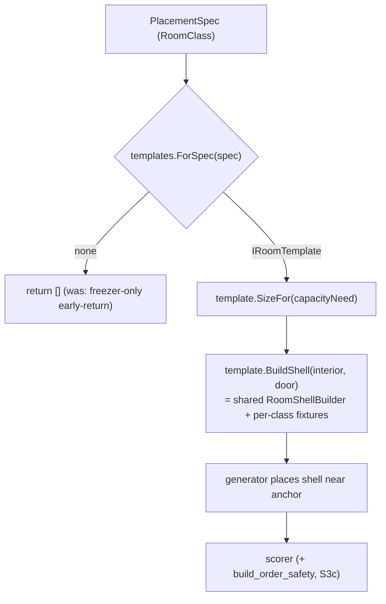

# Placement Solver 3 — Room-Class Breadth

> Implementation plan. Lands **code** in RimBob. No RIMAPI work.
>
> Solver1 (`5a8e6c9`) + Solver2 (`9f6fe90..0e86f5f`) ship a **freezer-only** solver: both generators
> ([`TemplateAnchoredGenerator.cs:18`](../Src/Ministers/Willie/Generators/TemplateAnchoredGenerator.cs),
> [`LargestEmptyRectangleGenerator.cs:19`](../Src/Ministers/Willie/Generators/LargestEmptyRectangleGenerator.cs))
> early-return on non-freezer, and `FreezerTemplate` is called as a **concrete static** with a hardcoded cooler shell.
> Solver3 = design §"Solver3 breadth" ([`placement-solver.md:265`](placement-solver.md)): **more room classes**
> (hospital, bedroom, workshop, storage), `ReuseExistingFootprintGenerator`, richer build-order safety, and the
> `RoomClass` alias map. This makes `SolveAsync` produce options for non-freezer rooms.
>
> **No compat code; wipe-and-regen on upgrade** for any persisted advice/option/trace shape.
> Worktree port: `.\run-rimbob.ps1 -ListenUrl http://127.0.0.1:5101`.

---

## 0. Motivation + the design crux

Today the freezer coupling is baked into two places:

1. **Generators** branch on `spec.RoomClass != Freezer && spec.TargetClass != Freezer` and then call
   `FreezerTemplate.SizeFor` / `FreezerTemplate.BuildShell` directly. Adding a room class means editing every generator.
2. **`FreezerTemplate.BuildShell`** mixes **generic room geometry** (border walls, door, floor, access cell —
   [`FreezerTemplate.cs:23-61`](../Src/Ministers/Willie/Placement/FreezerTemplate.cs)) with **freezer specifics** (the
   `Cooler` on the opposite wall, `Concrete` floor). Hospital/bedroom/workshop reuse ~80% of that geometry but swap the
   interior fixtures and floor.

**Decision: extract an `IRoomTemplate` seam + a shared shell-geometry builder first (S3a), then add room classes behind
it (S3b).** Generators resolve a template by `RoomClass` from an injected set instead of hardcoding `FreezerTemplate`;
the freezer-only early-return becomes "no template for this room class -> return []". This keeps the generators
room-class-agnostic and lets each template own its own fixtures.

**Reachability caveat — Solver3 is solver-internal breadth.** The orchestrator only calls `SolveAsync` on
`freezer_request_active` (willie-placement-wiring W1). Non-freezer rooms (`MissingRoomDecision`,
[`Rules.cs:152-173`](../Src/Ministers/Willie/Rules.cs)) stay prose until a **second wiring pass** routes missing-room
traces into the solver — explicitly out of scope here and in
[`willie-placement-wiring.md:83`](willie-placement-wiring.md). Solver3 is validated by **solver-level tests** (hospital
spec -> options) and live freezer regression, not by live hospital options. State this loudly so nobody expects live
hospital advice after S3b lands.



---

## 1. Slices

### S3a — `IRoomTemplate` seam + shared shell geometry  *(REFACTOR, behavior-identical)*

Goal: zero behavior change for freezer; remove the freezer coupling so S3b is additive.

Files (new), `Src/Ministers/Willie/Placement/`:

- `IRoomTemplate.cs` — `RoomClass RoomClass { get; }`, `RectSize? SizeFor(CapacityNeed? need)`,
  `RoomShell BuildShell(RectSize interior, DoorSide door)`, `string Label { get; }`.
- `RoomShellBuilder.cs` — extract the **generic** geometry currently inside `FreezerTemplate`: border-wall loop, door
  cell + rotation, floor fill, `AccessCell`/`EdgeCenter`/`Opposite`/`RotationFor`. Parameterized by floor def + an
  optional list of "fixture" `TemplateAsset`s (relative cells) so a template adds its cooler/bed/bench on top.
- `RoomTemplateSet.cs` — `IRoomTemplate? ForSpec(PlacementSpec spec)`: resolve by `spec.RoomClass`; if null, map
  `spec.TargetClass` (`BuildingClass.Freezer -> RoomClass.Freezer`) so a `target_class=freezer, room_class=null` request
  still matches (preserves current `||` behavior). Backed by an injected `IReadOnlyList<IRoomTemplate>`.

Files (modified):

- `Src/Ministers/Willie/Placement/FreezerTemplate.cs` — becomes `sealed class FreezerTemplate : IRoomTemplate`;
  `BuildShell` delegates to `RoomShellBuilder` for walls/door/floor and adds the `Cooler` fixture + `Concrete` floor.
  `SizeFor` logic unchanged (FoodUnits, 8/tile, min 16). Keep static call-site compatibility **only if** trivial;
  otherwise update the two generators (next bullet).
- `Src/Ministers/Willie/Generators/TemplateAnchoredGenerator.cs` +
  `Src/Ministers/Willie/Generators/LargestEmptyRectangleGenerator.cs` — ctor-inject `RoomTemplateSet`; replace the
  freezer-only early-return + `FreezerTemplate.SizeFor`/`BuildShell` statics with
  `var template = templates.ForSpec(spec); if (template is null) return [];` then `template.SizeFor` / `template.BuildShell`.
  `LabelFor` -> `template.Label`.
- `Src/ApiHost/Program.cs` — register `IReadOnlyList<IRoomTemplate>` (FreezerTemplate only, this slice) + `RoomTemplateSet`
  near the generator registration ([`Program.cs:70-75`](../Src/ApiHost/Program.cs)). Generators now resolve via DI.

Tests:

- Existing [`FreezerTemplateTests.cs`](../Src/Tests/Willie/FreezerTemplateTests.cs),
  [`TemplateAnchoredGeneratorTests.cs`](../Src/Tests/Willie/TemplateAnchoredGeneratorTests.cs),
  [`LargestEmptyRectangleGeneratorTests.cs`](../Src/Tests/Willie/LargestEmptyRectangleGeneratorTests.cs),
  [`PlacementDeterminismTests.cs`](../Src/Tests/Willie/PlacementDeterminismTests.cs) **must stay green unchanged** — this
  is the behavior-identical contract. Adjust only construction (inject `RoomTemplateSet`) if the ctor changes.
- New `RoomTemplateSetTests.cs` — `ForSpec` resolves freezer by `RoomClass`, by `TargetClass` fallback, and returns null
  for an unregistered class.

Risk: **medium.** Pure refactor across two generators + DI, but the shell-geometry extraction is fiddly; the freezer
golden tests are the guardrail.

### S3b — hospital / bedroom / workshop / storage templates + capacity sizing + alias map  *(CORE breadth)*

Files (new), `Src/Ministers/Willie/Placement/Templates/`:

- One `IRoomTemplate` per class: `HospitalTemplate`, `BedroomTemplate`, `WorkshopTemplate`, `StorageTemplate`.
  Each reuses `RoomShellBuilder` and supplies its own fixtures + floor:
  - Hospital — N medical-bed footprints (1x2) along a wall with a walkway; sterile-ish floor; `CapacityMeasure.Beds`.
  - Bedroom — 1 bed + small interior; `Occupants`/`Beds`; bigger interior than the bed for mood.
  - Workshop — N benches (~2x4 each) + work/stand cells; `WorkSlots`.
  - Storage — shelves/stockpile cells; `StorageStacks` (MVP 1 tile/stack).
- `CapacitySizing.cs` (or per-template) — `RectSize SizeFor(CapacityMeasure, double? amount)` heuristics with a sane
  default per class when `amount` is null. **Deterministic, explainable, no RNG.** Numbers tuned to RimWorld defaults
  (medical bed 1x2, simple bench 2x4, etc.) — leave exact constants to the implementer with a `// tune:` comment.

Files (modified):

- `Src/Ministers/Willie/Placement/AnchorResolver.cs` — resolve the TODO at
  [`AnchorResolver.cs:58`](../Src/Ministers/Willie/Placement/AnchorResolver.cs): add a small static **alias map**
  (`medbay`/`infirmary` -> Hospital, `fridge`/`cooler` -> Freezer, `shop`/`craftroom` -> Workshop, `lab` -> Research,
  `bunks` -> Barracks, `pantry` -> Storage, ...) consulted in `ParseRoomClass` after the exact normalized-enum match
  fails. Keep it short + documented; do not invent classes outside the `RoomClass` enum
  ([`FlagRequests.cs:155-170`](../Src/Common/Advice/FlagRequests.cs)).
- `Src/ApiHost/Program.cs` — register the four new `IRoomTemplate` impls into the `IReadOnlyList<IRoomTemplate>`.

Tests:

- `RoomTemplateBreadthTests.cs` — for each new class: `SizeFor` returns sane footprint for a typical `capacity_need` and
  for null; `BuildShell` produces a walled+doored shell with the expected fixtures; null for the wrong `CapacityMeasure`.
- Extend [`PlacementSolverTests.cs`](../Src/Tests/Willie/PlacementSolverTests.cs) — `SolveAsync` with a **hospital** spec
  + a hospital `near` anchor (fake ports) -> `Options.Count >= 1`, options carry the hospital footprint. Mirrors the
  freezer happy-path test. (Solver-level; not orchestrator-wired.)
- Extend [`AnchorResolverTests.cs`](../Src/Tests/Willie/AnchorResolverTests.cs) — alias `near medbay` resolves to a
  Hospital anchor.

Risk: **medium.** New templates + sizing heuristics; the per-class fixture geometry is the bulk of the work. Alias map is
trivial. Reuses S3a's builder so each template is small.

### S3c — `build_order_safety` score component  *(POLISH)*

Files (modified):

- `Src/Ministers/Willie/Placement/ScoreWeights.cs` — add `double BuildOrderSafety` to the record + `Default`
  ([`ScoreWeights.cs:10-15`](../Src/Ministers/Willie/Placement/ScoreWeights.cs)). **Wipe-and-regen** any persisted weight
  shape (no compat).
- `Src/Ministers/Willie/Placement/WalkablePathCostScorer.cs` — add a `build_order_safety` `MetricValue` (design §scoring,
  [`placement-solver.md:204`](placement-solver.md)). **Cheap heuristic only** (full sealed-region analysis needs RIMAPI
  region data — out of scope): penalize a candidate whose footprint touches the map edge or whose access cells sit in a
  near-occupied neighborhood (proxy for "about to be walled off"), reusing `PlacementEvidence` occupancy + the existing
  reachability result. Document the heuristic + its limits in the metric's `Better`/notes.

Tests:

- Extend [`WalkablePathCostScorerTests.cs`](../Src/Tests/Willie/WalkablePathCostScorerTests.cs) — a candidate against the
  map edge scores lower on `build_order_safety` than an interior candidate, all else equal; metric is present + weighted.

Risk: **low.** Additive scorer component; freezer determinism tests pin the ordering — expect to re-bless golden order if
the new weight shifts ties (see Solver2 R3 tie-break note).

### S3d — `ReuseExistingFootprintGenerator`  *(STRETCH — RIMAPI-evidence-gated)*

Design §generator registry ([`placement-solver.md:134`](placement-solver.md)): "repairs, replaces, expands, or
repurposes existing rooms before proposing new footprint sprawl."

**Blocker to confirm first:** current evidence is too thin for a real reuse generator —
`BuildingRecord.Position` is point-approx ([`PlacementEvidence.cs:41`](../Src/Ministers/Willie/PlacementEvidence.cs)),
`FreeRects` are occupancy-only, and `WillieRoomAnchor.EntryCells`/`RegionId` are RIMAPI stubs
([`placement-solver.md:308`](placement-solver.md)). Without room-footprint cells there is nothing to "expand."

Recommended split:

- **If** anchor evidence exposes room cells (CellsCount + a usable footprint): ship a **thin** version that proposes
  *expanding an under-capacity same-class room* (extend the existing rectangle toward adjacent free space) and nothing
  else. Repair/replace/repurpose deferred.
- **Else** (likely today): **defer S3d to a follow-up** gated on `rimapi-room-footprints`; do not stub a generator that
  can't see footprints. Land S3a–S3c, leave S3d as the named next slice.

Files (new, only if unblocked): `Src/Ministers/Willie/Generators/ReuseExistingFootprintGenerator.cs` (+ Program.cs
registration + tests). Risk: **high** — call the blocker before writing code.

---

## 2. Keep-green (every slice)

- Sync worktree with `master`; `dotnet build Src/RimBob.sln`; `dotnet test Src/Tests/RimBob.Tests.csproj`.
- S3a is the load-bearing one: the freezer generator/template/determinism golden tests must pass **unchanged** to prove
  behavior-identical.
- Live smoke on `:5101`: post a Willie freezer `building_request`, confirm options still render (freezer regression).
  New room classes are **not** live-reachable yet (no missing-room wiring) — verify via solver-level tests instead.

---

## 3. Out of scope

- **Missing-room -> solver wiring** (routing `MissingRoomDecision` traces into `SolveAsync`) — the second wiring pass;
  belongs in a follow-up to [`willie-placement-wiring.md`](willie-placement-wiring.md), not the solver.
- **`material_bottleneck` re-route / no-fit advice-routing** — advice-layer concern, deferred in willie-placement-wiring §3.
- **Better anchor/room detection at the RIMAPI layer** (`EntryCells`/`RegionId` population) — RIMAPI work; this plan only
  adds the RimBob-side `RoomClass` alias map.
- **Full sealed-region / unreachable-tile analysis** for build-order safety — needs RIMAPI region data; S3c ships a cheap
  proxy only.
- **`PatternMatchGenerator` / `ConstrainedGrowthGenerator`** (design Solver3 registry rows) — separate generators;
  revisit after S3a–S3c prove the room-class breadth.

---

## 4. Verification (per slice)

- S3a: freezer golden tests green unchanged; `RoomTemplateSet.ForSpec` resolves freezer by RoomClass + TargetClass
  fallback; generators no longer reference `FreezerTemplate` statically.
- S3b: `SolveAsync` with a hospital spec -> options; each new template builds a valid shell; `near medbay` alias resolves.
- S3c: `build_order_safety` metric present + weighted; edge candidate penalized; determinism re-blessed if order shifts.
- S3d: blocker call recorded; if shipped, expand-only reuse generator green; else deferred slice named.

---

## 5. HumanTodo capture (append in same commit as this plan)

```
- [ ] placement-solver-3 [2026-05-29] #construction #willie #solver Room-class breadth for the Placement Solver: extract IRoomTemplate seam + shared shell geometry behind FreezerTemplate (S3a, behavior-identical), add hospital/bedroom/workshop/storage templates + per-measure capacity sizing + RoomClass alias map (S3b), build_order_safety score component (S3c), ReuseExistingFootprintGenerator (S3d, RIMAPI-evidence-gated — confirm blocker first). Solver-internal breadth; missing-room orchestrator wiring is a separate pass. [plan](.plans/placement-solver-3.md)
```
