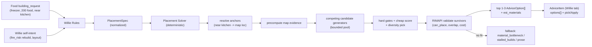

# Placement Solver - Plan

> Agent-created **design doc**. Lands in **RimBob** (Willie minister side), not
> RIMAPI. Deterministic component; **no LLM**. Turns a structured build spec
> into validated, pickable layout options for Willie.
>
> **Impl plan + landed-reality deltas:** [`placement-solver-1.md`](placement-solver-1.md)
> (Solver1 skeleton). This design was written pre-landing; where the two differ,
> the impl plan reflects current code.

---

## 0. Purpose

The **Placement Solver** is the deterministic engine that computes *where and how*
to build. It exists because the minister LLM must **not** author exact cells
(see [`willie-advice-schema.md`](willie-advice-schema.md) section 7.1: a simple
LLM cannot reliably emit per-cell placement, and `advice.md` forbids the LLM
picking payloads/target ids).

Key decision: **`building_request`s are processed directly by the Placement
Solver.** They are already structured ([`willie-request-taxonomy.md`](willie-request-taxonomy.md)
section 1a carries `target_class`, `room_class`, `capacity_need`, `adjacency`,
`power`, `temperature`, `materials_on_hand`, `deadline`, etc.), so no LLM
translation step is needed. Consequence: **request-driven build advice is a
deterministic rules-path** (Slice-A, no LLM escalation for the common case). The
LLM is reserved for genuine judgment (ambiguous tradeoffs), exactly as the
cabinet design wants.



---

## 1. Inputs / outputs

- **Input:** a `PlacementSpec` (normalized). A `BuildingRequest` maps to it
  ~1:1; a `WillieBuildIntent.build_intent` (self-originated Willie advice) maps
  to the same shape.
- **Output:** 1-3 `AdviceOption`s (each = `blueprint_group` + `est_materials` +
  `tradeoff_note`) attached to a Willie `AdviceItem`, rendered in **Willie's
  dashboard scope** (advice-schema section 7.2). If nothing fits, emit a
  non-placement advice instead (material bottleneck / blocked / prose with a
  flag).
- **Internal candidate pool:** larger than the emitted options. Several bounded
  candidate generators compete for best score; the shared solver gates, scores,
  dedupes, validates, and emits only the best diverse 1-3 options. Generators do
  not get private validation or private scoring rules.

---

## 2. `PlacementSpec` (normalized input)

One shape both `BuildingRequest` and `build_intent` collapse into, so the solver
has a single entry contract:

| field | from BuildingRequest | meaning |
|---|---|---|
| `target_class` | `target_class` | what to build (closed `BuildingClass`) |
| `room_class?` | `room_class` | functional room, if any |
| `capacity_need?` | `capacity_need` | sizing driver (`{food_units,200}`, `{beds,4}`) |
| `adjacency[]` | `adjacency` | semantic anchors (`near kitchen`, `away_from bedroom`) |
| `power?` / `temperature?` | same | implied power draw / thermal band |
| `constraints[]` | derived (no request field) | `double_wall`, `fire_safe_material`, etc. — derived from `room_class`/intent; `BuildingRequest` carries no `constraints` |
| `materials_on_hand?` | `materials_on_hand` | affordability hint |
| `deadline?` / `priority?` | same | urgency |
| `source` | `requested_from` | requester (for cross-link + `concern` mapping); no `source_minister` flag exists on `BuildingRequest` |

`concern` of the emitted advice comes from the request-to-concern mapping already
in [`willie-request-taxonomy.md`](willie-request-taxonomy.md) section 3
(freezer -> `thermal_control`, hospital -> `functional_rooms`, etc.).

---

## 3. Pipeline (per spec)

1. **Anchor resolution** - turn semantic `near:[kitchen]` into a real map
   location: find the matching room/building (kitchen room centroid, nearest
   food stockpile). Needs room/building reads + room-purpose inference.
2. **Sizing** - `capacity_need` -> footprint via templates (200 `food_units` ->
   roughly 5x5 freezer; `beds:4` -> barracks size). Honor `constraints`
   (`double_wall` -> 2-thick walls).
3. **Evidence precompute** - build shared grid facts used by all generators:
   occupancy, terrain affordance, roof/support, danger/fire risk, room/building
   anchors, conduit/power distance, stockpile/kitchen/freezer distance, and known
   expansion blockers.
4. **Candidate generation** - run a bounded generator registry. Each generator
   produces draft `blueprint_group` candidates with `generator_id`, source
   anchors, assumptions, and a reason summary. The pool may contain many drafts;
   the public output remains the best 1-3 options.
5. **Hard gates + cheap scoring** - reject impossible drafts before any RIMAPI
   call, compute the shared score vector, dedupe near-identical footprints, and
   select a small diverse survivor set for expensive validation.
6. **Validation** - call the RIMAPI `blueprint-group/validate`
   ([`rimapi-blueprint-groups-and-planning-overlay.md`](rimapi-blueprint-groups-and-planning-overlay.md)
   Capability A.1) for survivors; drop `!can_place` / overlapping; re-rank with
   validate results and keep the best diverse 1-3.
7. **Costing/readiness** - aggregate per-asset `cost[]` from validate into
   `est_materials`; compare to `materials_on_hand`. Keep `draftable`,
   `placement_valid`, `materials_ready`, and `apply_ready` separate.
8. **Assembly** - build `AdviceOption[]` (id, label, summary, blueprint_group,
   est_materials, tradeoff_note) into an `AdviceItem` with the mapped `concern`,
   Willie scope.
9. **No-fit fallback** - no valid placement: emit `material_bottleneck` (can't
   afford), `stalled_builds` (no space/blocked), or prose advice ("clear space
   near the kitchen first") + a flag back to the requester if needed.

### 3.1 Candidate generator registry

Generators are proposal sources, not authorities. They must emit deterministic
drafts and explain why each draft exists. The shared solver owns gates, scoring,
validation, dedupe, and final option selection.

| Generator | First use | Notes |
|---|---|---|
| `TemplateAnchoredGenerator` | Solver1 | Baseline freezer/room templates near resolved anchors. Boring, explainable, and first to ship. |
| `LargestEmptyRectangleGenerator` | Solver2 | Finds viable rectangular footprints for rooms and expansion space. |
| `MaximalEmptyRegionGenerator` | Solver3 | Maintains richer free-space candidates when the base is irregular. |
| `PatternMatchGenerator` | Solver2/Solver3 | Cooler wall slots, door-side patterns, turbine clearance, conduit reach, and local defense/build lint. |
| `ConstrainedGrowthGenerator` | Solver3 | Grows a room/cluster from anchors when a fixed rectangle is too rigid. |
| `ReuseExistingFootprintGenerator` | Solver3 | Repairs, replaces, expands, or repurposes existing rooms before proposing new footprint sprawl. |
| `LocalCpSatGenerator` | Future | Exact local packing for small pruned sets only; never whole-map brute force. |
| `WfcVariantGenerator` | Future spike | Internal-layout variant source inside an already-bounded region; never the core solver spine. |

### 3.2 Shared scoring vector

Use one score vector for every generator output. Keep individual components in
the trace so the dashboard can explain wins and losses.

```pseudo
score(candidate):
    reject if out_of_bounds
    reject if terrain_affordance_invalid
    reject if occupied_or_reserved
    reject if blocks_required_path
    reject if violates_room_or_power_hard_rule

    return weighted_sum(
        request_fit,
        adjacency_distance,
        path_cost,
        power_access,
        temperature_fit,
        material_cost,
        fire_risk,
        defense_exposure,
        expansion_room,
        build_order_safety,
        generator_confidence,
        diversity_bonus)
```

Material shortage should block `apply_ready`, not hide a good layout candidate.
A draft can be worth showing when it is `placement_valid` but not yet
`materials_ready`, as long as the option label and tradeoff note make that clear.

### 3.3 Metric value trace

Every score component should carry the measured value where one exists, its unit,
the normalized 0-1 ranking value, the active weight, and the final contribution.
The raw value explains the world; the normalized value explains why the candidate
won or lost.

```pseudo
MetricValue {
    id: "freezer_to_kitchen_distance",
    raw_value: 18,
    unit: "tiles",
    normalized: 0.72,
    weight: 16,
    contribution: 11.52,
    better: "lower"
}
```

Use explicit units for measured facts and enum/bool values for status facts:

| Metric family | Example metrics | Unit / value shape |
|---|---|---|
| Distance | `adjacency_distance`, `freezer_to_kitchen_distance`, `storage_to_workbench_distance`, `hospital_to_defense_entry_distance` | `tiles` |
| Pathing | `path_cost`, `named_loop_cost`, `blocked_path_cost` | `path_tiles` or `estimated_ticks` |
| Capacity | `capacity_fit`, `food_capacity`, `bed_capacity`, `storage_capacity`, `work_slots` | `tiles`, `nutrition`, `beds`, `stacks`, `work_slots` |
| Power | `power_access`, `power_stability`, `battery_margin` | `tiles_to_conduit`, `watts`, `battery_watt_days` |
| Temperature | `temperature_fit`, `freezer_target_delta`, `cooler_exhaust_heat` | `celsius`, `degrees_over_target`, `target_band` |
| Materials | `material_cost`, `missing_materials`, `material_flow` | item counts by def (`steel`, `components`, `stone_blocks`), `tiles_to_stockpile` |
| Fire | `critical_room_wood_wall_ratio`, `flammable_floor_ratio`, `nearest_structure_gap` | `percent`, `gap_tiles` |
| Defense exposure | `critical_room_depth_from_perimeter`, `hostile_line_exposure`, `enemy_cover_debt` | `tiles`, `hostile_line_tiles`, `cover_cells` |
| Expansion/topology | `expansion_room`, `primary_circulation_spine`, `main_path_branch_count`, `door_layers` | `free_tiles`, `rect_width`, `rect_height`, `branch_count`, `door_layers` |
| Room quality | `room_size`, `cleanliness`, `impressiveness`, `roof_coverage` | `room_tiles`, game stat value, `percent` |
| Terrain/roof | `terrain_risk`, `bridge_tiles_needed`, `mountain_roof_exposure` | `blocked_tiles`, `bridge_tiles`, `roof_risk_tiles` |
| Build order | `build_order_safety`, `unreachable_tiles`, `sealed_regions`, `prerequisites` | `unreachable_tiles`, `sealed_region_count`, `prerequisite_count` |
| Wealth/phase | `wealth_discipline`, `colony_phase_fit` | `silver_value`, `wealth_delta`, `days_since_landing`, `colonist_count` |
| Confidence/uncertainty | `generator_confidence`, `uncertainty_penalty`, `missing_data_coverage` | normalized score, `missing_fields_count`, `stale_input_percent` |

Do not force units onto values that are naturally booleans or enums:
`draftable`, `placement_valid`, `materials_ready`, `apply_ready`,
`rimapi_validation_status`, and hard-gate reasons should stay typed status
fields. `request_fit` and `diversity_bonus` can be normalized scores, but should
also carry reason chips such as `different_anchor`, `different_orientation`, or
`matched_capacity_need`.

### 3.4 Solver pseudocode

```pseudo
solve(spec, snapshot):
    anchors = resolve_anchors(spec, snapshot)
    evidence = precompute_map_evidence(snapshot, anchors)
    drafts = []

    for generator in generator_registry.for_spec(spec):
        drafts += generator.generate(spec, evidence, budget_for(generator))

    unique_drafts = dedupe_by_cells_shape_anchor(drafts)
    cheap_survivors = hard_gate_and_score(unique_drafts, evidence)
    validation_batch = select_diverse_top_k(cheap_survivors, max_validate_count)

    validated = validate_blueprint_groups(validation_batch)
    final_candidates = rank_with_validation_results(validated)

    return top_options(final_candidates, max_options = 3)
```

---

## 4. Where it lives / dependencies

- The solver does **I/O** (live map reads + RIMAPI validate calls), so it is **not
  pure domain** (repo rule: pure domain projects take no external deps). Pure
  packing/anchor math can be a testable helper; orchestration is service-side.
- Likely: `Src/Ministers/Willie/PlacementSolver.cs` (orchestration via
  `RimApiClient` + the RIMAPI blueprint-group client) + pure layout helpers. The
  Willie `Rules.cs` calls it when an active `building_request` is present.
- Candidate generators should be small pluggable services over the same
  `PlacementSpec` + precomputed evidence. They should be easy to fixture-test
  independently and cheap to disable when a generator produces noisy drafts.
- **Depends on:**
  - Fork blueprint-group `validate`/`place` (rimapi-groups Capability A) -
    **required**.
  - Building/room/terrain reads + room-purpose inference
    (`source-todo-building-condition-read`; room detection - a real sub-problem).
  - Schema landing **S2** (typed `building_requests` exist) + the advice
    `options[]`/`blueprint_group` types (S1).

---

## 5. Slicing

| Slice | Scope |
|---|---|
| **Solver1 skeleton** | One `room_class` (freezer), one anchor (near kitchen), `TemplateAnchoredGenerator` only, **one** candidate (not 3), rectangular shell + 1 cooler, RIMAPI-validate, single option. Proves the pipeline end-to-end while establishing the generator registry/trace shape. |
| **Solver2 options** | Add bounded competition: template variants + `LargestEmptyRectangleGenerator` + local `PatternMatchGenerator` where useful. Emit 1-3 diverse options with shared score components and `tradeoff_note`s. |
| **Solver3 breadth** | More room classes (hospital, bedroom, workshop), better anchor/room detection, `ReuseExistingFootprintGenerator`, no-fit fallbacks, and richer build-order safety. |
| **Solver4 (future)** | Whole-base planning outline driving the planning overlay (rimapi-groups Capability B). Local CP-SAT and WFC stay optional generator experiments after the basic solver proves value. |

---

## 6. Determinism + tests

Pure packing/anchor math is unit-tested with **map-grid fixtures** (input spec +
canned map -> expected footprints). The RIMAPI `validate` call is the only I/O -
mock it in tests. Same fixture discipline as ministers
(`Src/Tests/Willie/Fixtures/`).

Generator tests should cover:

- Same spec + same snapshot + same seed produces the same draft set.
- Generator budgets cap output before validation.
- Dedupe removes near-identical drafts without hiding distinct tradeoffs.
- Score components explain why the winning candidate beat the losers.
- Invalid generator outputs are rejected by the shared gates or RIMAPI validation.

If proposal, option, or solver-trace persistence/wire shapes change, use **no
compat code; wipe-and-regen on upgrade.**

---

## 7. Dashboard

- **Willie tab:** the emitted `AdviceItem` renders its `options[]` picker + Apply
  (advice-schema section 7.2). Requesters' tabs show only their outbound request.
- **Inspectability:** the solver trace should be visible in Willie's Rules/debug
  view, matching the "dashboard is an inspection surface" rule.
- Show `generator_id`, hard-gate rejection reason, metric trace rows
  (`raw_value`, `unit`, `normalized`, `weight`, `contribution`, `better`),
  validation status, readiness booleans (`draftable`, `placement_valid`,
  `materials_ready`, `apply_ready`), and the final diversity reason for each
  emitted option.

---

## 8. Open questions

- [x] **Anchor/room detection.** Resolved for Solver1: `WillieBriefing.AnchorInventory`
      ships room anchors from the briefing derivation, so `near:kitchen` filters by
      `RoomClass`. Not a Solver1 gate anymore. Remaining gap: `EntryCells`/`RegionId`
      are stubs until their RIMAPI endpoints land, so target cell falls back to
      `Centroid` (target-quality, not a blocker).
- [x] **Packing approach.** Use competing bounded generators behind one shared
      validator/scorer. Start with templates; add rectangle and pattern
      generators before heavier algorithms.
- [ ] **Generator budgets/diversity.** What per-generator caps and diversity
      thresholds keep validation cheap while still producing meaningfully
      different options?
- [ ] **When does it run?** Per cabinet cycle, or on-demand when a
      `building_request` appears? Each candidate costs RIMAPI `validate` calls at
      frame cadence - bound the call count.
- [ ] **Supersession.** Re-run on map change / stale options - does a
      not-yet-applied option survive a fresh snapshot? (ties to advice-schema Q5).
- [ ] **Affordability vs placement order.** If `materials_on_hand` can't cover
      any candidate, prefer `material_bottleneck` over offering an unbuildable
      option - confirm the precedence.
