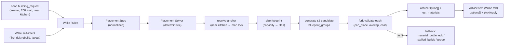

# Placement Solver — Plan

> Agent-created plan. Lands in **RimBob** (Construction minister side), not the
> RIMAPI fork. Deterministic component; **no LLM**. Turns a structured build spec
> into validated, pickable layout options for Willie (Minister of Construction).

---

## 0. Purpose

The **Placement Solver** is the deterministic engine that computes *where and how*
to build. It exists because the minister LLM must **not** author exact cells
(see [`basie-advice-schema.md`](basie-advice-schema.md) §7.1: a simple LLM cannot
reliably emit per-cell placement, and `advice.md` forbids the LLM picking
payloads/target ids).

Key decision: **`building_request`s are processed directly by the Placement
Solver.** They are already structured ([`basie-request-taxonomy.md`](basie-request-taxonomy.md)
§1a carries `target_class`, `room_class`, `capacity_need`, `adjacency`, `power`,
`temperature`, `materials_on_hand`, `deadline`…), so no LLM translation step is
needed. Consequence: **request-driven build advice is a deterministic rules-path**
(Slice-A, no LLM escalation for the common case). The LLM is reserved for
genuine judgment (ambiguous tradeoffs), exactly as the cabinet design wants.

---

## 1. Inputs / outputs

- **Input:** a `PlacementSpec` (normalized). A `BuildingRequest` maps to it
  ~1:1; a `ConstructionIntent.build_intent` (self-originated Willie advice) maps
  to the same shape.
- **Output:** 1–3 `AdviceOption`s (each = `blueprint_group` + `est_materials` +
  `tradeoff_note`) attached to a Willie `AdviceItem`, rendered in **Willie's
  dashboard scope** (advice-schema §7.2). If nothing fits → a non-placement
  advice instead (material bottleneck / blocked / prose with a flag).

---

## 2. `PlacementSpec` (normalized input)

One shape both `BuildingRequest` and `build_intent` collapse into, so the solver
has a single entry contract:

| field | from BuildingRequest | meaning |
|---|---|---|
| `target_class` | `target_class` | what to build (closed `BuildingClass`) |
| `room_class?` | `room_class` | functional room, if any |
| `capacity_need?` | `capacity_need` | sizing driver (`{food_units,200}`, `{beds,4}`) |
| `adjacency[]` | `adjacency` | semantic anchors (`near kitchen`, `away_from bedroom`) |
| `power?` / `temperature?` | same | implied power draw / thermal band |
| `constraints[]` | (intent) / derived | `double_wall`, `fire_safe_material`, … |
| `materials_on_hand?` | `materials_on_hand` | affordability hint |
| `deadline?` / `priority?` | same | urgency |
| `source` | `requested_from` + flag `source_minister` | requester (for cross-link + `concern` mapping) |

`concern` of the emitted advice comes from the request→concern mapping already
in [`basie-request-taxonomy.md`](basie-request-taxonomy.md) §3 (freezer →
`thermal_control`, hospital → `functional_rooms`, …).

---

## 3. Pipeline (per spec)

1. **Anchor resolution** — turn semantic `near:[kitchen]` into a real map
   location: find the matching room/building (kitchen room centroid, nearest
   food stockpile). Needs room/building reads + room-purpose inference.
2. **Sizing** — `capacity_need` → footprint via templates (200 `food_units` →
   ~5×5 freezer; `beds:4` → barracks size). Honor `constraints` (double_wall →
   2-thick walls).
3. **Candidate generation** — produce ≤3 candidate `blueprint_group`s near the
   anchor: room shell (floor + walls + door) + required buildings (cooler, beds,
   bench). Vary by size/orientation (compact vs roomy vs alt-rotation). Ordered
   assets (floor→walls→door→buildings).
4. **Validation** — call the fork `blueprint-group/validate`
   ([`rimapi-blueprint-groups-and-planning-overlay.md`](rimapi-blueprint-groups-and-planning-overlay.md)
   §A.1) per candidate; drop `!can_place` / overlapping; keep best ≤3.
5. **Costing** — aggregate per-asset `cost[]` from validate → `est_materials`;
   compare to `materials_on_hand`.
6. **Assembly** — build `AdviceOption[]` (id, label, summary, blueprint_group,
   est_materials, tradeoff_note) → `AdviceItem` with the mapped `concern`,
   Willie scope.
7. **No-fit fallback** — no valid placement: emit `material_bottleneck` (can't
   afford), `stalled_builds` (no space/blocked), or prose advice ("clear
   space near the kitchen first") + a flag back to the requester if needed.

---

## 4. Where it lives / dependencies

- The solver does **I/O** (live map reads + fork validate calls), so it is **not
  pure domain** (repo rule: pure domain projects take no external deps). Pure
  packing/anchor math can be a testable helper; orchestration is service-side.
- Likely: `Src/Ministers/Construction/PlacementSolver.cs` (orchestration via
  `RimApiClient` + the fork blueprint-group client) + pure layout helpers. The
  Construction `Rules.cs` calls it when an active `building_request` is present.
- **Depends on:**
  - Fork blueprint-group `validate`/`place` (rimapi-groups Capability A) — **required**.
  - Building/room/terrain reads + room-purpose inference (`source-todo-building-condition-read`; room detection — a real sub-problem).
  - Schema landing **S2** (typed `building_requests` exist) + the advice `options[]`/`blueprint_group` types (S1).

---

## 5. Slicing

| Slice | Scope |
|---|---|
| **PS1 skeleton** | One `room_class` (freezer), one anchor (near kitchen), **one** candidate (not 3), templated rectangular shell + 1 cooler, fork-validate, single option. Proves the pipeline end-to-end. |
| **PS2 options** | 1–3 candidate variants (compact / roomy / orientation) + `tradeoff_note`s. |
| **PS3 breadth** | More room classes (hospital, bedroom, workshop), better anchor/room detection, no-fit fallbacks. |
| **PS4 (future)** | Whole-base planning outline driving the planning overlay (rimapi-groups Capability B). |

---

## 6. Determinism + tests

Pure packing/anchor math is unit-tested with **map-grid fixtures** (input spec +
canned map → expected footprints). The fork `validate` call is the only I/O —
mock it in tests. Same fixture discipline as ministers
(`Src/Tests/Construction/Fixtures/`).

---

## 7. Dashboard

- **Willie tab:** the emitted `AdviceItem` renders its `options[]` picker + Apply
  (advice-schema §7.2). Requesters' tabs show only their outbound request.
- **Inspectability:** the solver trace (candidates considered, why each was
  dropped — overlap / can't-place / too costly) should be visible in Willie's
  Rules/debug view, matching the "dashboard is an inspection surface" rule.

---

## 8. Open questions

- [ ] **Anchor/room detection.** How to resolve `near:kitchen` / `near:stockpile`
      from RIMAPI reads — room purpose inference is the hard sub-problem. May
      gate PS1 if room reads are weak.
- [ ] **Packing approach.** Templated room shapes (start here) vs a general
      rectangle packer. Start templated; generalize only if needed.
- [ ] **Candidate variation.** How to generate *meaningfully* different ≤3
      options (size, cooler count, orientation) rather than near-duplicates.
- [ ] **When does it run?** Per cabinet cycle, or on-demand when a
      `building_request` appears? Each candidate costs fork `validate` calls at
      frame cadence — bound the call count.
- [ ] **Supersession.** Re-run on map change / stale options — does a
      not-yet-applied option survive a fresh snapshot? (ties to advice-schema Q5).
- [ ] **Affordability vs placement order.** If `materials_on_hand` can't cover
      any candidate, prefer `material_bottleneck` over offering an unbuildable
      option — confirm the precedence.
