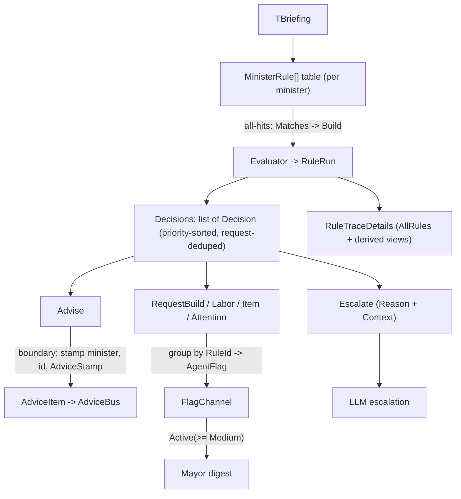

# Rules / Decisions / Advice — Great Simplification Refactor

**Status:** PLANNED — built for a **single autonomous Codex run** (run the whole plan in one session, **no gimp slicing, no verifier loop**). Codex implements on its own branch+worktree and commits; the human lands. Every decision below is **pre-resolved** so the run never needs a human/Claude call mid-flight.
**Supersedes:** `rules-effects-union.md` (renamed/expanded into this file).
**Follow-on to:** the landed table-driven all-hits refactor ([`minister-rules-table-refactor`](minister-rules-table-refactor.md)).
**Decisions recorded in:** [`Docs/DESIGN.md`](../Docs/DESIGN.md) Decision Log + [`Docs/design/ministers.md`](../Docs/design/ministers.md) Rules Layer.

---

## Goal

Flatten the rules→decisions→advice output types into one coherent shape: a rule emits a flat list of **typed effect `Decision`s**; a shared runner folds them by type at the publish boundary; diagnostics, flags, and wire advice are all derived from that one list. Remove the composite-`Decision` collapse, the `AgentFlag`-as-closed-union, the duplicate advice/flag priority enums, the stringly rule-id round-trip, the rule-authored wire/lifecycle fields, and the over-built `RuleTraceDetails`.

This is a **behavior-equivalent refactor** (see §Behavior) except a small, explicit set of intended **wire changes** (see §Wire). Behavior parity is judged against the existing test suite + replay corpus — Codex mirrors current advice/flags/escalation per fixture, re-expressed as effects, and regenerates fixtures/corpus where the shape shifts.

## Pipeline at a glance



---

## Locked decisions (no mid-run guessing)

1. **Scope = full-stack.** .NET **and** the `Dashboard/` TS. Wire changes land cleanly; TS types + affected tabs update in the same run.
2. **Unified priority enum = `Priority`.** Rename `AdvicePriority` → `Priority` (it is now shared by advice and flags — the advice-specific name reads wrong on a routing flag); delete the old flag-only priority enum and the ~5 identity converters; rename/retype `AgentFlag.Priority : Priority`. Wire JSON field names are `priority` everywhere: advice, flags, and request/effect DTOs all use the same field name for the same type.
3. **Effect vocabulary (locked):** base record `Decision`; effect kinds `Advise`, `RequestBuild`, `RequestLabor`, `RequestItem`, `RequestAttention`, `Escalate`.
4. **Parked smells:** `Supersedes` **deleted** (dead). `AutonomyAtIssue` **kept** (autonomy-dial audit stamp). Action↔`Request*` overlap **deferred** (by-design co-reference; untangling is a separate Assisted-Apply-ownership redesign).
5. **No cap.** All-hits keeps priority-sort only; the tail cap stays deferred.
6. **Escalate carries its payload.** `Escalate(RuleId Rule, string Reason, object? Context = null)`. `Context` is the minister's LLM-escalation payload (Chef crop candidates, Welfare context) — distinct from replay `Context`/`EscalationContext`. Must not be dropped.
7. **No-match behavior is preserved per minister.** Chef → `Escalate` (with Context); Welfare → its `needs_stable` terminal output; Willie → its `maintain_build_program` output. Re-express today's no-match output as effects; do **not** change which ministers escalate vs emit terminal advice.
8. **Willie inbound plumbing unchanged.** The effect union changes Willie's rule *output*, not its inbound-request input. Willie keeps re-solving every active inbound request each cycle (dirty-solve stays deferred); its rule closures still take `inboundBuildingRequests`.
9. **`RuleId`** = `readonly record struct RuleId(string Value)` (string at the wire/replay/TS; nominal in memory). Per-minister `static` id constants. No global cross-minister enum.
10. **Naming / files / wire are unconstrained.** Back-compat is not a goal (wipe-and-regen): prefer the clearest name and file layout, rename freely where it improves clarity. This run renames `AdvicePriority`→`Priority`, splits the `IMinisterRules.cs` god-file into per-type files, and may rename `MinisterRuleTableEvaluator`→`RuleRunner`. Do not keep a worse name to avoid churn.

## Target shapes (authoritative signatures)

```csharp
// ── the effect union ────────────────────────────────────────────────
public abstract record Decision(RuleId Rule);

public sealed record Advise(
    RuleId Rule, Priority Priority,
    string Title, string Body, string Rationale,
    IReadOnlyList<AdviceAction> Actions,
    IReadOnlyList<string>? GuideCitationIds = null,
    IReadOnlyList<AdviceOption>? Options = null) : Decision(Rule);

public sealed record RequestBuild    (RuleId Rule, BuildingRequest  Request, string To, Priority Priority) : Decision(Rule);
public sealed record RequestLabor    (RuleId Rule, LaborRequest     Request, string To, Priority Priority) : Decision(Rule);
public sealed record RequestItem     (RuleId Rule, ItemRequest      Request, string To, Priority Priority) : Decision(Rule);
public sealed record RequestAttention(RuleId Rule, AttentionRequest Request, string To, Priority Priority) : Decision(Rule);

public sealed record Escalate(RuleId Rule, string Reason, object? Context = null) : Decision(Rule);

// ── the rule (producer) ─────────────────────────────────────────────
public sealed record MinisterRule<TBriefing>(
    RuleId Id,
    Func<TBriefing, bool> Matches,
    Func<TBriefing, string> Reason,
    Func<TBriefing, IReadOnlyList<Decision>> Build);   // 1..N effects

public sealed record MinisterRuleTraceDescriptor<TBriefing>(   // unchanged: catalogue-only
    RuleId Id, Func<TBriefing, string> Reason, Func<TBriefing, RuleId?, string> Outcome);

// ── the evaluator return ────────────────────────────────────────────
public sealed record RuleRun(
    IReadOnlyList<Decision> Decisions,   // all-hits: priority-sorted, request-deduped
    RuleTraceDetails Diagnostics);

// ── consolidated diagnostics ────────────────────────────────────────
public sealed record RuleTraceDetails(
    RuleId? SelectedRule,                          // = the Escalate effect's Rule on escalate; null on multi-hit
    IReadOnlyList<RuleEvaluationTrace> AllRules);  // every rule: id, outcome, reason, output
// MatchedSignals  => AllRules.Where(r => r.Outcome == RuleOutcome.Selected)   (computed prop)
// Emitted advice/actions/flags => projected from the Decision list            (computed/helper)
// SuppressedCandidates: DELETED.  WithEmissions/WithRuleEmissions: DELETED.

public enum RuleOutcome { Selected, NotMatched, Escalated }   // snake_case at the wire

public readonly record struct RuleId(string Value);

// ── advice wire DTO: time fields grouped ────────────────────────────
public sealed record AdviceStamp(            // wire: "stamp": { ... }
    DateTimeOffset IssuedAt, DateTimeOffset ExpiresAt,
    GameDate? IssuedGameDate, long? IssuedGameTick, long? ExpiresGameTick);
// AdviceItem: replace the 5 flat time fields with `AdviceStamp Stamp`; delete `Supersedes`;
//   keep `AutonomyAtIssue`. All other fields unchanged.

// ── flag priority merge ──────────────────────────────────────────────
// delete the old flag-only enum;  AgentFlag.Priority : Priority  (wire name "priority")
```

`IMinisterRules<TBriefing>.Evaluate(briefing, context)` returns `RuleRun`. The `RulesResult` / composite `Decision(Advice[],Flags[],Trace)` / `Escalate` wrapper union are **deleted**.

## Boundary projection (the runner)

The minister cycle folds `RuleRun.Decisions` by effect type:

- **`Advise` → `AdviceItem`.** A single projection (`AdviceBus`/`AdviceSnapshotPolicy`) stamps owning `Minister`, qualified `Id` (`$"{minister}_{rule.Value}"`), and `AdviceStamp` (`IssuedAt = now`, `ExpiresAt = now.AddHours(Priority >= High ? 4 : 24)`, game ticks from `briefing.GameTick`/context). This one projection also serves the LLM path (`AdviceResponseNormalizer`). Rules never author timestamps, minister, or id.
- **`Request*` → `AgentFlag`.** Group a concern's request effects by `RuleId` into one `AgentFlag` (priority = the concern's `Priority`; `SourceMinister` = the running minister; `RequestedFrom` = the effect's `To`). Publish to `FlagChannel`. Rules never hand-build `AgentFlag`.
- **`Escalate` → LLM.** If `Decisions` contains only `Escalate` (no `Advise`/`Request*`), take the escalate path with `Escalate.Reason`/`.Context`.

All-hits aggregation (priority sort + cross-effect request dedup) stays in the evaluator; `Request*` dedup keys are the existing `BuildingRequestKey`/`LaborRequestKey`/`ItemRequestKey`/`AttentionRequestKey`.

## Correlation

Every effect carries the concern's `RuleId`. Willie solves each `RequestBuild`, then enriches the `Advise` with the **same** `RuleId` (replaces `EmittedRuleTraces` + `willie_<trace>` parsing). Delete `DrivingAdviceId`, `TraceFromAdviceId`, and the hardcoded `IsMissingRoomTrace` string set (use typed `RuleId` equality against the Willie id constants).

## Files: rewrite vs edit

**Rewrite (cleaner from scratch than patched):**

- **Rewrite + split** the `IMinisterRules.cs` god-file into clean per-type files: `Decision.cs` (`Decision` base + `Advise` + `RequestBuild/Labor/Item/Attention` + `Escalate`), `RuleRun.cs`, `RuleTraceDetails.cs`, `RuleOutcome.cs`, `RuleId.cs`; leave `IMinisterRules.cs` as just the interface. `MinisterRule.cs` exists — retype its `Build` → `IReadOnlyList<Decision>`. Rename `Src/Common/Advice/AdvicePriority.cs` → `Priority.cs`; add `Src/Common/Advice/AdviceStamp.cs`.
- `Src/Common/Ministers/MinisterRuleTableEvaluator.cs` — return `RuleRun`; `Aggregate` over effects; consolidated `BuildTrace`; per-effect-type dedup; delete `WithRuleEmissions`/`OutputActionFor` string plumbing that no longer fits.
- `Src/Ministers/Food/Rules.cs`, `Src/Ministers/Welfare/Rules.cs`, `Src/Ministers/Willie/Rules.cs` — rebuild the rule tables so each `Build` returns `IReadOnlyList<Decision>` (split today's combined advice+flag builders into `Advise` + `Request*` effects). **Keep** predicates, `reason` selectors, and all domain helpers; only the emission shape changes.

**Edit:**

- `Src/Ministers/Willie/MinisterOfWillie.cs` — fold the effect list; correlate by `RuleId`; delete `EmittedRuleTraces`/composite-trace dependence; keep the board-solve loop + solver-offline handling.
- `Src/Ministers/Welfare/MinisterOfWelfare.cs`, `Src/Ministers/Food/Chef.cs` — fold the effect list; preserve `Escalate.Context` feed to the LLM.
- `Src/Common/Ministers/AgentFlag.cs` — delete the old flag-only enum; rename/retype the flag priority property to `Priority : Priority`.
- `Src/Common/Advice/AdviceItem.cs` — 5 time fields → `AdviceStamp Stamp`; delete `Supersedes`; keep `AutonomyAtIssue`.
- `Src/Coordination/AdviceSnapshotPolicy.cs` — delete the old flag-priority converter; flag priority comes from the concern priority via the projection.
- `Src/Coordination/AdviceBus.cs` — host the `Advise → AdviceItem` stamping projection (or a dedicated `AdvicePublisher`); sort still by priority then issue.
- `Src/Coordination/FlagChannel.cs` — `Active(Priority minimum = Low)`; filter/sort unchanged.
- `Src/LlmGateway/AdviceResponseNormalizer.cs`, `Src/LlmGateway/FoodLlmResponseParser.cs` — use `Priority`; build `AdviceItem` via the shared stamping projection; drop the flag-priority converters.
- `Src/Ministers/Food/Rules.cs` flag-priority converter (+ Welfare/Willie copies) — delete.
- **Dashboard TS** (`Dashboard/`) — diagnostics: drop `suppressed_candidates`, read `RuleOutcome` strings, consume the projected emitted-traces; `AdviceItem`: read `stamp.*` instead of flat time fields; drop `supersedes`. Rebuild the bundle.

**Regenerate:** the Welfare/Willie/Chef replay corpus where the wire shape shifts (advice `stamp`, removed fields) — wipe-and-regen, no compat (repo norm).

## Execution order (within the one run)

Build/tests may be red between steps; only the final state must be green.

1. **Types.** Add the `Decision` union + `Advise` + `RuleId` + `RuleOutcome` + `AdviceStamp`; rewrite `IMinisterRules.cs` (`RuleRun`, consolidated `RuleTraceDetails`); priority merge (delete the old flag-only enum, rename/retype `AgentFlag.Priority`).
2. **Evaluator.** Rewrite `MinisterRuleTableEvaluator` → `RuleRun`, effect aggregation, per-effect dedup, consolidated `BuildTrace`.
3. **Boundary.** Implement the `Advise→AdviceItem` stamping projection and the `Request*→AgentFlag` grouping; wire `AdviceBus`/`AdviceSnapshotPolicy`/`AdviceResponseNormalizer` through it.
4. **Ministers (rules).** Port Food, Welfare, Willie rule tables to emit effects.
5. **Ministers (consume).** Rewire `MinisterOfWillie`/`MinisterOfWelfare`/`Chef` to fold the effect list; correlate by `RuleId`; preserve `Escalate.Context`.
6. **Delete dead.** `Supersedes`, `SuppressedCandidates`, `EmittedRuleTraces`, `WithEmissions`/`WithRuleEmissions`, old flag-priority converters, `DrivingAdviceId`/`TraceFromAdviceId`/`IsMissingRoomTrace`, `RuleEmission`, `RulesResult`/composite `Decision`/`Escalate` wrapper.
7. **Dashboard TS.** Update types + Rules/SYSTEM/advice tabs; rebuild.
8. **Tests + corpus.** Rewrite rules/trace/advice tests; regen replay corpus.
9. **Verify.** Full build + full test suite green (§Verification).

## Behavior: equivalent, not pinned

This is a simplification, not a behavior freeze. The bar is **equivalent observable intent**, not byte-identical output. Update tests/fixtures/corpus to the new shapes; treat a diff as a regression only if it breaks a **firm** invariant below. Everything else is **free to change** — regen it, don't fight it.

**Firm (correctness — must hold):**

- No `AllRules` coverage shrink: every rule + fallback descriptor still appears in the catalogue (the slice-2 regression), still derived, no hand strings.
- Mayor still receives Medium+ flags (`Request*→AgentFlag` projects `Priority`, and `Active(Priority.Medium)` filters by that field).
- Willie still solves + records every active inbound request each cycle; solver-offline still preserves prior advice.
- Cross-minister request dedup still collapses the same physical request to one.
- No `Advise` apply-action silently becomes an auto `Request*` (the Suggest-mode boundary).
- Each minister's no-match path still produces the same kind of output (Chef escalates; Welfare/Willie emit their terminal advice).

**Free to change (expected — regen, don't fight):**

- Exact trace/diagnostic text, `reason` strings, and equal-priority ordering tiebreaks.
- Fixture JSON snapshots and the replay corpus (wipe-and-regen).
- The intended wire changes (advice `stamp`, removed `supersedes`/`suppressed_candidates`, `RuleOutcome`).
- Internal helper shapes, file splits, and test structure.

## Wire changes (intended, full-stack)

- `AdviceItem`: 5 flat time fields → nested `stamp` object; `supersedes` removed; `autonomy_at_issue` kept.
- Diagnostics: `suppressed_candidates` removed; trace status is the `RuleOutcome` enum (same string values, now centralized).
- No change to `AdviceItem` action/option JSON or SSE event names. `AgentFlag` changes its priority field to wire as `priority`, matching advice and the shared `Priority` type.

## Verification

- `dotnet build Src/RimBob.sln` — 0 errors.
- `dotnet test Src/RimBob.sln` — full suite green (coordination, endpoints, Willie solver, advice, rules).
- `Dashboard/`: `npm run build` (or repo equivalent) — 0 TS errors; Rules/SYSTEM/advice tabs render the new shapes.
- Greps (expect **no implementation hits**, excluding this plan if needed): `AdvicePriority`, old flag-only priority enum/property/converters, `TraceFromAdviceId`, `DrivingAdviceId`, `IsMissingRoomTrace`, `RuleEmission`, `RulesResult`, `SuppressedCandidates`, `WithEmissions`, `WithRuleEmissions`, `Supersedes`, `"selected"`/`"not_matched"`/`"escalated"` status literals.
- JSON-first (needs Host): cabinet cycle → `AdviceItem` carries `stamp`, no `supersedes`/`suppressed_candidates`; Mayor digest still receives Medium+ Willie/Welfare/Chef flags; Willie `GET /solver/requests` shows a fresh outcome per inbound request.

## Residual risks (pre-decided fallbacks — still no human call)

- **`RuleTraceDetails` consumers beyond the dashboard.** If a non-dashboard consumer reads `MatchedSignals`/`Emitted*` as concrete stored collections, expose them as computed properties over `AllRules` + the effect list (keep the public getters; change only the backing). Do **not** reintroduce stored copies.
- **`Escalate.Context` typing.** Leave it `object?` this run (per-minister payload shapes vary); typing it is out of scope. Just thread it through unchanged.
- **Willie composite helpers.** Keep `SelectPlacementRequest`/`TryGetPlacementRequest`/`MissingRoomRequest`/`IsFreezingBuildRequest` (consumed by the solver); only their trace-string callers change to `RuleId`.
- **`AdviceStamp` game-tick source.** Stamp game ticks from `briefing.GameTick` (and `GameDate` from the same normalization used today); if a path lacks a briefing tick, stamp the wall fields and leave game ticks null (today's nullable contract).

## Deferred (explicit non-goals, even in this run)

- Action↔`Request*` co-reference untangling (separate Assisted-Apply-ownership design).
- Willie dirty-solve (new+dirty instead of re-solve-all).
- Fold Willie inbound requests into `WillieBriefing`.
- Multi-`Advise` fan-out from one rule (the type allows it; no current case).
- Cap on all-hits output.
