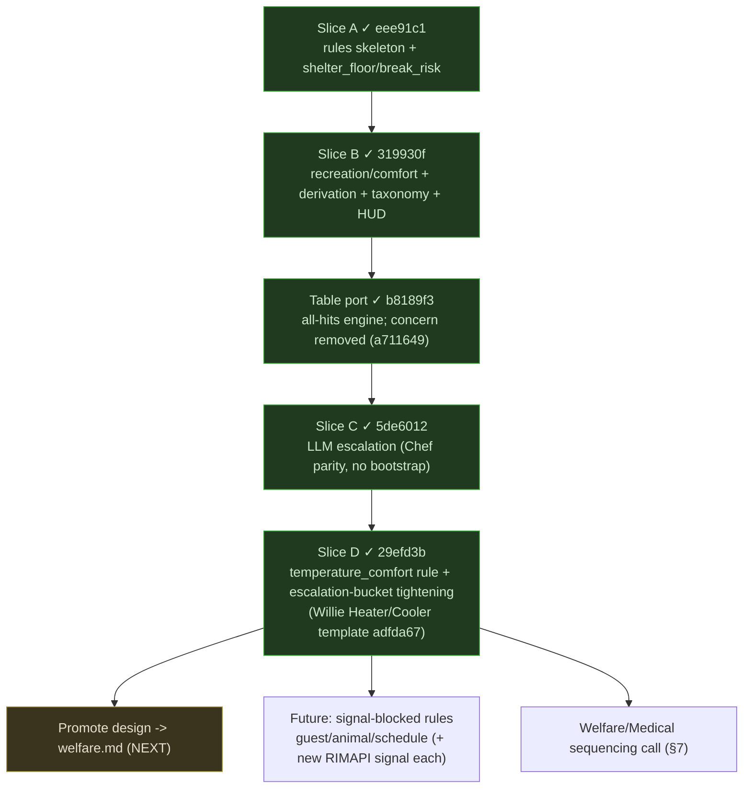

# Welfare — Meta-Plan

> **Master index + roadmap** for the Welfare minister effort. Welfare owns the **Mood & Needs** domain; code names use `Welfare*`.
>
> Single place to see where the Welfare effort stands: architecture, the new-colony scenario, landed vs remaining work, reused machinery, locked decisions, open decisions, research. Detail lives in linked plans; exact C# lives in source.
>
> **Status (2026-06-05):** Welfare is a **full rules-first LLM feeder** (Chef parity) with five deterministic rules. Slices **A (`eee91c1`), B (`319930f`), table port (`b8189f3`, concern removal `a711649`), C — LLM escalation (`5de6012`), and D — `temperature_comfort` (`29efd3b`) — all landed.** The temperature `RequestBuild` resolves end-to-end via Willie's `Heater`/`Cooler` placement templates (`adfda67`). Welfare emits deterministic advice + cross-minister build requests, and escalates genuinely-unexplained mood pressure to the LLM (no bootstrap). **Next: promote design → `welfare.md` (§6.3); remaining rule work is signal-blocked or human-gated (§6.4, §7).**
>
> **North-star (delivered for the deterministic path):** a brand-new colony with no beds → Welfare tells the player "colonists will sleep unsheltered" and emits a `building_request` to Willie for a basic barracks with beds, reusing Willie's Placement Solver. Welfare builds **no** placement engine of its own.

---

## 0. Architecture (post-refactor — read this first)

Two repo-wide refactors landed mid-effort and changed Welfare's shape. The plans below predate them; this section is the current truth.

- **No `concern`.** The `concern` concept was deleted ([`delete-concern.md`](delete-concern.md), `a711649`). There is no `WelfareConcern` enum and no `AdviceItem.Concern`. Rules are identified by a **trace id** string (`break_risk`, `shelter_floor`, `recreation_gap`, `comfort_beauty`). Autonomy graduates on **action-kind + validation**, not per-concern.
- **Table-driven, all-hits rules** ([`minister-rules-table-refactor.md`](minister-rules-table-refactor.md)). `Welfare/Rules.cs` is one ordered `RuleTable` of `MinisterRule<WelfareSourceBriefing>(traceId, matchPredicate, reasonFn, emitFn)`. The shared `MinisterRuleTableEvaluator.EvaluateAllHits` fires **every** matching rule (all-hits hit-policy), so simultaneous mood pressures all surface. `Evaluate` returns a `RuleRun` (decisions + trace); empty → `needs_stable` fallthrough.
- **Decision model.** An emit returns `IReadOnlyList<Decision>`: an `Advise(trace, Priority, title, body, rationale, actions[])` plus zero or more `RequestBuild` / `RequestItem` / `RequestAttention` (cross-minister requests are first-class decisions, not inline `AgentFlag` construction). `Priority` enum (`Critical/High/Medium/Low`) — not the old `AdvicePriority`.
- **Cross-minister build path (unchanged intent, confirmed wiring).** A published `RequestBuild` becomes a Willie-owned `building_request`; per `ministers.md` Play Mode, that **wakes Willie in `FlagFired` / rules-only mode** and runs the Placement Solver — no extra trigger. Welfare authors the *why*; Willie owns the *where*.

---

## 1. North-star chain (the vertical slice everything serves)

The new-colony shelter scenario, end to end — the deterministic path, all landed:

```
New colony (~3 colonists, day 1): no beds, no roofed bedroom
-> Welfare briefing (WelfareSourceBriefing): mood distribution, per-pawn needs,
   ThoughtDigest (ShelterSleep/Recreation/ComfortBeauty/...),
   Sleep{ BedCount, BedDeficit, UnroofedBedroomCount }, Recreation{...}
-> Welfare rule table (all-hits, deterministic): shelter_floor matches
     (Sleep.BedDeficit > 0 || Sleep.UnroofedBedroomCount > 0)
-> emits Decisions:
     Advise(trace="shelter_floor", Priority.High,
            "Colonists need more sleeping shelter", body, rationale,
            actions=[PlaceBlueprint note owned by Willie])
     RequestBuild(trace="shelter_floor",
            BuildingRequest{ RoomClass=Barracks, TargetClass=Bed,
                             CapacityNeed=(Beds, deficit),
                             RequestedFrom="Willie", Priority=High })
-> MinisterOfWelfare publishes the advice snapshot + the building_request
-> the building_request wakes Willie (FlagFired / rules-only)
-> Willie rule table sees the inbound request -> Placement Solver
     (room-class templates incl. barracks) -> options[]
-> player picks one in Willie's Build Queue tab + clicks Apply
     -> fork validate -> place blueprint group -> readback
```

The whole right half already existed in Willie (Placement Solver + bedroom/barracks templates + `place_blueprint_group` Apply). The `basic_shelter` trigger was moved to Welfare on 2026-05-27 ([`willie-advice-types.md`](willie-advice-types.md) §4.5) so this day-one need has an owner. Welfare's job stayed narrow: read Mood & Needs, decide shelter is missing, emit the `RequestBuild`.

As of Slice C (`5de6012`), a cycle with **no** matching rule but material *unexplained* mood pressure escalates to the LLM (`Escalate("unexplained_mood_pressure", …)`) instead of going silent — see §6.1. Calm colonies still publish an empty `needs_stable` snapshot.

---

## 2. What Welfare says in a NEW COLONY (the test scenario)

Acceptance target the human named: stand Welfare on a fresh save and get **good day-one advice**, not generic "improve mood" prose. Output is **sparse** (Advice Quality Contract) and all-hits — every matched pressure surfaces, calm states stay silent.

### 2.1 Expected output, priority-ordered (rule = trace id)

| Rule (trace) | Priority | What it says | Resolution path | Status |
|---|---|---|---|---|
| `shelter_floor` | **High** | "Colonists need more sleeping shelter" (no beds / deficit / unroofed). | `RequestBuild` → Willie barracks + N beds (or roof). **Headline; matches the human's example.** | landed |
| `break_risk` | High/Critical | "N colonists near mental break" + dominant driver; routes driver to live owner (Chef/Willie). | `Advise` + optional `RequestItem`/`RequestAttention`. | landed |
| `comfort_beauty` | Low | "Colonists need a table" / low comfort-beauty. | `RequestBuild` → Willie table (only when a concrete table-pressure thought exists), else advise-only. | landed |
| `recreation_gap` | Low/Medium | "Recreation need is falling." | `RequestBuild` → Willie rec source **only when** `HasBuildings && !HasRecreationSource`; else advise-only review note. | landed |

State-summary line carries the factual baseline (mood distribution, bed/roof status, top driver) above the cards.

### 2.2 No first-cycle special case

The first live cycle runs the same rules-first path as every cycle — `shelter_floor` fires on day 1 with no LLM. A genuinely ambiguous first cycle reaches the LLM only through the normal escalation fallthrough (landed Slice C, `5de6012`), never a forced bootstrap (`ministers.md` "First Live Cycle").

### 2.3 What stays silent on day 1

A clean 3-pawn colony → near-empty snapshot beyond the shelter headline: `break_risk` empty (no one breaking); `temperature_comfort` only fires when a `Temperature` thought crosses the floor (mild weather → silent); social / guest / animal pressures have no rules yet (social → LLM escalation, the rest unwired); a colony with beds + roof + a rec source publishes a successful empty `needs_stable` snapshot. Empty is correct, not a failure.

---

## 3. Artifact map

### Landed implementation plans

| Plan | Holds | Status |
|---|---|---|
| [`welfare-rules-slice-a.md`](welfare-rules-slice-a.md) | First rule cut + minister skeleton + registry/DI + new-colony fixture. | LANDED `eee91c1` (pre-refactor vocabulary; see its banner). |
| [`welfare-rules-slice-b.md`](welfare-rules-slice-b.md) | Briefing derivation extensions (Sleep/Recreation/ThoughtDigest), `WelfareThoughtTaxonomy`, recreation/comfort rules, multi-pressure emission, mood HUD. | LANDED `319930f` (pre-refactor vocabulary; see its banner). |
| [`welfare-rules-table-port.md`](welfare-rules-table-port.md) | Port of Welfare A+B rules onto the shared table-driven all-hits engine; drops concern. | LANDED `b8189f3`. |
| [`welfare-llm-slice-c.md`](welfare-llm-slice-c.md) | LLM escalation for Mood & Needs judgment calls (escalate `unexplained_mood_pressure`; `welfare.system.md` prompt; RAG; parser/normalizer; no bootstrap). | LANDED `5de6012`. |
| [`welfare-rules-slice-d.md`](welfare-rules-slice-d.md) | Rule breadth — promote signal-ready `temperature_comfort` to a deterministic rule (Willie `Heater`/`Cooler`) + tighten the escalation bucket so wired categories don't double-fire. | LANDED `29efd3b`; Willie solver template `adfda67`. |

### Reused machinery (do NOT rebuild)

| Existing artifact | Welfare's use |
|---|---|
| Willie inbound `building_request` → Placement Solver (room-class templates incl. barracks; [`placement-solver-3.md`](placement-solver-3.md)) | Turns Welfare's `RequestBuild` into validated `options[]`. |
| Willie `HeaterTemplate` / `CoolerTemplate` + `RoomTemplateSet` (`adfda67`) | Solves Welfare's `temperature_comfort` `RequestBuild(Heater\|Cooler)`. |
| `place_blueprint_group` Apply ([`willie-option-apply-payload.md`](willie-option-apply-payload.md)) | Player applies the chosen shelter in Willie's tab. |
| Shared rule engine: `MinisterRule<T>`, `MinisterRuleTableEvaluator.EvaluateAllHits`, `RuleRun`, `Decision`/`Advise`/`RequestBuild` (`Src/Common/Ministers`) | Welfare's rule table + emissions. |
| Flag channel + corpus restore ([`restore-minister-outputs-from-corpus.md`](restore-minister-outputs-from-corpus.md)) | Carries Welfare's request to Willie across cycles/restarts. |

**Locked consequence:** Welfare ships **no** placement engine, **no** `place_blueprint` authorship, and **no** Apply surface of its own. It emits `Advise` + `Request*` decisions; Willie owns the build Apply.

### Source data (landed)

`WelfareSourceBriefing` (`Src/Common/Briefings/WelfareBriefing.cs`), derived by `WelfareBriefingDerivation`, served at `/api/briefings/welfare/latest`. Carries mood distribution, per-pawn needs + `TopNegativeThoughts`, `NeedLows`, room quality, and the Slice-B-landed `Sleep` (bed count/deficit/unroofed), `Recreation` (joy-low, sources), and `ThoughtDigest` (taxonomy grouping). Open source gaps: per-pawn bed assignment (deficit-by-count is enough today); guest/animal signals + a deeper apparel/exposure temperature signal (thought-based `Temperature` already drives `temperature_comfort`); prisoner + surgery (`source-todo-prisoner-surgery-signals`).

### Grounding

- **RAG corpus** (for Slice C): `Docs/guides/Base/rimworldwiki-rooms.md`, `Docs/guides/beginner/{survival-tactics,beginner-survival-tips,tips-and-tricks,wealth-management}.md`.
- **RimMind research filed in `Tasks.md`:** `rimmind-mood-risk-causes`, `rimmind-medical-risk-digest`, `investigate-trend-history-minister-briefing`.
- **Canonical docs:** [`welfare.md`](../docs/design/ministers/welfare.md), [`ministers.md`](../docs/design/ministers.md), [`advice.md`](../docs/design/advice.md).
- **Reference ministers:** `Src/Ministers/Food/` (Chef — the LLM-wired feeder Slice C mirrors), `Src/Ministers/Willie/` (request-emitter + table all-hits pattern).

---

## 4. Rule set (trace ids)

Rules are a closed, ordered table keyed by trace id — **no concern enum**. Landed rules + the forward set:

| Rule (trace) | Trigger (deterministic) | Emits | Status |
|---|---|---|---|
| `break_risk` | `Mood.BreakRiskCount > 0` | `Advise` + driver-routed `RequestItem`/`RequestAttention` to live owner | landed |
| `shelter_floor` | `Sleep.BedDeficit > 0` or `Sleep.UnroofedBedroomCount > 0` | `Advise` + `RequestBuild`(barracks/beds or roof) | landed |
| `recreation_gap` | `Recreation.JoyLowCount > 0` | `Advise` + `RequestBuild`(rec source) when source provably absent | landed |
| `comfort_beauty` | ComfortBeauty thought group or comfort/beauty `NeedLow` | `Advise` + `RequestBuild`(table) on concrete table-pressure | landed |
| `temperature_comfort` | `Temperature` thought group with `WorstOffset ≤ -3` (`HasMoodThoughts`) | `Advise` + `RequestBuild`(Willie `Heater`/`Cooler`; cold/hot sniff) — ambiguous label → `RequestAttention` | **landed `29efd3b`** |
| `social_pressure` | `Social` thought pressure | — | **LLM-served, not promoted** (nuanced, no physical fix, no live owner) |
| `ideology_pressure` | `Ideology` thought pressure | — | **LLM-served, not promoted** |
| `health_pressure` | `Health` thought pressure | `Advise` (note until Medical live) | deferred (gated on Welfare/Medical sequencing §7) |
| `guest_hospitality` | guest lodging/social pressure | `Advise` + `RequestBuild` | future (needs **new** RIMAPI signal) |
| `animal_welfare` | tame-animal living-condition pressure | `Advise` + `RequestBuild`(pen/barn/bed/shelter) | future (needs **new** RIMAPI signal) |
| `schedule_balance` | schedule causing avoidable rest/joy loss | `Advise` (Suggest-only `set_priority`) | future (needs **new** RIMAPI signal) |

**Signal-ready vs signal-blocked:** `Social`/`Ideology`/`Temperature`/`Health` thought groups already populate `ThoughtDigest.ByCategory` (no new RIMAPI read needed); `guest`/`animal`/`schedule` each need a **new** briefing signal first. **Promotion test:** a signal-ready category graduates to a deterministic rule only when the rule yields *concrete, routable* advice — `temperature_comfort` does (live Willie `Heater`/`Cooler`); `social`/`ideology` do **not** (no physical fix, `SuggestedOwner` is null) and stay LLM-escalation-served (§6). Adding a rule is a table entry + (if signal-blocked) one new derivation; there is no enum to graduate.

---

## 5. Locked decisions

- **Minister `Welfare`; domain "Mood & Needs."** Code: `WelfareSourceBriefing`, `Welfare/Rules.cs`, `MinisterOfWelfare`.
- **No `concern`.** Rules keyed by trace id; emit `Advise` + `Request*` decisions; autonomy = action-kind + validation (`delete-concern.md`).
- **Rules earn their place (promotion test).** A signal-ready thought category becomes a deterministic rule only when it yields concrete, routable advice (`temperature_comfort` → live Willie `Heater`/`Cooler`). Nuanced, no-physical-fix categories (`social`, `ideology`) stay LLM-escalation-served — not promoted to brittle rules.
- **Table-driven, all-hits.** One `RuleTable`; `EvaluateAllHits` fires every match; `needs_stable` empty fallthrough. Multi-pressure colonies surface all matched rules, priority-sorted.
- **Welfare places nothing.** Emits advice + `RequestBuild`; the *where*/`place_blueprint_group`/Apply is Willie's. `basic_shelter` trigger lives in Welfare; resolution in Willie.
- **No Welfare-owned Assisted Apply (request-only).** Schedule/`set_priority` stays Suggest-only (high blast radius).
- **Domain hand-offs** (per `welfare.md`): hunger→Chef, treatment→Medical (future), apparel production→Industry (future), guest trade→Economy (future), builds→Willie. Welfare keeps the mood/break-risk framing; routes only to **live** owners today (Chef, Willie).
- **No first-cycle bootstrap escalation** (`ministers.md` "First Live Cycle").
- **Sparse output.** No exhaustive mood menus.
- **No compat code.** Briefing/wire changes wipe-and-regen on upgrade (AGENTS.md).

---

## 6. Remaining work



1. **Slice C — LLM escalation** ([`welfare-llm-slice-c.md`](welfare-llm-slice-c.md)) — **LANDED `5de6012`.** Escalation is the rule-table fallthrough: `Rules.Evaluate` emits `Escalate("unexplained_mood_pressure", …)` when no rule matched but material out-of-scope mood pressure remains (dominant non-shelter/rec/comfort `ThoughtDigest` group below `MaterialThoughtOffset`, or `AverageMood < EscalationMoodFloor`); else empty `needs_stable`. `MinisterOfWelfare` extracts the sole `Escalate` and runs `RunEscalationAsync` (RAG → `llm.CallWelfareAsync` → parse/normalize → snapshot + replay), with `ForceLlm`/`RulesOnly` arms and **no bootstrap**. `welfare.system.md` prompt, `WelfareRagRetriever`, registry LLM flags + DI all landed.
2. **Slice D — rule breadth** ([`welfare-rules-slice-d.md`](welfare-rules-slice-d.md)) — **LANDED `29efd3b`.** `temperature_comfort` promoted (`Temperature` thought group `WorstOffset ≤ -3` → `Advise` + cold/hot-sniffed `RequestBuild` Willie `Heater`/`Cooler`; ambiguous → `RequestAttention`; Priority High at `≤ -8` or multi-pawn). `IsEscalationCategory` now excludes `Temperature` so mild temp no longer double-fires as `unexplained_mood_pressure`; escalation bucket = `{Social, Ideology, Health, Other}` + mood-floor. WD3 follow-up — Willie `Heater`/`Cooler` placement template — landed `adfda67`, so the request resolves to real `options[]`. `social`/`ideology` stay LLM-served by design; `guest`/`animal`/`schedule` + a deeper apparel/exposure temperature signal remain signal-blocked.
3. **Promote design → `welfare.md` (NEXT)** — fold the landed five-rule set + briefing fields + LLM escalation into the canonical doc; retire the concern language there too.
4. **Signal-blocked rules (future)** — `guest_hospitality` / `animal_welfare` / `schedule_balance`, each gated on a new RIMAPI read + derivation; sequence from R7 telemetry.
5. **Welfare/Medical sequencing** (§7) — unblocks `health_pressure`.

**Tests:** Welfare fixtures in `Src/Tests/Welfare/Fixtures/`. The new-colony + multi-concern fixtures are the headline regressions.

---

## 7. Open decisions (need a human call)

| Decision | Where | Lean |
|---|---|---|
| Welfare/Medical rollout order | `Tasks.md` `resolve-welfare-medical-sequencing`; `welfare.md` | Welfare first (live); Medical as a second wave. |
| Welfare own Assisted Apply, or request-only? | §5 | Request-only — Willie owns build Apply. |
| Schedule advice vs deferred Labor/Auto | `welfare.md` | Suggest-only `set_priority` note; no knob write until Auto. |
| Prisoner living-condition mood pressure now or later? | `welfare.md` | Defer; free-colonist mood only for now. |
| Next signal-blocked rule order (guest/animal/schedule) | §6.4 | Drive by R7 telemetry. (`temperature_comfort` already landed `29efd3b`; `social`/`ideology` settled as LLM-served.) |

**Resolved since v1:** the `concern` enum question is moot (concern deleted); rules read the existing `WelfareSourceBriefing` directly; the briefing-schema/derivation work landed in Slice B; the new-colony fixture (R4) landed.

---

## 8. Research steps

- **R1 — briefing gap audit.** ✓ done (informed Slice A/B; `WelfareSourceBriefing` fields enumerated).
- **R2 — bed/sleep signal.** Partly resolved: deficit-by-count (`Sleep.BedDeficit`) landed; per-pawn bed *assignment* still unread (not required today).
- **R3 — thought taxonomy.** ✓ landed as `WelfareThoughtTaxonomy` + `ThoughtDigest` (Slice B). Extend the def→category seed as Slice C/D corpus grows; ties to `rimmind-mood-risk-causes`.
- **R4 — new-colony fixture.** ✓ landed (`Src/Tests/Welfare/Fixtures/new-colony.json`).
- **R5 — Welfare/Medical boundary.** Open. Medical owns treatment; Welfare owns mood/break-risk framing. Feeds §7. Ties to `rimmind-medical-risk-digest`.
- **R6 — schedule advice vs Labor/Auto.** Open. Suggest-only representation; gated on a RIMAPI Pawn Edit GET (`set-priority-advice-briefing-read`).
- **R7 — escalation telemetry.** Open. Read landed Welfare LLM replays (`Path:"llm"`) after live runs: which `ThoughtDigest` categories actually drive `unexplained_mood_pressure`. Now validates the landed `temperature_comfort` thresholds (`-3f` match / `-8f` severe) post-hoc and sequences the signal-blocked backlog (guest/animal/schedule). Cheap.

---

## 9. Entry points for the next session

- **Promote design → `welfare.md` is next (§6.3)** — all five rules + LLM escalation now landed; fold the rule set, briefing fields, and escalation into the canonical doc and retire the concern language. No code; doc-only.
- **Landed Slice D reference:** `Src/Ministers/Welfare/Rules.cs` (`temperature_comfort` row `:53`, `MatchesTemperatureComfort` `:252`, emission `:283`, `IsEscalationCategory` excludes `Temperature` `:482`), fixtures `Src/Tests/Welfare/Fixtures/{too-cold,too-hot,temperature-ambiguous,mild-temperature,cold-with-shelter-gap,social-only}.json`. Willie template `Src/Ministers/Willie/Placement/Templates/{Heater,Cooler}Template.cs` (`adfda67`).
- **Landed Slice C reference:** `MinisterOfWelfare.cs` (LLM arms, no bootstrap), `welfare.system.md`, `WelfareLlmResponseParser`, `WelfareRagRetriever`. Mirror minister `Src/Ministers/Food/Chef.cs` — **Chef still carries the `IsBootstrap` arm** Welfare omits (`verify-first-cycle-bootstrap-removed`).
- **Remaining rule work** is signal-blocked (guest/animal/schedule — new RIMAPI read each) or human-gated (Welfare/Medical §7); confirm sequencing from R7 telemetry.
