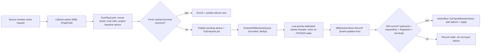

# Willie Async Solve Pool

**Status:** PLAN — not started. Design-only; needs land approval.
**Owner:** Willie placement / Coordination.
**Scope:** Move the Willie placement + grow-zone solves off the cabinet's critical path into a dedicated background solve service (a `Channel` work queue + a bounded async worker pool). The cabinet cycle enqueues solve jobs and returns immediately using whatever `WillieSolverStore` already has cached; workers solve against a frozen `ColonyState` capture, fill the store, and atomically patch the live Willie advice with options + Apply actions when the result is still current. The dashboard solver/requests boards reflect a `queued → running → options/no_fit/error/stale` lifecycle.

**Provenance:** merge of two independent design passes — Claude's `willie-async-solve-pool` and Codex's `willie-background-solver-pool`. Kept Claude's light `ColonyStateFreeze` ref-copy, the `IWillieSolveQueue` inline test seam, and typed jobs. Adopted Codex's atomic compare-and-swap advice patch (`AdviceBus.TryPatchMinisterAdvice`) as a **core** slice, the explicit store/board state vocabulary, and the "no persisted-replay-shape change in the first slices" discipline. Rejected Codex's deep `ColonyStateSnapshot` capture-and-restore (heaviest path, runs on every cache miss).

---

## Goal

Today every solve runs inline on whoever called the cabinet:

- `CabinetCycle.RunCycleAsync` runs ministers **sequentially** (`foreach descriptor … await RunResolvedMinisterAsync`).
- `MinisterOfWillie.RunPlayCycle` solves **each** inbound building/zone request **sequentially** (`await SolveAndRecordPlacementAsync` per request — driving request, missing-room rules, the solve board, the zone board).
- `PlacementSolver.SolveAsync` interleaves synchronous CPU (generators, hard gates, scoring, diverse selection) with RimAPI HTTP round-trips (`pathCostProbe.GetPathCostsAsync` once, then up to 3 sequential `placementValidator.ValidateAsync`).
- `GrowZonePlacementSolver.SolveAsync` is **100% synchronous CPU** wrapped in `Task.FromResult` — it lies about being async and blocks the caller; `BestOrigin` ([GrowZonePlacementSolver.cs:285](../Src/Ministers/Willie/GrowZonePlacementSolver.cs)) does a full `O(W·H)` grid scan per free-rect per candidate dimension, the heaviest CPU in the system, running on the cabinet/request thread.

The HTTP triggers (`POST /api/cabinet/trigger`, `POST /api/ministers/willie/trigger/rules` — [CabinetEndpoints.cs](../Src/ApiHost/Endpoints/CabinetEndpoints.cs)) **block the request** until every solve finishes. The day-rollover path (`DayTickOrchestrator`, a `BackgroundService`) blocks its own poll loop. Goal: the trigger returns as soon as rules are evaluated and jobs are queued; the solver runs on background workers; the board reflects results as they complete; and the advice card gains its options + Apply actions in place once a still-current solve lands.

The store is **already built for this**: `WillieSolverStore` is `lock`-guarded, keyed by `(minister, requestKey)`, fingerprint-versioned, evicts stale `requestKey`s on `RecordInbound`, and the `willie-solver-cache` work (Tasks.md, WORKTREE) added fresh-outcome reuse via `WillieSolveCacheKey` + `CachedSolveOutcome`.

---

## Current seams

| Area | Seam |
|---|---|
| Minister run | `MinisterOfWillie.RunPlayCycle` runs rules + placement solves inline ([MinisterOfWillie.cs](../Src/Ministers/Willie/MinisterOfWillie.cs)). |
| Building solver | `IPlacementSolver.SolveAsync(PlacementSpec, WillieBriefing, ColonyState, ct)` ([PlacementSolver.cs](../Src/Ministers/Willie/PlacementSolver.cs)). |
| Zone solver | `IGrowZonePlacementSolver.SolveAsync(ZoneRequest, WillieBriefing, ColonyState, ct)` ([GrowZonePlacementSolver.cs](../Src/Ministers/Willie/GrowZonePlacementSolver.cs)). |
| Outcome store / board | `WillieSolverStore` — inbound boards, per-request outcomes, fingerprints ([WillieSolverStore.cs](../Src/Ministers/Willie/WillieSolverStore.cs)). |
| Freshness key / dedupe key | `WillieSolveCacheKey.ForBuilding`/`ForZone` ([WillieSolveCacheKey.cs](../Src/Ministers/Willie/WillieSolveCacheKey.cs)). |
| Advice publish | `AdviceBus.ReplaceMinisterAdvice(...)` replaces the whole minister snapshot ([AdviceBus](../Src/Coordination)). |
| Immediate wakeup | `CabinetCycle.RunWillieRequestFollowUpsAsync` wakes Willie right after a source minister publishes routed requests ([CabinetCycle.cs](../Src/Coordination/CabinetCycle.cs)). |
| State container | `ColonyState`, aggregates are `Versioned<T>` over **immutable** records swapped via `Update` ([Versioned.cs:14](../Src/Common/Versioning/Versioned.cs)). |
| Background pattern | `AddHostedService<…>` ([Program.cs:288-291](../Src/ApiHost/Program.cs)); ref `DayTickOrchestrator` (94 LOC). |

---

## Target architecture



`MinisterOfWillie.RunPlayCycle` becomes a **producer**: records boards, evaluates rules, projects baseline advice/flags, reuses a fresh cached outcome if present, else enqueues a job and publishes advice with a pending note — never waiting for a cold solve. The **worker** owns cold execution: solve the frozen capture, record the outcome, and patch the live advice only if it is still current.

---

## Locked Decisions

- **One async pool, fed by a `Channel`.** Singleton `ChannelWillieSolveQueue` + `WillieSolveWorker : BackgroundService`. No fire-and-forget `Task.Run` from inside the minister — all background solving flows through the one named, observable, cancellable, bounded service.
- **Low OS-thread priority — dedicated threads, not the thread pool.** Solves must run below the HTTP request / cabinet / ingestion threads. The .NET `ThreadPool` has **no per-work-item priority API**, so `Task.Run`/channel-on-pool would run at normal priority. The worker pool is therefore N **dedicated `Thread`s** created with `Thread.Priority = ThreadPriority.BelowNormal` (configurable; `IsBackground = true`) draining the channel — not pool threads. Caveat that drives the lane split below: a `Thread.Priority` only governs CPU that actually runs **on that thread**; after an `await`, the continuation resumes on a **normal-priority** pool thread. So OS priority bites the *synchronous* CPU, not awaited continuations.
- **Two lanes, because the priority caveat matches the workload.** The grow-zone solver is **100% synchronous CPU** (the heavy lane — `BestOrigin` O(W·H) scans) → run it on the dedicated `BelowNormal` threads and the **entire** solve is low-priority. The building solver is **I/O-bound** (RimAPI path-cost + validate dominate wall-time) with modest CPU; its heaviest CPU (generators + hard-gating in `PlacementSolver.SolveAsync`) runs **before the first `await`**, so starting it on a `BelowNormal` thread makes that chunk low-priority too, while the post-probe scoring/assembly (small) and the RimAPI I/O waits are unaffected — which is fine, OS thread priority barely matters for I/O waits, and the 1-permit RimAPI gate already throttles that lane. Net: the CPU that can starve the host runs low-priority; the I/O lane is throttled by the gate.
- **`BelowNormal`, not `Lowest`, by default.** `ThreadPriority.Lowest` risks starvation — under sustained host CPU load a solve could be starved indefinitely (and never refresh the board). Default `BelowNormal`; expose `Lowest`/`Normal` via config with a starvation warning. (`Thread.IsBackground` is about process-exit lifetime, **not** scheduling — do not conflate.)
- **Background solves read a frozen `ColonyState`, never the live singleton.** Each job carries `ColonyStateFreeze.Capture(live)`: a `new ColonyState()` whose `Versioned<T>` are `Update`d to the live `.Value`s. Aggregate values are immutable, so the freeze is a handful of **reference copies** — not a deep serialize. // WHY reject the deep-snapshot approach: `ColonyStateSnapshotStore.Capture`/`RestoreInto` deep-copies the full serializable graph (terrain grid + all aggregates) on **every cache miss enqueue**; ref-copy is correct (immutable values can't be mutated under us) and orders of magnitude cheaper.
- **Job identity = the existing input fingerprint.** Dedupe on `(kind, requestKey, fingerprint)`: `TryEnqueue` returns the existing job state instead of adding a second channel item; skip entirely if the store already holds a fresh terminal outcome. A newer fingerprint for the same `requestKey` **supersedes** (cancels) the stale in-flight job.
- **Stale outcomes are self-correcting on the read path.** An outcome written against an old fingerprint is never served (fingerprint mismatch) and is evicted on the next `RecordInbound`. Supersede-cancel is an optimization, not a correctness requirement, on the **board** path.
- **Stale outcomes are a hard hazard on the patch path → compare-and-swap.** A completed worker may only patch advice after re-checking, under the bus lock: current active advice id == job `DrivingAdviceId`, the current request board still contains `requestKey`, the current fingerprint for that request still == job fingerprint, and the outcome is terminal. Any miss → record `stale`, do not mutate advice. The patch must **preserve the card's existing player-Apply result** (or refuse) so a background patch never clobbers an in-flight Apply.
- **RimAPI is single-flight.** Path-cost + validate hit one RimWorld instance that resolves on its game main thread (see `rimapi-growzone-mainthread-fix` / `grow-zone-apply-500`). Building solves run through a **1-permit RimAPI gate**; pure-CPU grow-zone solves run on the pool up to a configured degree. Default: zone parallelism 2, building gate 1. Configurable via `RimBobOptions.WillieSolve` (`WorkerPriority` default `BelowNormal`, `Degree`, `RimApiGate`, `QueueCap`).
- **Explicit live state vocabulary.** Store/board rows carry `not_seen_yet | queued | running | options | no_fit | error | stale`. `outcome: null` means "seen, never enqueued". `TryGetFresh*Outcome` returns **only** reusable terminal outcomes (`options`, `no_fit`); `queued/running/error/stale` are diagnostics, not reusable.
- **Test seam: `IWillieSolveQueue`.** Production = `ChannelWillieSolveQueue` (async). Tests = `InlineWillieSolveQueue` (solves synchronously on `TryEnqueue` through the same `WillieSolveExecutor`) so existing "trigger → assert options/outcome" assertions stay deterministic. The real async path + stale path get their own dedicated tests so the seam never hides production behavior.
- **No persisted-shape churn in the decoupling slices.** Queue/job/board lifecycle state is **live-only**. The replay corpus and durable minister snapshots keep their existing shapes; a cold-solve cabinet run simply persists rules replay with no embedded solver output (same as a no-op), exactly as today's offline path already does. No `pending` marker is written to the corpus.
- **No-compat (AGENTS.md).** If a *later* slice changes a persisted shape, wipe-and-regen, no legacy reader. The replay corpus lives under `var/` (gitignored, runtime-regenerated), so even an intended shape change costs ~0 manual regen.
- **`PreserveSolverOfflineReplayAsync` is removed.** With no inline solve, the cabinet run can't go offline mid-run. Offline/error becomes a worker-recorded outcome; previously published advice stays in the bus until a fresh outcome arrives. Deletes a whole branch — simplification.
- **Eventual consistency is the accepted contract.** First run for a new request: prose advice + a "layout options computing in the background" note, no options. Options land on the board within seconds; the advice card gains options + Apply **in place** once the still-current worker patch fires (Slice 5) — no manual re-trigger needed.

---

## Job model

Typed jobs (no `BuildingRequest?`/`ZoneRequest?` nullable soup), carrying enough immutable data to run without touching the live singleton **and** to patch the right advice item later:

```csharp
public interface IWillieSolveJob
{
    string JobId { get; }
    WillieSolveKind Kind { get; }            // Building | Zone
    string Minister { get; }
    string RequestKey { get; }
    string InputFingerprint { get; }
    string? SourceMinister { get; }
    WillieBriefing Briefing { get; }
    ColonyState FrozenState { get; }         // ColonyStateFreeze.Capture
    string DrivingAdviceId { get; }          // which advice card the patch targets
    bool RemoveFallbackWhenApplyReady { get; }
    long? GameTick { get; }
    DateTimeOffset EnqueuedAt { get; }
}

public sealed record WillieBuildingSolveJob(... BuildingRequest Request, IReadOnlyList<MaterialHint> MaterialsOnHand ...) : IWillieSolveJob;
public sealed record WillieZoneSolveJob(... ZoneRequest Request ...) : IWillieSolveJob;
```

`DrivingAdviceId` + `RemoveFallbackWhenApplyReady` are captured at enqueue (not re-derived in the worker), so the worker patches deterministically.

---

## Slices

Each slice lands independently and squash-merges to master green (AGENTS.md worktree flow). Slices 1–2 are behavior-neutral prep; 3–4 deliver the decoupling (board live, eventual-consistent advice); 5 makes it seamless (in-place options + Apply); 6 is observability + docs.

### Slice 1 — Extract `WillieSolveExecutor` (behavior-neutral)

Pull "solve one request → store outcome" out of `MinisterOfWillie` so the minister, the worker, and the inline test queue share one code path. New `WillieSolveExecutor` owns `TrySolvePlacementAsync`/`TrySolveZonePlacementAsync` (offline/failure → `PlacementSolveAttempt` mapping, moved verbatim), the fresh-cache check, and the `RecordBuildingOutcome`/`RecordZoneOutcome` write. `MinisterOfWillie` delegates — still inline, still awaited, cabinet still blocks. Zero behavior change. Tests: existing Willie suite green untouched; add a focused `WillieSolveExecutorTests`.

### Slice 2 — Frozen capture + typed jobs (behavior-neutral)

`ColonyStateFreeze.Capture(ColonyState live)` (in `Src/StateStore/`): per-aggregate `frozen.X.Update(live.X.Value)` + copy `LastRefreshSource`/`LastLiveRefreshAt`. `IWillieSolveJob` + the two typed records. Tests: capture then `Update` the live state → frozen unchanged; solver output identical on `frozen` vs `live` for a fixed fixture (freeze is transparent).

### Slice 3 — Queue + worker + store states (not yet wired to the minister)

- `IWillieSolveQueue` (`bool TryEnqueue(IWillieSolveJob)`, `WillieSolveQueueStatus Status`), `ChannelWillieSolveQueue` (singleton, bounded channel, `(kind, requestKey, fingerprint)` dedupe, per-`requestKey` supersede CTS, status counts + pending set).
- `WillieSolveWorker : BackgroundService` owning a **dedicated low-priority worker pool** — in `StartAsync` it spins up `Degree` long-running `Thread`s (`Priority = WorkerPriority` default `BelowNormal`, `IsBackground = true`), each a blocking consumer of the channel; in `StopAsync` it signals + joins them. // WHY dedicated threads, not `Task.Run`: the thread pool has no priority API. Per job: re-check store freshness → `WillieSolveExecutor` on `job.FrozenState` → record; building jobs first acquire the 1-permit RimAPI gate; catch per-job so one throw never kills a worker; CT linked to `ApplicationStopping` + the supersede CTS. The grow-zone (sync) solve runs entirely on the low-pri thread; the building solve begins there (low-pri generators/gating) then awaits RimAPI (continuation on the pool, gated). `InlineWillieSolveQueue` (test double, solves synchronously at normal priority).
- `WillieSolverStore`: add the `queued/running/error/stale` live states; `RecordInbound` pruning also drops queued/running jobs whose `requestKey` left the board.
- DI: `AddSingleton<WillieSolveExecutor>`, `AddSingleton<IWillieSolveQueue, ChannelWillieSolveQueue>`, `AddHostedService<WillieSolveWorker>`, `RimBobOptions.WillieSolve` (`WorkerPriority`, `Degree`, `RimApiGate`, `QueueCap`).
- Tests: bounded enqueue, duplicate coalescing, supersede/cancel, start/complete transitions, worker records terminal outcomes, worker does **not** read post-enqueue singleton mutations (fake solver asserts it got the frozen value), pruning removes queued/running on board drop, worker threads come up at the configured `BelowNormal` priority (assert `Thread.CurrentThread.Priority` inside a fake solver) and are joined on shutdown.

### Slice 4 — `MinisterOfWillie` producer refactor (board fills async)

- Per solvable request: compute fingerprint → `TryGetFresh*Outcome`. **Hit:** enrich advice from `CachedSolveOutcome` as today. **Miss:** `queue.TryEnqueue(job)` (carrying `DrivingAdviceId`) + leave advice prose-only with a "computing in background" body note.
- Remove `PreserveSolverOfflineReplayAsync` + the `attempt.SolverOffline` early-returns. Persist rules replay with no embedded cold-solve output on a miss (no corpus shape change).
- Cabinet run-step copy ([CabinetCycle.cs](../Src/Coordination/CabinetCycle.cs)): "served M cached, queued K background solves" — honest that async results land on the board, not the step.
- Tests (real async via the channel queue **and** deterministic via `InlineWillieSolveQueue`): trigger returns with prose advice + jobs enqueued, no block; cache hit still enriches immediately; offline/error recorded by worker with no cabinet short-circuit; board breadth + source-minister attribution preserved; `CabinetCycleTests` updated for the step copy.

### Slice 5 — Atomic advice patch (in-place options + Apply; the promoted core slice)

- Extract `WillieAdviceComposer` (pure: baseline advice item + a solver outcome → enriched item with options + `PlaceBlueprint`/`DesignateZoneReq` Apply actions). Reused by the inline enrichment **and** the worker patch so both paths produce byte-identical enrichment.
- `AdviceBus.TryPatchMinisterAdvice(string minister, string adviceId, Func<AdviceItem, AdviceItem?> patch)`: takes the bus lock, finds the current active item, applies the patch, rebuilds the snapshot, queues persistence, emits SSE; returns `false` if the card is no longer current.
- Worker, on a terminal outcome, runs the compare-and-swap guards (adviceId + requestKey + fingerprint + terminal; preserve existing Apply result) and patches; on any guard miss records `stale`.
- Tests (`AdviceBusTests` + worker): patch succeeds for current advice, fails for missing/stale, preserves state-summary/flags/chains and any in-flight Apply result; a deliberately slow fake job whose fingerprint changed mid-flight records `stale` and does **not** mutate advice.

### Slice 6 — Dashboard + docs

- Solver / Requests / Zone Requests surfaces render the full `queued/running/options/no_fit/error/stale` vocabulary; rows show an outcome object (not `null`) once a job exists; Build Queue renders Apply controls only from real `options[]` + Willie-authored `actions[]`. Backend payloads (`WillieRequestRowPayload.FromRow` et al., [MinisterEndpoints.cs:830-901](../Src/ApiHost/Endpoints/MinisterEndpoints.cs)) expose the states + a `QueueStatus`. Dashboard polls while any job is in-flight. // TODO: a `solve_completed` SSE event to push updates without polling — follow-up.
- Optional: `CabinetRunLogStore` child-step job lifecycle (`queued → running → completed/failed/stale`) so the Run Cabinet surface shows solver jobs after the synchronous rules pass returns. Defer if it widens the slice.
- Update the static dashboard snapshot + docs (below).

---

## Risks and Sequencing

- **Stale solve patching advice (primary correctness risk).** Mitigated by the Slice 5 compare-and-swap guards under the bus lock; never ship the patch without them. The decoupling (Slices 1–4) deliberately does **not** patch — the board reflects the store and advice re-enriches from cache on the next run — so the hardest race is isolated to one slice you can land last.
- **Torn ColonyState read.** `ColonyStateFreeze.Capture` at enqueue; the freeze reads `.Value` per aggregate on the cabinet thread under the existing single-writer-per-cycle assumption (no weaker than today's inline read).
- **RimAPI contention.** 1-permit gate keeps building solves single-flight; only pure-CPU zone solves parallelize.
- **Thread-priority reality.** OS `BelowNormal` priority only deprioritizes CPU on the dedicated worker threads; awaited continuations escape to the normal-priority pool, so the building solver's post-RimAPI CPU is not low-pri (acceptable — it is small and the lane is gated). `Lowest` risks starving solves under sustained host load → default `BelowNormal`. Worker threads are dedicated (not pool), so a stuck solve consumes a real OS thread until cancelled — bounded by `Degree`; ensure per-job cancellation actually unblocks the synchronous solve loops (the solvers honor `ct.ThrowIfCancellationRequested`).
- **Memory.** Each in-flight job pins a frozen `ColonyState` (terrain grid etc.). Bounded by queue cap + pool degree; drop superseded same-`requestKey` jobs. Far lighter than a deep snapshot per job.
- **Advice patch vs player Apply race.** The patch preserves the card's existing Apply result or refuses (Slice 5 guard).
- **Cabinet run-log implying completion.** Slice 4 copy says "queued K"; optional Slice 6 run-log child jobs make per-job progress explicit.
- **Test fidelity.** Keep worker + inline paths sharing `WillieSolveExecutor`/`WillieAdviceComposer` so the inline seam exercises real solve + enrich behavior; back it with dedicated async + stale tests.

---

## Verification

- `dotnet build Src\RimBob.sln`; `dotnet test Src\RimBob.sln --filter FullyQualifiedName~Willie` after each slice; non-reach gate `dotnet test Src\RimBob.sln --filter "kind!=reach"` before each land.
- Live (per `launch-rimbob-from-worktree` + `verify-json-first` memory): sync the worktree with master, launch from the worktree on a non-`5000` port, verify `/api/system/health` + the `RimBob.Host.exe` process path. Then:
  1. `POST /api/cabinet/trigger` (or willie trigger) → returns **fast** with prose advice, no inline block.
  2. `GET /api/ministers/willie/solver/requests` + `/zone-requests` show `queued`/`running` quickly, then terminal `options`/`no_fit`; `QueueStatus` drains.
  3. The advice card initially has no Apply controls for cold solves, then gains options + Apply **in place** once the worker patch fires (no re-trigger).
  4. Stale proof: change the active request / refresh state before a deliberately slow job finishes → the completed job records `stale` and does not patch advice.
  5. Offline RimWorld → worker records an offline/error outcome on the board; prior advice preserved; cabinet run does not fail.

---

## Non-Goals

- No change to solver **algorithms** (`PlacementSolver`, `GrowZonePlacementSolver`, generators, scorers) — only where/when they run.
- No new RIMAPI writes; MVP suggest + player-confirmed Apply posture unchanged; Apply stays player-click gated.
- No parallelism against RimAPI beyond the single-flight gate.
- No queue persistence across restarts — in-flight jobs drop on shutdown and re-enqueue naturally on the next cabinet run (a cache miss re-queues).
- No persisted replay-output / durable-snapshot shape change in the decoupling slices.
- No deep `ColonyStateSnapshot` capture-and-restore for job inputs (rejected for the ref-copy freeze).

---

## Dashboard

Willie **Solver / Requests / Zone Requests** tabs gain the `queued/running/options/no_fit/error/stale` lifecycle + a queue-status strip (queued / in-flight / completed-this-session); pending rows show "computing…" distinct from `not_seen_yet`/`no_fit`/offline. The board already reflects outcomes live from `WillieSolverStore`; this adds in-flight visibility + poll-while-busy refresh. Touch: [MinisterSolverView.tsx](../Dashboard/src/components/minister/MinisterSolverView.tsx), [MinisterRequestsView.tsx](../Dashboard/src/components/minister/MinisterRequestsView.tsx), `ministers.ts`, `styles.css`, static snapshot `web/Snapshot/pages/willie/solver.html`. Follow-up: `solve_completed` SSE to drop polling.

## Doc updates (same turn as the relevant slice)

- `Docs/design/architecture.md` — async solve service (channel + **dedicated low-priority worker threads**, two-lane CPU/I-O split, `WorkerPriority` config), frozen-state invariant, `IWillieSolveQueue` seam, `AdviceBus.TryPatchMinisterAdvice` primitive.
- `Docs/design/ministers/construction.md` — producer/worker flow, eventual-consistency + stale-patch contract, removal of the offline-preserve branch, run-step semantics.
- `Docs/design/state-store.md` — `ColonyStateFreeze.Capture` and why background readers must freeze (and why not a deep snapshot).
- `Docs/design/dashboard.md` — the state vocabulary + queue surface.
