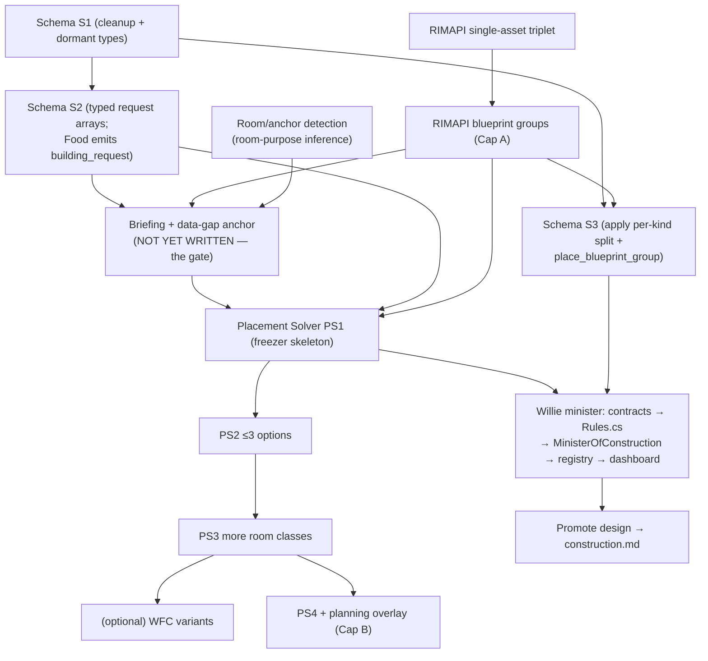

# Willie (Minister of Construction) — Meta-Plan

> **Master index + roadmap** for the Minister of Construction effort. Persona
> **Willie**; cabinet label **Construction** (UI/prompt flavor only).
>
> This doc ties together the design anchors, implementation plans, RIMAPI work,
> locked decisions, remaining work, and open decisions. It is the single place to
> see where the Construction effort stands. Detail lives in the linked plans;
> exact C# lives in source after landing.
>
> **Milestone:** M4 (first cabinet wave); Construction lands **first** after Food
> (Food's first live dependencies are cooler/power/room/storage builds). Design
> phase ~complete; **no Construction code landed yet.**
>
---

## 1. North-star chain (the vertical slice everything serves)

```
Food emits building_request {target_class: freezer, capacity_need:{food_units,200},
   adjacency:[near kitchen], temperature:{freezing}, deadline:{by_day,15}}
 → Willie Rules see an active building_request (deterministic path, no LLM)
 → Placement Solver: anchor (near kitchen) → size (200 food → ~5x5) → ≤3 candidate
   blueprint_groups → fork validate each → est_materials
 → AdviceItem (concern=thermal_control) with options[] (≤3 layouts)
 → player picks one in Willie's dashboard tab (sends advice-id + option-id)
 → Host wraps the chosen blueprint_group as a place_blueprint_group apply, fork-validates
 → player clicks Apply → fork validate→place→read the group (floor→walls→door→cooler)
```

This is the milestone-exit demo. It crosses the schema, the request taxonomy, the
Placement Solver, the fork group endpoints, and the dashboard pick UI — all
designed below.

---

## 2. Artifact map

### Design anchors — the "what" (settled this design session)
| Plan | Holds |
|---|---|
| [`willie-advice-types.md`](willie-advice-types.md) | The 9 canonical Construction concerns + first-slice rules-vs-LLM split. |
| [`willie-advice-schema.md`](willie-advice-schema.md) | Advice/output side: flatten (drop icon/reason), per-kind apply split, `options[]`, `blueprint_group`, `place_blueprint_group`. |
| [`willie-request-taxonomy.md`](willie-request-taxonomy.md) | Request/input side: typed request arrays, rich `BuildingRequest`, inbound ask-map → concern. |

### Engine designs — the "how Willie decides where to build"
| Plan | Holds |
|---|---|
| [`placement-solver.md`](placement-solver.md) | Deterministic engine: `building_request`/intent → `PlacementSpec` → ≤3 validated `AdviceOption`s. Slices PS1–PS4. **No LLM.** |
| [`wfc-variant-generator.md`](wfc-variant-generator.md) | Optional/experimental Wave-Function-Collapse variant generator for *internal* layouts inside a fixed rectangle. Not the core solver. |

### Implementation plans — land code in RimBob
| Plan | Holds |
|---|---|
| [`schema-landing.md`](schema-landing.md) | Lands the schema anchors as code. **S1** additive cleanup + dormant types · **S2** typed flag request arrays (Food emits `building_request`) · **S3** apply per-kind split (bundle with fork). Gimp one slice at a time. |

### RIMAPI work (lands in `C:\dev\RIMAPI-for-RimBob`, HTTP-only integration)
| Plan | Holds |
|---|---|
| [`rimapi-blueprint-placement-endpoint.md`](rimapi-blueprint-placement-endpoint.md) | Single-asset blueprint `validate` / `place` / `read` triplet (the primitive). |
| [`rimapi-blueprint-groups-and-planning-overlay.md`](rimapi-blueprint-groups-and-planning-overlay.md) | Capability A: blueprint **groups** (room shell + contents). Capability B (future): planning overlay via vanilla `Designator_Plan`. |

### Source research / heuristics
| Plan | Holds |
|---|---|
| [`base-construction-layout-agent.md`](base-construction-layout-agent.md) | Original 10-phase Construction implementation plan + Slices A/B/C (mirror-Food file list). |
| [`base-layout-construction-tips.md`](base-layout-construction-tips.md) | Community base-building heuristics → spatial-lint signals + dashboard panels. |
| [`deterministic-cos-cabinet-issue-solver.md`](deterministic-cos-cabinet-issue-solver.md) | Issue-report model + CoS routing (Construction issue families map onto the 9 concerns). |

### Grounding
- RAG corpus: `Docs/guides/Base/*` (rooms, colony-building, defense-structures, efficient layouts, killbox, planner, more-planning-mod) + `Docs/guides/beginner/*`.
- Canonical design docs: [`../Docs/design/ministers/construction.md`](../Docs/design/ministers/construction.md) (the promotion target — not yet updated), [`../Docs/design/ministers.md`](../Docs/design/ministers.md), [`../Docs/DESIGN.md`](../Docs/DESIGN.md).
- Reference implementation: `Src/Ministers/Food/` (the only fully-built feeder; Willie mirrors it).

---

## 3. Locked decisions (this session)

- **Persona Willie; cabinet label Construction.** No separate Base Layout minister; layout is a capability inside Construction.
- **9 concerns** ([`willie-advice-types.md`](willie-advice-types.md)): `power_stability`, `thermal_control`, `basic_shelter`, `functional_rooms`, `storage_placement`, `material_bottleneck`, `fire_risk`, `stalled_builds`, `base_layout`. `base_topology` folded into `base_layout` (dashboard grouping only). `functional_rooms` and `storage_placement` both kept (orthogonal). No generic `build_structure` concern — that is the `place_blueprint` *action*, not a category.
- **MVP posture = suggest + player-confirmed apply** (not suggest-only). Every write is player-click-gated; coverage partial; not `Auto`. (Landed in `DESIGN.md` + `AGENTS.md` this session.)
- **Typed request arrays** ([`willie-request-taxonomy.md`](willie-request-taxonomy.md)): `building_requests[]` / `labor_requests[]` / `item_requests[]` / `attention[]` replace the generic `requests[]`. `BuildingRequest` is rich (`target_class`, `room_class`, `capacity_need`, `adjacency`, `power`, `temperature`, `deadline`…). `requested_from` stays a **string** (not an enum) for now.
- **Advice flatten:** drop `AdviceAction.icon` (dashboard derives) and `.reason` (redundant with advice-level rationale).
- **`AdviceActionApply` per-kind split** (STJ polymorphic) + new `place_blueprint_group` kind. A single placement is a length-1 group (no separate single kind).
- **`AdviceItem.options[]`** for multi-option advice; each `AdviceOption` carries a `blueprint_group`. Dashboard pick sends only advice-id + option-id; the Apply click stays the consent boundary.
- **Request-driven build = deterministic Placement Solver path** (no LLM for the common case — requests are already structured). LLM reserved for genuine judgment.
- **LLM never authors exact cells.** The Placement Solver computes placement; the LLM proposes intent only.
- **Blueprint groups** placed atomically-ish on one player Apply. **Planning overlay** (future) uses the vanilla `Designator_Plan`, not forbidden blueprints.
- **WFC** is an optional future variant generator inside a validated rectangle, never the core solver, never bypassing live-state validation.

---

## 4. Remaining work (ordered, with dependencies)



**Phase ordering:**

1. **Schema landing** — `schema-landing.md`. S1 (safe, mechanical) → S2 (foundational; Food starts emitting typed `building_request`). S3 deferred, bundled with fork groups.
2. **RIMAPI** — single-asset triplet → blueprint groups (Capability A). Required before the Placement Solver can validate candidates.
3. **Briefing + data-gap anchor** — **the one undesigned piece.** For each `ConstructionBriefing` field: signal, RIMAPI/state-store source, availability (`have` / `need-fork` / `defer`). Grounded by mining RimMind (`ConstructionBacklogPart`, `StorageSaturationPart`) and the known gaps (`source-todo-building-condition-read`). This gates which Slice-A rules are real vs aspirational, and feeds the solver's anchor resolution.
4. **Room/anchor detection** — room-purpose inference from RIMAPI reads (resolve `near:kitchen` → map location). The hard sub-problem; may gate PS1. Depends on building/room reads (`source-todo-building-condition-read`, `source-todo-room-quality-read`).
5. **Placement Solver** — PS1 skeleton (freezer, near-kitchen, 1 candidate) → PS2 (≤3 variants) → PS3 (more room classes) → PS4 (base planning). Depends on §1 S2, §2 groups, §3 briefing, §4 room detection.
6. **Willie minister** — mirror Food: contracts → `Rules.cs` (rules-first; calls Placement Solver on an active `building_request`) → `MinisterOfConstruction` → registry/DI/cabinet order → dashboard scope. Slices A/B/C from `base-construction-layout-agent.md`.
7. **Promote design → `construction.md`** — record the 9 types, posture, and I/O contracts into the canonical doc; link these anchors. (Deferred by choice; do once anchors settle.)
8. **Optional/future** — WFC variant generator; planning overlay (Capability B); whole-base planning (PS4).

**Critical path:** S1→S2 + fork(single→groups) → briefing/data-gap + room detection → PS1 → Willie Rules Slice A → dashboard. The **briefing/data-gap** and **room detection** are the real gates; everything spatial waits on them.

---

## 5. Open decisions (need a human call)

| Decision | Where | Lean |
|---|---|---|
| Group atomicity on partial fresh-state failure + `MaxBlueprintGroupAssets` | advice-schema Q1 = rimapi-groups §4 | validate-all gate, then best-effort place + per-asset report; cap ~64 |
| Anchor/room-purpose detection approach | placement-solver Q1 | the hard gate; templated room detection first, may need RIMAPI room reads |
| Candidate variation method (templates vs packer vs WFC) | placement-solver Q2/Q3, wfc | templates first; WFC only if it beats templates in fixtures |
| Floor-fill representation (per-cell vs compressed rect) | advice-schema Q2 | per-cell now; cap room size; revisit if payloads bloat |
| `ResourceRequest` vs `AdviceAction` shared-shape refactor | both anchors flagged | partly mooted — S2 retires `ResourceRequest` from the flag path |
| Solver run cadence (per cycle vs on-demand) | placement-solver Q4 | on-demand when a `building_request` appears; bound fork `validate` calls |
| Picked-not-applied option survives a fresh snapshot? | advice-schema Q5, placement-solver Q5 | open |
| Feedback records *which* option was picked | advice-schema Q6 | yes — high-value refinement signal |

**Resolved this session:** `requested_from` = string; `base_topology` folded; `functional_rooms` + `storage_placement` both kept; `build_structure` dropped; suggest+apply posture; deterministic request→solver path.

---

## 6. Entry points for the next session

- **Land code now, low-risk:** gimp `schema-landing.md` **S1** (additive, mechanical), then **S2**.
- **Unblock the spatial work:** write the **briefing + data-gap anchor** (§4.3) — the gate.
- **RIMAPI track (parallel, separate repo):** single-asset triplet → groups (Capability A).
- **Defer:** Willie minister wiring, Placement Solver PS1, and the `construction.md` promotion until S2 + fork groups + briefing land.
