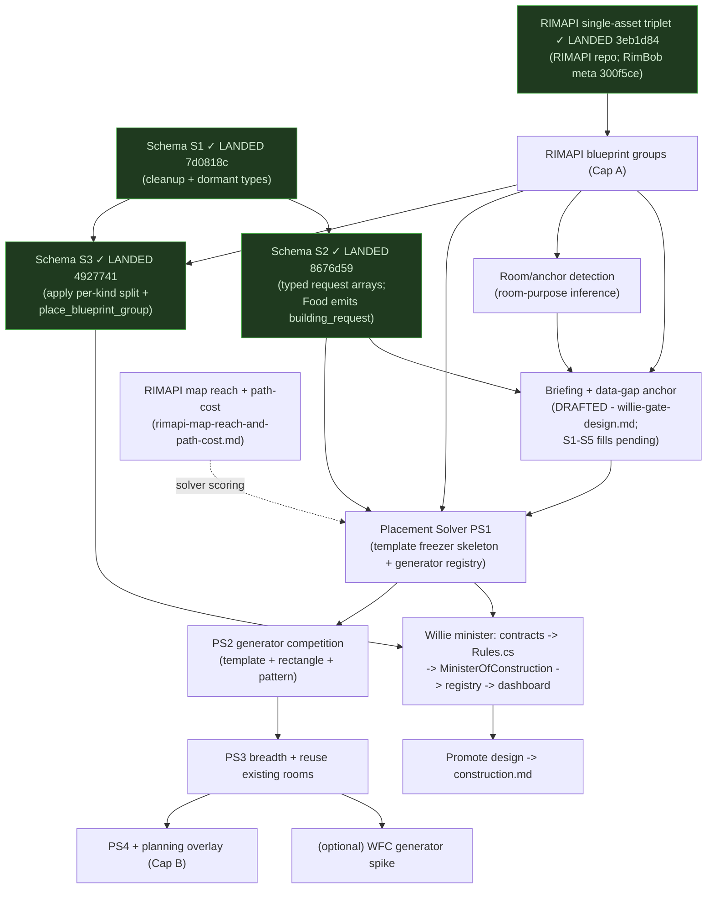

# Willie (Minister of Construction) - Meta-Plan

> **Master index + roadmap** for the Minister of Construction effort. Persona
> **Willie**; cabinet label **Construction** (UI/prompt flavor only).
>
> This doc ties together the design anchors, implementation plans, RIMAPI work,
> locked decisions, remaining work, and open decisions. It is the single place to
> see where the Construction effort stands. Detail lives in the linked plans;
> exact C# lives in source after landing.
>
> **Milestone:** M4 (first cabinet wave); Construction lands **first** after Food
> (Food's first live dependencies are cooler/power/room/storage builds). Design
> phase ~complete; **no Construction code landed yet.**

---

## 1. North-star chain (the vertical slice everything serves)

```
Food emits building_request
  { target_class: freezer,
    capacity_need: {food_units, 200},
    adjacency: [near kitchen],
    temperature: {freezing},
    deadline: {by_day, 15} }
-> Willie Rules see an active building_request (deterministic; no LLM)
-> Placement Solver:
     anchor (near kitchen) -> size (200 food -> ~5x5)
     -> precompute map evidence
     -> run bounded candidate generators
     -> hard-gate, cheap-score, dedupe, pick diverse survivors
     -> fork-validate survivors, estimate materials
-> AdviceItem (concern=thermal_control) with options[] (top 1-3 layouts)
-> player picks one in Willie's dashboard tab
     (sends advice-id + option-id)
-> Host wraps chosen blueprint_group as a place_blueprint_group apply;
   fork-validates
-> player clicks Apply -> fork validate -> place
     -> read the group (floor/walls/door/cooler)
```

This is the milestone-exit demo. It crosses the schema, the request taxonomy, the
Placement Solver, the fork group endpoints, and the dashboard pick UI.

---

## 2. Artifact map

### Design anchors - the "what"

| Plan | Holds |
|---|---|
| [`willie-advice-types.md`](willie-advice-types.md) | The 9 canonical Construction concerns + first-slice rules-vs-LLM split. |
| [`willie-advice-schema.md`](willie-advice-schema.md) | Advice/output side: flatten (drop icon/reason), per-kind apply split, `options[]`, `blueprint_group`, `place_blueprint_group`. |
| [`willie-request-taxonomy.md`](willie-request-taxonomy.md) | Request/input side: typed request arrays, rich `BuildingRequest`, inbound ask-map -> concern. |
| [`willie-gate-design.md`](willie-gate-design.md) | Construction briefing + data-gap anchor (the GATE): per-field `signal/source/availability/consumers/notes` for all 9 concerns + anchor inventory contract. Slice scaffold drafted; S1-S5 fills pending. |

### Engine designs - the "how Willie decides where to build"

| Plan | Holds |
|---|---|
| [`placement-solver.md`](placement-solver.md) | Deterministic engine: `building_request`/intent -> `PlacementSpec` -> bounded candidate generator registry -> shared gates/scoring -> top 1-3 validated `AdviceOption`s. **No LLM.** |
| [`wfc-variant-generator.md`](wfc-variant-generator.md) | Optional/experimental Wave-Function-Collapse candidate generator for internal layouts inside a fixed rectangle. Not the core solver. |

### Implementation plans - land code in RimBob

| Plan | Holds |
|---|---|
| [`schema-landing.md`](schema-landing.md) | Lands the schema anchors as code. **S1** additive cleanup + dormant types; **S2** typed flag request arrays (Food emits `building_request`); **S3** apply per-kind split (bundle with fork). Gimp one slice at a time. |

### RIMAPI work (lands in `C:\dev\RIMAPI-for-RimBob`, HTTP-only integration)

| Plan | Holds |
|---|---|
| [`rimapi-blueprint-placement-endpoint.md`](rimapi-blueprint-placement-endpoint.md) | Single-asset blueprint `validate` / `place` / `read` triplet (the primitive). |
| [`rimapi-blueprint-groups-and-planning-overlay.md`](rimapi-blueprint-groups-and-planning-overlay.md) | Capability A: blueprint **groups** (room shell + contents). Capability B (future): planning overlay via vanilla `Designator_Plan`. |
| [`rimapi-map-reach-and-path-cost.md`](rimapi-map-reach-and-path-cost.md) | In-map reachability + path cost (`/map/reach`, `/map/path-cost`, batch). Region-BFS for coarse rank, A* for tiebreak. Unblocks real `near:<class>` solver scoring beyond euclidean-from-centroid. |

### Background / supporting plans

| Plan | Holds | Kind |
|---|---|---|
| [`base-construction-layout-agent.md`](base-construction-layout-agent.md) | Original 10-phase Construction implementation plan + Slices A/B/C (mirror-Food file list). | Primary source for the Willie-minister implementation phase. |
| [`base-layout-construction-tips.md`](base-layout-construction-tips.md) | Community base-building heuristics -> spatial-lint signals + dashboard panels. | Research input for solver heuristics. |
| [`deterministic-cos-cabinet-issue-solver.md`](deterministic-cos-cabinet-issue-solver.md) | Issue-report model + CoS routing (Construction issue families map onto the 9 concerns). | Cross-minister design. |

### Grounding

- RAG corpus: `Docs/guides/Base/*` (rooms, colony-building, defense-structures,
  efficient layouts, killbox, planner, more-planning-mod) + `Docs/guides/beginner/*`.
- Canonical design docs: [`../Docs/design/ministers/construction.md`](../Docs/design/ministers/construction.md),
  [`../Docs/design/ministers.md`](../Docs/design/ministers.md), [`../Docs/DESIGN.md`](../Docs/DESIGN.md).
- Reference implementation: `Src/Ministers/Food/` (the only fully-built feeder;
  Willie mirrors it).

---

## 3. Locked decisions

- **Persona Willie; cabinet label Construction.** No separate Base Layout
  minister; layout is a capability inside Construction.
- **9 concerns** ([`willie-advice-types.md`](willie-advice-types.md)):
  `power_stability`, `thermal_control`, `basic_shelter`, `functional_rooms`,
  `storage_placement`, `material_bottleneck`, `fire_risk`, `stalled_builds`,
  `base_layout`. `base_topology` folded into `base_layout` (dashboard grouping
  only). `functional_rooms` and `storage_placement` both kept (orthogonal). No
  generic `build_structure` concern - that is the `place_blueprint` action, not a
  category.
- **MVP posture = suggest + player-confirmed apply** (not suggest-only). Every
  write is player-click-gated; coverage partial; not `Auto`.
- **Typed request arrays** ([`willie-request-taxonomy.md`](willie-request-taxonomy.md)):
  `building_requests[]` / `labor_requests[]` / `item_requests[]` / `attention[]`
  replace the generic `requests[]`. `BuildingRequest` is rich (`target_class`,
  `room_class`, `capacity_need`, `adjacency`, `power`, `temperature`, `deadline`,
  etc.). `requested_from` stays a **string** (not an enum) for now.
- **Advice flatten:** drop `AdviceAction.icon` (dashboard derives) and `.reason`
  (redundant with advice-level rationale).
- **`AdviceActionApply` per-kind split** (STJ polymorphic) + new
  `place_blueprint_group` kind. A single placement is a length-1 group (no
  separate single kind).
- **`AdviceItem.options[]`** for multi-option advice; each `AdviceOption` carries
  a `blueprint_group`. Dashboard pick sends only advice-id + option-id; the
  Apply click stays the consent boundary.
- **LLM scope:** never authors exact cells; reserved for genuine judgment
  (intent, not placement). Request-driven build = deterministic Placement Solver
  path; LLM only invoked when the input is unstructured. Placement Solver
  computes placement; LLM proposes intent only.
- **Candidate generation is competitive, validation is shared.** Several bounded
  generators can propose drafts, but one shared solver owns hard gates, score
  vector, dedupe/diversity, fork validation, and final top 1-3 option selection.
  Generators do not get private scoring or bypass RIMAPI validation.
- **Score traces carry units.** Measured metrics keep raw values with explicit
  units (`tiles`, `watts`, `celsius`, item counts, `silver_value`, etc.) beside
  normalized 0-1 ranking values. Example shape:
  `{metric:"distance_to_kitchen", raw:7, unit:"tiles", normalized:0.82}`.
  Boolean/enum readiness and validation facts stay typed status fields, not
  fake metrics.
- **Blueprint groups** placed atomically-ish on one player Apply. **Planning
  overlay** (future) uses the vanilla `Designator_Plan`, not forbidden
  blueprints.
- **WFC** is an optional future generator inside a validated rectangle, never the
  core solver, never bypassing live-state validation.
- **No compat code for proposal/trace persistence changes.** Scope: local
  on-disk state only (no external consumers). If the solver option or trace
  wire shape changes, wipe-and-regen on upgrade.

---

## 4. Remaining work (ordered, with dependencies)



Note: FORK3 is **not** a hard PS1 gate. PS1 can ship with euclidean-from-centroid scoring as Slice A; FORK3 swaps in walkable distance for Slice B without changing the solver contract. RIMAPI verified today exposes `/api/v1/map/rooms` but **no** in-map reachability or pathfinding endpoint — only worldmap caravan path.

**Phase ordering:**

1. **Schema landing** [✓ LANDED — S1 `7d0818c`, S2 `8676d59`, S3 `4927741`].
   Source of truth: `schema-landing.md`. Food emits typed `building_request`;
   `AdviceActionApply` poly-split with `place_blueprint_group`; `options[]` and
   `BlueprintGroup` dormant in `Src/Common/Advice/`.
2. **RIMAPI** - single-asset triplet [✓ LANDED — RIMAPI `3eb1d84`, RimBob
   meta `300f5ce`] -> blueprint groups (Capability A, pending). Required before
   the Placement Solver can validate candidates.
3. **Briefing + data-gap anchor** - **drafted** in
   [`willie-gate-design.md`](willie-gate-design.md); S1-S5 fills pending. For
   each `ConstructionBriefing` field: signal, RIMAPI/state-store source,
   availability (`have` / `need-fork` / `defer`). Grounded by mining RimMind
   (`ConstructionBacklogPart`, `StorageSaturationPart`) and the known gaps
   (`source-todo-building-condition-read`). This gates which Slice-A rules are
   real vs aspirational, and feeds the solver's anchor resolution.
   - **Power-net availability resolved (2026-05-27):** `/api/v1/map/power/info`
     is aggregate-only (gen/draw/battery totals + building id lists); per-net
     split + outage flag = `need-fork`. RimBob's `PowerInfoDto` is broken —
     expects 4 floats, RIMAPI sends 9 fields (see `rimapi-power-info-dto.md`).
   - **Anchor scoring resolved (2026-05-27):** drop centroid-as-primary;
     anchor = `{room_id, entry_cells[], region_id}`. Solver does region-tier
     batch rank → A* top-K tiebreak. Both require **FORK3**
     (`rimapi-map-reach-and-path-cost.md`); Slice A ships with
     euclidean-from-centroid approximation as fallback.
4. **Room/anchor detection** - room-purpose inference from RIMAPI reads (resolve
   `near:kitchen` -> map location). The hard sub-problem; may gate PS1. Depends
   on building/room reads (`source-todo-building-condition-read`,
   `source-todo-room-quality-read`) — i.e. on FORK2.
5. **Placement Solver** - PS1 skeleton (freezer, near-kitchen,
   `TemplateAnchoredGenerator`, one candidate) -> PS2 competing generators
   (templates + rectangle + local patterns, top 1-3 options) -> PS3 more room
   classes and reuse-existing-footprint logic -> PS4 base planning. Depends on
   S2, groups, briefing, and room detection.
6. **Willie minister** - mirror Food: contracts -> `Rules.cs` (rules-first;
   calls Placement Solver on an active `building_request`) ->
   `MinisterOfConstruction` -> registry/DI/cabinet order -> dashboard scope.
   Slices A/B/C from `base-construction-layout-agent.md`.
7. **Promote design -> `construction.md`** - keep canonical docs aligned once
   anchors settle.
8. **Optional/future** - WFC variant generator; planning overlay (Capability B);
   whole-base planning (PS4).

**Tests:** Placement Solver tests live in `Src/Tests/PlacementSolver/`;
seed-based replay for solver determinism (same inputs -> same options ranking).
Per-minister tests live alongside their minister directory under `Src/Tests/`.

**Critical path:** [S1/S2/S3 ✓] [FORK1 ✓] -> FORK2 (groups) ->
briefing/data-gap + room detection -> PS1 -> Willie Rules Slice A -> dashboard.
The **briefing/data-gap** and **room detection** are the real gates;
everything spatial waits on them.

---

## 5. Open decisions (need a human call)

| Decision | Where | Lean |
|---|---|---|
| Group atomicity on partial fresh-state failure + `MaxBlueprintGroupAssets` | advice-schema Q1 (see also rimapi-groups §4) | validate-all gate, then best-effort place + per-asset report; cap ~64 |
| Anchor/room-purpose detection approach | placement-solver Q1 | the hard gate; templated room detection first; RIMAPI `/api/v1/map/rooms` available today |
| Anchor scoring representation | placement-solver / willie-gate-design S3 | **resolved 2026-05-27:** `{room_id, entry_cells[], region_id}` + region-BFS scoring (FORK3); euclidean-from-centroid only as Slice-A fallback |
| Generator budgets and diversity thresholds | placement-solver Q3 | start with tiny per-generator caps; validate only a diverse top survivor set |
| Floor-fill representation (per-cell vs compressed rect) | advice-schema Q2 | per-cell now; cap room size; revisit if payloads bloat |
| `ResourceRequest` vs `AdviceAction` shared-shape refactor | both anchors flagged | partly mooted - S2 retires `ResourceRequest` from the flag path |
| Solver run cadence (per cycle vs on-demand) | placement-solver Q4 | on-demand when a `building_request` appears; bound fork `validate` calls |
| Picked-not-applied option survives a fresh snapshot? | advice-schema Q5, placement-solver Q5 | open |
| Feedback records *which* option was picked | advice-schema Q6 | yes - high-value refinement signal |

**Resolved:** `requested_from` = string; `base_topology` folded; `functional_rooms`
and `storage_placement` both kept; `build_structure` dropped; suggest+apply
posture; deterministic request -> solver path; candidate generation uses a
bounded generator registry with one shared validator/scorer.

---

## 6. Entry points for the next session

> Active items only — see §4 for the full phase graph.

- **Unblock the spatial work:** fill GATE S1-S5 in
  [`willie-gate-design.md`](willie-gate-design.md) (skeleton drafted; tables,
  RimMind cross-walk, anchor inventory contract, rule-vs-aspiration cut still
  empty).
- **RIMAPI track (parallel, separate repo):**
  - `FORK1` triplet ✓ landed.
  - `FORK2` blueprint groups Capability A — pending.
  - `FORK3` map reach + path-cost
    ([`rimapi-map-reach-and-path-cost.md`](rimapi-map-reach-and-path-cost.md))
    — pending. Not a hard PS1 gate; Slice A can use euclidean fallback.
  - `rimapi-power-info-dto` — DTO mismatch bug, plan landed.
- **Deferred until `GATE` + `FORK2` land:** Willie minister wiring
  (§4 `WILLIE`), Placement Solver PS1 (§4 `PS1`), `construction.md` promotion
  (§4 `PROMOTE`).
