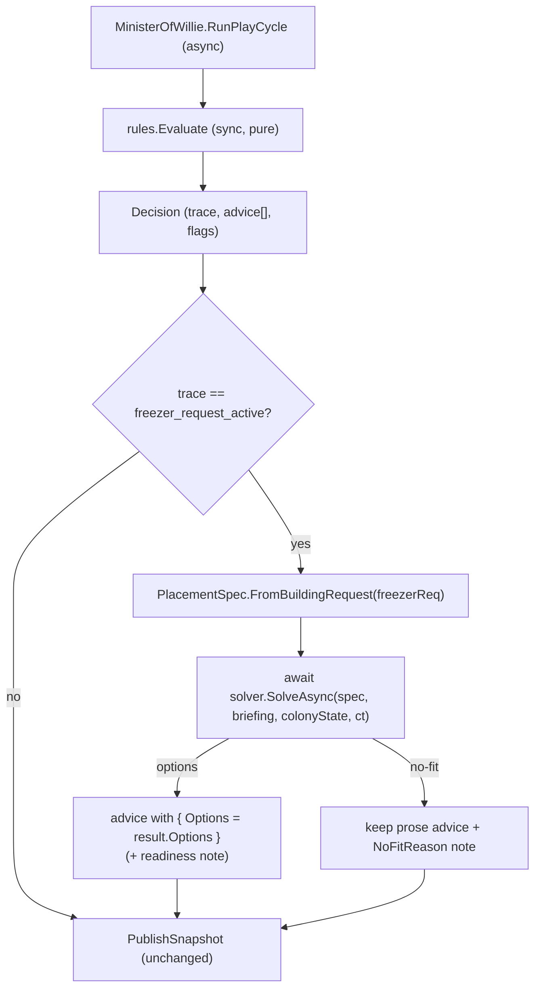

# Willie Placement Wiring — Solver → Rules → Advice

> Implementation plan. Lands **code** in RimBob. No RIMAPI work.
>
> Makes the **landed** Placement Solver (Solver1 `5a8e6c9`, Solver2 `9f6fe90..0e86f5f`) actually emit options on a live `building_request`. Today `PlacementSolver` is fully registered ([`Program.cs:70-75`](../Src/ApiHost/Program.cs)) but **nothing calls `SolveAsync`** — the integration TODOs at [`Rules.cs:125`](../Src/Ministers/Willie/Rules.cs) (`freezer_request_active`) and [`Rules.cs:170`](../Src/Ministers/Willie/Rules.cs) (missing-room) are unburned. The solver is dead weight until this lands.
>
> **No compat code; wipe-and-regen on upgrade** for any persisted advice/option shape. Worktree port: `.\run-rimbob.ps1 -ListenUrl http://127.0.0.1:5101`.

---

## 0. Motivation + the design crux

`MinisterOfWillie.RunPlayCycle` is the **async orchestrator**: it calls `rules.Evaluate(...)` (sync) then `PublishSnapshot`/replay ([`MinisterOfWillie.cs:21-67`](../Src/Ministers/Willie/MinisterOfWillie.cs)). `Rules.Evaluate` is **sync, pure, zero-dependency** (`AddSingleton<WillieRules>()`, no ctor) and **must stay so** — the AGENTS minister convention keeps `Rules.cs` deterministic + unit-testable, and `SolveAsync` is `async` and needs `ColonyState` + the RIMAPI ports.

**Decision: the solver call lives in `MinisterOfWillie`, not `Rules`.** Rules keeps emitting its deterministic prose `AdviceItem` for `freezer_request_active`; the orchestrator then **enriches** that item with `result.Options` when the solver produces them. Clean seam: Rules stays pure/tested, async I/O stays in the orchestrator.

`AdviceItem.Options` already exists (`IReadOnlyList<AdviceOption>? Options = null`, [`AdviceItem.cs:46`](../Src/Common/Advice/AdviceItem.cs)) — the attach point. `PlacementSpec.FromBuildingRequest` already exists (Solver1a). So this is wiring, not new contract.

**Scope: freezer path only.** Solver3 adds solver-internal room-class breadth, but live missing-room routing still needs a second wiring pass. This first wiring slice keeps the live enrichment narrow: Chef freezer request -> Willie freezer options. Missing-room (kitchen/hospital/storage) stays prose until the follow-up explicitly routes those traces into the solver.



---

## 1. Slices

### W1 — inject solver + attach options on `freezer_request_active`  *(CORE)*

Files (modified):

- `Src/Ministers/Willie/MinisterOfWillie.cs`
  - ctor adds `PlacementSolver solver` + `ColonyState colonyState` (both registered singletons). Primary-ctor param list extends; DI resolves automatically — confirm `RimBob.Ministers.csproj` already refs State (it does — `MinisterOfWillie` uses `RimBob.State`).
  - In `RunPlayCycle`, in the `case Decision decision:` arm, **before** `PublishSnapshot`: if `decision.Trace == "freezer_request_active"`, find the matching freezer `BuildingRequest` from `inboundRequests`, build a `PlacementSpec`, `await solver.SolveAsync(spec, briefing, colonyState, ct)`, and if `result.Options.Count > 0` replace the matching `AdviceItem` in `decision.Advice` with `item with { Options = result.Options }`. Publish the enriched advice list.
  - Keep the call **guarded** by trace + request presence so `SolveAsync` (RIMAPI validate + path-cost I/O) runs only when a freezer request is active — addresses design §8 "bound the call count" at cabinet cadence.
- `Src/Ministers/Willie/Rules.cs`
  - Expose the freezer-match predicate so the orchestrator reuses it without duplicating logic: make `IsFreezingBuildRequest` `public static` (currently private, [`Rules.cs:365`](../Src/Ministers/Willie/Rules.cs)). No behaviour change.

Tests (new), `Src/Tests/Willie/`:

- `MinisterOfWilliePlacementTests.cs` — inject a **fake `PlacementSolver`** (or fake the ports it sits on). freezer request present → published advice for `freezer_request_active` carries `Options` from the solver; non-freezer decision → advice unchanged (no solver call); solver returns 0 options → advice unchanged + no crash.
  - Note: `PlacementSolver` is a concrete sealed class. To fake it cheaply, inject **fake `IPathCostProbe` + `IPlacementValidator`** (the ports) and a real `PlacementSolver`, OR extract a tiny `IPlacementSolver` seam (one method) — **recommend the `IPlacementSolver` seam** so the orchestrator test does not reconstruct map fixtures. Decide in W1.

Risk: **medium.** New async call + DI extension in the orchestrator; the test-seam decision is the only judgement call.

### W2 — no-fit mapping + readiness/trace surfacing  *(POLISH)*

Files (modified):

- `Src/Ministers/Willie/MinisterOfWillie.cs`
  - On `result.NoFit is not null`: keep the Rules prose advice but annotate (e.g. append a `Rationale` suffix or a structured note) from `NoFitReason` (`NoReachablePath` → "no walkable route to a kitchen anchor"; `ValidationRejected` → "no buildable footprint near the kitchen"; `HardGateRejected`/`NoDrafts` → "no clear space near the kitchen"). Do **not** fabricate a `material_bottleneck` re-route here — Rules owns that branch via the backlog/stalled rules; full re-route is a Solver-followup.
  - Carry `result.Trace` into the replay entry (`MinisterReplayEntry`) so the dashboard/debug view can inspect solver candidates (design §7). Today replay records `RuleTrace`/`RuleDiagnostics` only.
  - Surface `result.MaterialsReady` on the option/advice so the dashboard can show "valid but unaffordable" without hiding the layout (design §3.2).

Tests (new):

- extend `MinisterOfWilliePlacementTests.cs` — `NoReachablePath` no-fit → prose advice retained + note present, no `Options`; replay entry carries the solver trace.

Risk: **low.** Annotation + trace plumbing.

---

## 2. Keep-green (every slice)

- Sync worktree with `master`; `dotnet build Src/RimBob.sln`; `dotnet test Src/Tests/RimBob.Tests.csproj`.
- Live smoke on `:5101`: post a Willie freezer `building_request`, confirm the Willie advice item renders `options[]` (and a no-fit case renders prose + note).

---

## 3. Out of scope

- **Missing-room → solver options** (kitchen/hospital/storage prose at `Rules.cs:170`) — Solver3 provides the internal templates, but a second wiring pass must still route those traces into `SolveAsync`.
- **Group `place` Apply write** — the player-click executor; separate Assisted Apply path.
- **`material_bottleneck` re-route from a solver no-fit** — heavier advice-routing; revisit after W2 proves the no-fit note.
- **Cabinet-cadence supersession** of not-yet-applied options on a fresh snapshot (advice-schema Q5 / design §8).

---

## 4. Verification (per slice)

- W1: orchestrator test green; live freezer request → advice carries `options[]`; non-freezer path unchanged.
- W2: no-fit note present + no options; replay carries solver trace; `MaterialsReady` visible.

---

## 5. HumanTodo capture (append in same commit as this plan)

```
- [ ] willie-placement-wiring [2026-05-29] #construction #willie #solver #integration Wire the landed Placement Solver into MinisterOfWillie: inject PlacementSolver + ColonyState, call SolveAsync on freezer_request_active and attach result.Options to the AdviceItem (W1); no-fit NoFitReason note + readiness/solver-trace surfacing (W2). Rules stays sync/pure; async solver call lives in the orchestrator. Freezer path only. [plan](.plans/willie-placement-wiring.md)
```
