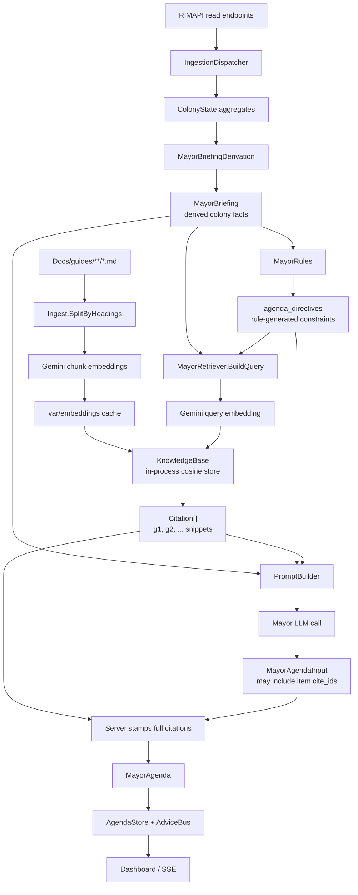

# RimAI — Knowledge Base and RAG

> **Living document.** See `CLAUDE.md` for update rules.

---

## Purpose

Ground minister reasoning in actual RimWorld community knowledge rather than relying on LLM training data alone. Game mechanics and community-optimal strategies are ingested once at startup and retrieved at LLM call time.

---

## Two-tier content strategy

**Tier 1 — System prompt (evergreen content)**
Distilled, stable strategic knowledge baked into each minister's system prompt. Cached at the LLM API layer (prompt caching). Does not hit the vector store.

- Agriculture: crop choice rules, seasonal priorities, food math
- Defense: raid tier benchmarks, killbox principles, weapon recommendations
- Construction: build order heuristics, material choices, power math
- Welfare: mood modifier sources, recreation building efficiency
- Mayor: two-year strategic plan (Y1-Y2 guide)

**Tier 2 — RAG retrieval (long-tail)**
Specific, situational, or detailed content retrieved at call time. Used when the situation likely needs guide knowledge that isn't in the system prompt.

- Specific event handling (infestations, mechanoid clusters, toxic fallout)
- DLC-specific mechanics (Royalty quests, Biotech genes, Ideology rituals)
- Edge-case farm decisions (devilstrand timing, drug crop yield math)
- Defense against unusual raid compositions

---

## Implementation

### Mayor data flow



`MayorBriefingDerivation` answers "what is true about the colony?" and writes structured facts. `MayorRules` answers "what must the Mayor pay attention to?" and writes agenda directives. `MayorRetriever` uses both the facts and directives to retrieve guide passages before the Mayor LLM call.

### In-process cosine store

No vector DB framework. Small corpus; simple store is sufficient and debuggable.

```csharp
public class KnowledgeBase
{
    private List<Chunk> _chunks;

    record Chunk(float[] Embedding, string Text, ChunkMetadata Meta);

    public IEnumerable<string> Retrieve(float[] queryEmbedding, int topK = 5)
        => _chunks
            .OrderByDescending(c => CosineSimilarity(c.Embedding, queryEmbedding))
            .Take(topK)
            .Select(c => c.Text);

    static float CosineSimilarity(float[] a, float[] b) { ... }
}
```

On-disk JSON cache of embeddings keyed by chunk hash (SHA-256 of text content). Re-runs don't re-embed unless content changes.

### Upgrade path

If corpus exceeds ~5,000 chunks or query latency becomes noticeable, swap `KnowledgeBase` backend to Qdrant or sqlite-vss. Interface stays the same; only the implementation changes.

---

## Guide corpus

```
Docs/guides/
├── strategic-plan-y1-y2.md          // Y1-Y2 colony strategy, distilled
└── beginner/
    ├── beginner-survival-tips.md     // Steam guide (1.4, 2023) — colonist setup, research path
    ├── survival-tactics.md           // rimworldhub.com — first 15 min, base layout, mood breaks
    ├── wealth-management.md          // gamepadsquire.com — raid-point math, trade beacons, 60/140 rule
    ├── killbox-design.md             // thegamer.com — 10 killbox design principles
    ├── first-steps.md                // bisecthosting.com — scenario selection, 8-step build order
    ├── tips-and-tricks.md            // blogs.plitch.com — 11 tips
    └── failed-fetches.md             // wiki URLs blocked by 403 — copy manually
```

`Ingest.cs` points to this path via config — `Src/KnowledgeBase/` stays pure C# infrastructure.

Each minister session should identify which guides are most relevant and add them. Suggested additions:

| Minister | Guides to add |
|---|---|
| Agriculture | RimWorld wiki crop tables, food math guide |
| Defense | Killbox guide, raid composition wiki, mechanoid guide |
| Construction | Power math, room stats (beauty, cleanliness), biome-specific tips |
| Welfare | Mood modifier reference, recreation building guide |
| Mayor | General strategy tier list, wealth management wiki page |

---

## Retrieval per minister

Each minister has a retrieval profile — a query template and topic filter:

```csharp
public class RetrievalProfile
{
    public string[] TopicFilters  { get; }  // e.g. ["food", "farming", "hunting"]
    public string   QueryTemplate { get; }  // "{situation} in {season}, what should I do?"
    public int      TopK          { get; }  // default 3
    public bool     RequiredForEscalation { get; }  // skip retrieval on rules path
}
```

Retrieval only runs on the LLM escalation path. Rules evaluations don't use RAG.

---

## When a rule needs guide knowledge

A rule can flag that it needs guide knowledge before it can fire:

```csharp
// In Agriculture Rules.cs
if (briefing.Season == Season.Fall && briefing.DaysToWinter < 15)
{
    // This decision benefits from guide knowledge — escalate with context
    return new Escalate(
        reason: "First devilstrand harvest decision — guide knowledge needed",
        context: new { briefing.DevilstrandGrowth, briefing.DaysToWinter }
    );
}
```

The escalation reason flags that RAG retrieval for "devilstrand harvest timing" should be included in the LLM prompt.

---

## M2 implementation (resolved decisions)

- **Embedding model:** Gemini `gemini-embedding-001` via `Google.GenAI` 1.6.1. Configured under `RimAi:Rag:EmbeddingModel`. (`text-embedding-004` was the original choice but is not exposed on the v1beta endpoint that the SDK currently targets.) 3072-dim by default; free tier handles the current ~50-chunk corpus.
- **Chunking:** semantic by H1/H2/H3 markdown headings. Sections exceeding `Ingest.MaxChunkChars` (≈ 800 tokens) are split on paragraph boundaries; deeper headings (H4+) stay inside the parent chunk. Implementation: `Src/KnowledgeBase/Ingest.cs::SplitByHeadings`.
- **Cache:** SHA-256-keyed JSON files under `var/embeddings/` (configurable via `RimAi:Rag:CacheRoot`). Append-only for M2 — corpus is small; GC is post-MVP.
- **Retrieval:** `MayorRetriever` builds a query string from the briefing (date, season, food, threat, wealth, weather, research, plus agenda directives) and pulls `topK` chunks. Disabled (or missing-key) cleanly short-circuits to an empty list — the Mayor still runs.
- **Tier 1 status:** evergreen prompt distillation is not part of the shipped M2 implementation. The Mayor currently consumes guide knowledge through Tier 2 `retrieved_guides[]`; distillation is a follow-up if prompt traces show under-use of retrieved passages.

### Citation rendering

Each retrieved chunk becomes a `Citation { cite_id, source_path, heading, snippet }` (snippet truncated to ~320 chars). The Mayor's prompt receives them as a `retrieved_guides[]` array; the LLM may attach `cite_id`s to specific `short_term[]` / `long_term[]` items via the optional `cite_ids` field. The Mayor's `MayorAgenda.citations[]` is server-stamped from the retriever's output regardless of what the LLM emits, so the dashboard always has the snippet text to render.

When `RimAi:Rag:Enabled` is `false`, retrieval is skipped, `retrieved_guides` is omitted from the prompt, and `MayorAgenda.citations` is empty.

## Open questions

- [ ] Guide freshness: RimWorld updates change mechanics. How do we flag stale guide content?
- [ ] Per-minister guide curation: who decides which guides are relevant? Add to each minister's session scope (re-engaged at M3 when Agriculture lands).
- [ ] Tier 1 (evergreen content baked into system prompts): not yet implemented — Mayor still relies on Tier 2 retrieval for guide knowledge. Revisit once we measure the Mayor under-using Tier 2 hits.
