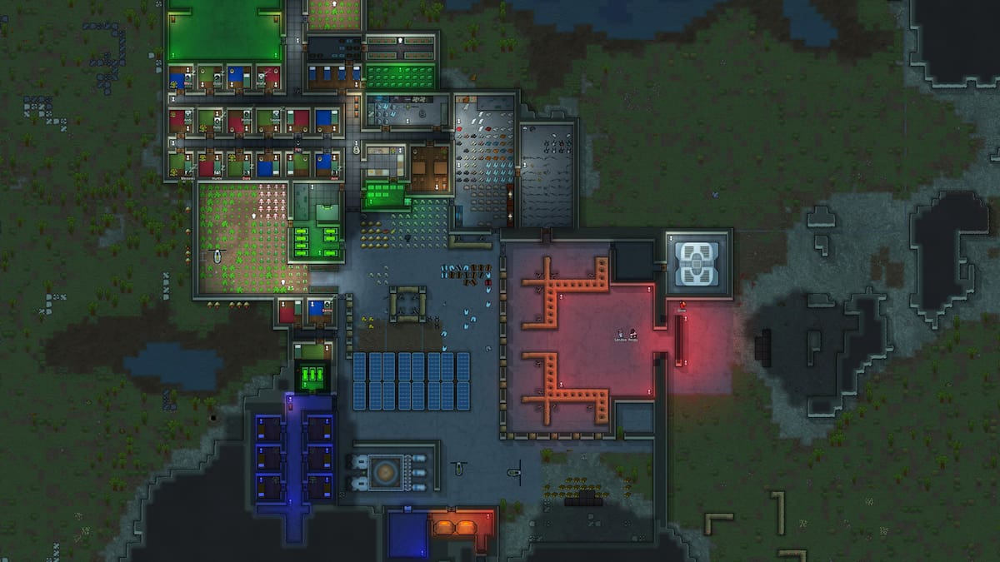
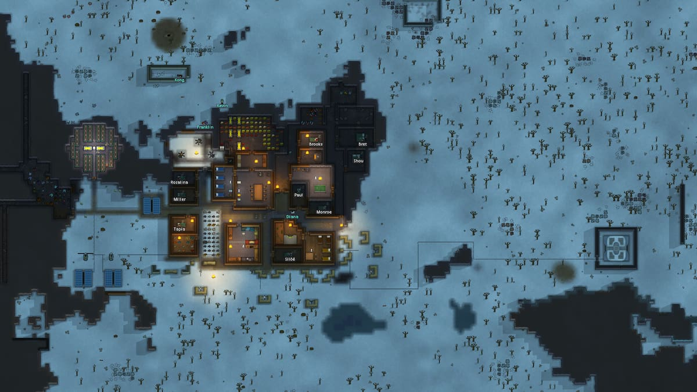
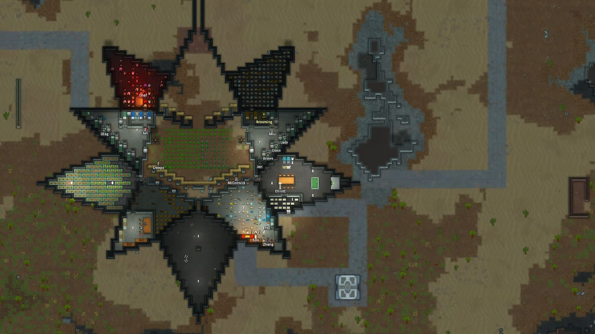

# Dot Esports - How To Build A Killbox In RimWorld

Source: https://dotesports.com/general/news/how-to-build-a-killbox-in-rimworld  
Retrieved: 2026-05-21  
Source license: No permissive reuse license found  
Attribution: Dot Esports / GAMURS, images captioned by source as via Ludeon Studios  
Note: Original RimBob summary. This is not a verbatim copy of the source.

## RimBob Use

Introductory killbox vocabulary source. Useful for simple player-facing explanations, but lower authority than the RimWorld Wiki defense page for exact mechanics.

## Layout Heuristics

- A killbox is a controlled raid path that funnels attackers into an exposed firing area.
- Core pieces are a funnel or entry labyrinth, a cover-free killing field, and a defended colonist bunker.
- Size the defender frontage around available shooters. A wider killbox is only useful if enough pawns can cover it.
- Depth should match weapon range. A deep field wastes space if defenders cannot hit the far side.
- Use stronger walls, doors, and cover materials as the colony advances.
- Give the entry at least two bends before the final opening so raiders do not get a clean straight firing line.
- Keep the killing field free of enemy cover.
- Build defender positions with alternating wall and cover opportunities so colonists can fire from relative safety.
- Semi-circular or angled bunker layouts can widen firing coverage compared with a straight line.
- Sandbags, barricades, or similar slow tiles inside the entry can buy more firing time.
- Spike traps in the entry path soften raids before the main firing line.
- EMP-ready defenders near the entry help against mechanoids and shield-belt attackers.

## Images

The featured hero image timed out during download. The three saved images below are the source's useful killbox/layout examples.

Source image: https://media.dotesports.com/wp-content/uploads/2023/01/24092437/whats-a-killbox-rimworld.jpg

Source image: https://media.dotesports.com/wp-content/uploads/2023/01/24092548/building-the-killbox-rimworld.jpg

Source image: https://media.dotesports.com/wp-content/uploads/2023/01/24092650/making-more-effective-killboxes-rimworld.jpg

## Caution

Use this as an accessible explanation, not a rules source. Exact trap spacing, barricade behavior, sapper/breacher handling, and turret counters should be checked against the wiki and current game behavior.

