# Indie Game Culture - Rimworld Base Layout Ideas and Tips

Source: https://indiegameculture.com/guides/rimworld-base-layout-ideas/  
Retrieved: 2026-05-21  
Source license: No permissive reuse license found  
Attribution: Linden Garcia / Indie Game Culture, plus named community creators where the article credits them  
Note: Original RimBob summary. This is not a verbatim copy of the source.

## RimBob Use

Good source for archetype vocabulary and visual examples: superstructure, mountain, town, circular, 11x11, layered, peninsula, and large community showcase bases. Useful for Willie classification and dashboard evidence.

## Layout Heuristics

- Choose terrain before placing rooms: fertile soil, rock/water defense, power, food access, and distance from map edges matter.
- Build the food loop as a cluster: farms near freezer, freezer near kitchen, kitchen near dining, but avoid routing general traffic through the kitchen.
- Segment crop fields with two-tile paths to limit fire spread.
- Group rooms by operating domain: workshop/research/storage, bedroom block, prison/hospital/defense, and food chain.
- Superstructures are efficient, easy to heat/cool, and easy to inspect, but dangerous if the outer shell is breached.
- Mountain bases provide natural defense and temperature stability but introduce infestation risk and indoor mood pressure.
- Town/city layouts are flexible and satisfying to watch, but they need longer paths and more perimeter defense.
- Circular bases are mostly aesthetic but suit sun-lamp grow-room geometry and compact insulation patterns.
- 11x11 grids are a practical modular default: symmetric doors, repeatable expansion, and center-friendly equipment radius.
- Layered bases protect critical infrastructure by depth and buy time after outer walls fail.
- Peninsula and water-border bases turn terrain into natural chokepoints, but may require lucky map generation or mods.
- The strongest examples mix archetypes instead of copying a single pattern literally.

## Images

These images are source-attributed local references. They should not be treated as freely licensed project art.

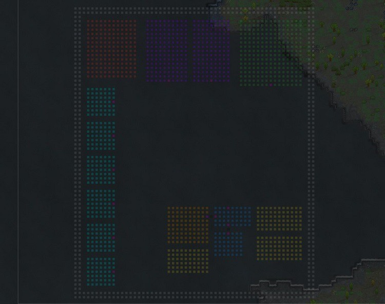

Source image: https://indiegameculture.com/wp-content/uploads/2023/09/rimworld-full-base-example.jpg

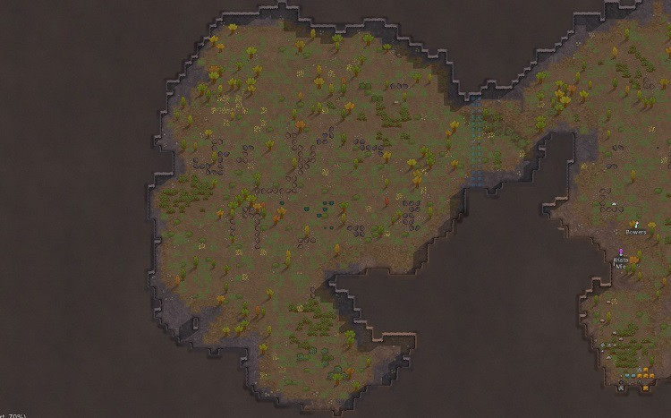

Source image: https://indiegameculture.com/wp-content/uploads/2023/09/rimworld-walled-in-base.jpg

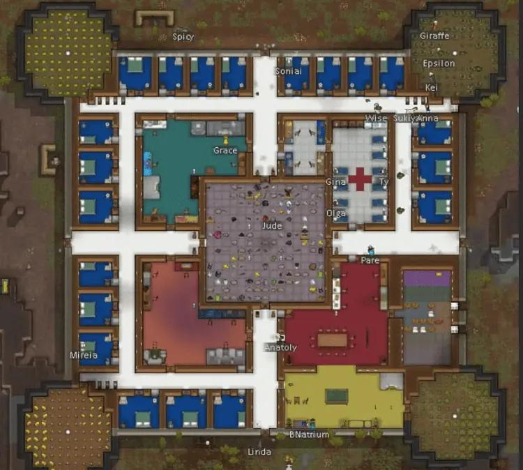

Source image: https://indiegameculture.com/wp-content/uploads/2023/09/super-structure-base-natrium-from-rimworldbase.png

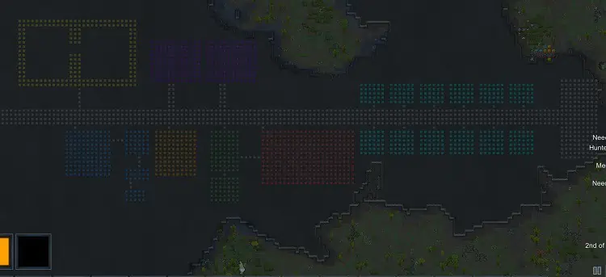

Source image: https://indiegameculture.com/wp-content/uploads/2023/09/rimworld-base-example.jpg

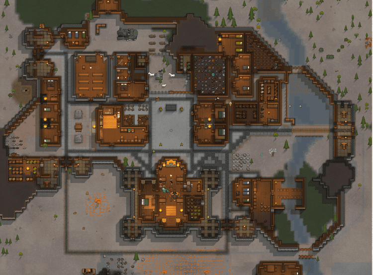

Source image: https://indiegameculture.com/wp-content/uploads/2023/09/rimworld-town-layout-khanaervon.png

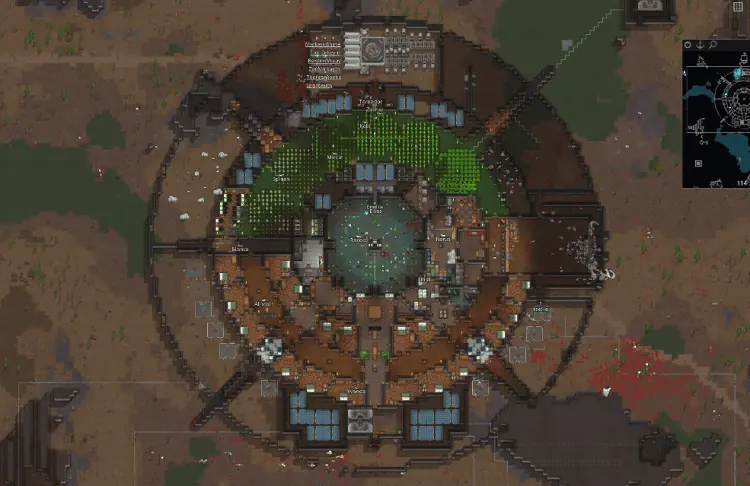

Source image: https://indiegameculture.com/wp-content/uploads/2023/09/rimworld-cirucular-base-jblade20000.png

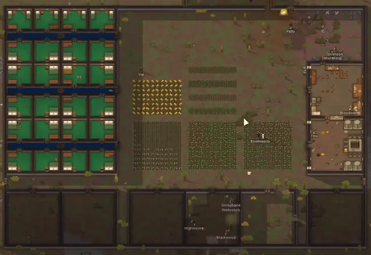

Source image: https://indiegameculture.com/wp-content/uploads/2023/09/rimworld-base-11-X-11-layout.png

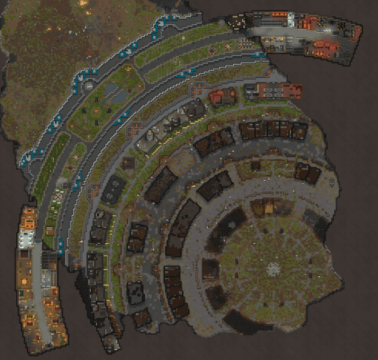

Source image: https://indiegameculture.com/wp-content/uploads/2023/09/rimworld-base-the-onion.png

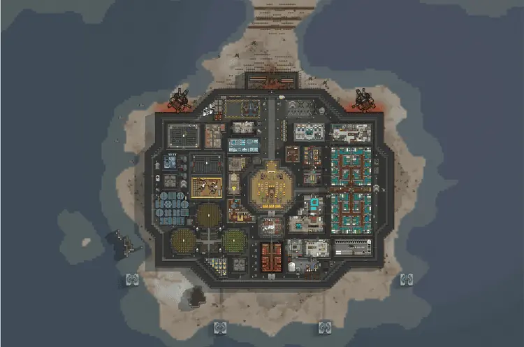

Source image: https://indiegameculture.com/wp-content/uploads/2023/09/rimworld-the-peninsular-base.png

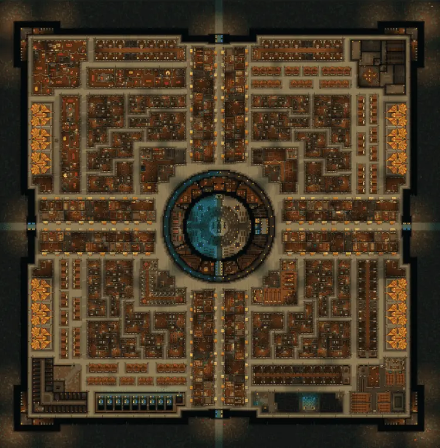

Source image: https://indiegameculture.com/wp-content/uploads/2023/09/rimworld-eternal-city-base.png

Source image: https://indiegameculture.com/wp-content/uploads/2023/09/rimworld-ice-base.png

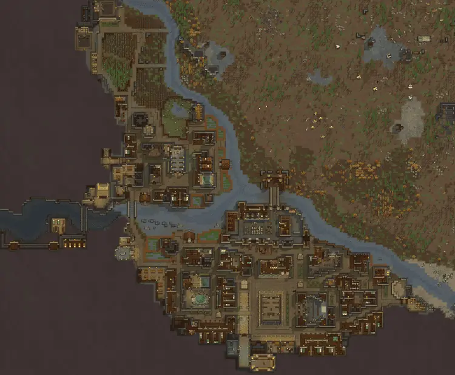

Source image: https://indiegameculture.com/wp-content/uploads/2023/09/rimworld-base-sedes.png
