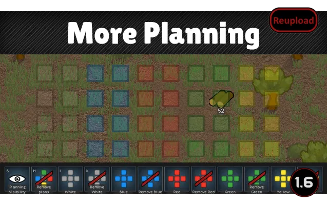
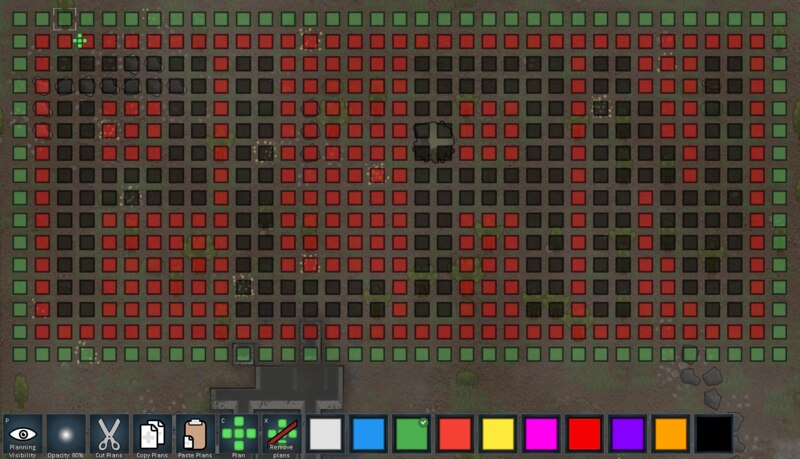

# More Planning Mod

Source: https://rimworldbase.com/more-planning-mod-2/  
Retrieved: 2026-05-21  
Source license: No permissive reuse license found for page screenshots; mod code is separately reported as MIT in older mod listings  
Attribution: RimWorld Base, mlie, 53N4, Dango998, alextd, and linked Steam/GitHub sources  
Note: Original RimBob summary. This is not a verbatim copy of the source.

## RimBob Use

Reference for how in-game planning UX should feel: lightweight, colored, layered, editable, and close to the normal Architect workflow. Useful for future Willie dashboard overlays and for translating agent spatial suggestions into player-readable draft plans.

## Workflow Heuristics

- Make planning a first-class Architect category instead of burying it as a single order.
- Multiple planning designations let players encode different layers: rooms, walls, paths, utilities, danger zones, future expansion, and phasing.
- Per-designation show/hide controls matter because layout plans become unreadable when every future layer is visible at once.
- Opacity control matters because planning marks must coexist with terrain, buildings, zones, and work overlays.
- Copy/paste turns good room modules into reusable chunks.
- Cut/copy/paste support implies layout work is iterative block editing, not just note-taking.
- Optional cleanup after construction or deconstruction prevents stale plans from lingering after execution starts.
- Shift override supports fast replanning without erase/repaint loops.
- Save compatibility matters because players often adopt planning tools mid-colony.
- Small UI affordances can beat heavy external planners when they remain inside the normal RimWorld workflow.

## Images

These images are source-attributed local references. They should not be treated as freely licensed project art.

Source image: https://rimworldbase.com/wp-content/uploads/2025/11/MorePlanning.png

Source image: https://images.steamusercontent.com/ugc/14140525228906377775/3CA5C57A455FA37BFEC7DB314F82ED5E7AA1B1D2/?ima=fit&impolicy=Letterbox&imw=800

## Dashboard/Agent Implications

- If RimBob proposes layouts, keep them as colored layers the player can accept, ignore, or edit.
- Do not jump from "planner can show this" to "Host can build this." In RimBob terms, these are Suggest-mode visual drafts unless a later Assisted Apply path explicitly supports blueprint placement.
