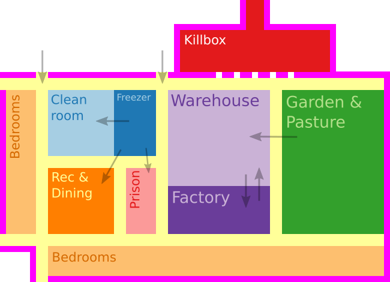
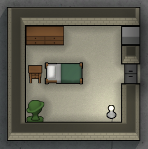
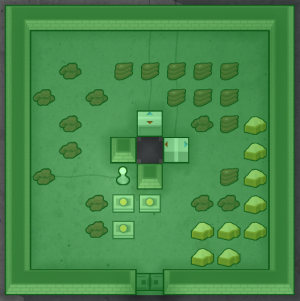
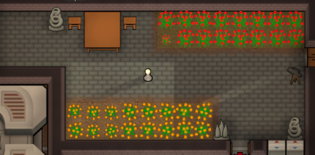
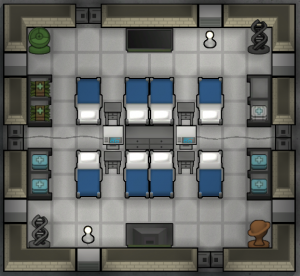
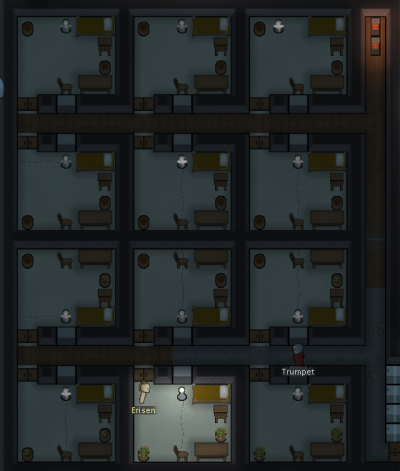
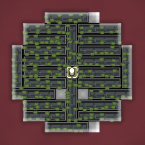

# RimWorld Wiki - Colony Building Guide

Source: https://rimworldwiki.com/wiki/Colony_Building_Guide  
Retrieved: 2026-05-21  
Source license: CC BY-SA 3.0 unless otherwise noted  
Attribution: RimWorld Wiki contributors, "Colony Building Guide"  
Note: Original RimBob summary. This is not a verbatim copy of the source.

## RimBob Use

Primary guide for Construction, Food, Defense, Medical, Welfare, Industry, and Mayor layout reasoning. The most valuable signals are adjacency, expansion space, traffic control, and the way early temporary rooms can evolve into permanent infrastructure.

## Layout Heuristics

- Build toward a plan, but stage it in small usable chunks. A first freezer can temporarily serve as storage, barracks, and workspace before being remodeled into the full freezer.
- Put bedrooms near the base edge. They need room to expand and should not block daytime production traffic.
- Keep high-traffic loops tight: fields and hunting returns to freezer, freezer to kitchen, freezer to dining, warehouse to workshop.
- Keep hospitals and prisons more central than normal bedrooms because doctors, wardens, patients, and prisoners create frequent traffic.
- Give the freezer three useful connections: outside production, kitchen, and main warehouse. Leave one side open for future expansion.
- Protect coolers. They are weak wall points and should vent into unroofed protected pockets, mountainsides, or other controlled hot-side spaces.
- Keep the kitchen clean and out of normal traffic. The dining room should have a shorter path to meals than the path through the kitchen.
- Combine dining, recreation, and sometimes throne/courtyard functions when the shared room improves multiple moodlets with one beauty investment.
- Put workshops near warehouses, but keep ugly raw-material storage from dragging down workroom comfort.
- Plan power as layout. Protect generators, batteries, and conduits, isolate backup batteries, and use redundant routes where outages matter.
- Compact bases are easier to secure. One or two intentional approaches plus useful internal corridors can carry early and midgame defense.
- Temperature control is room topology: large common rooms often need direct heating/cooling, while bedrooms can share conditioned hallways through vents.

## Images

Source image: https://rimworldwiki.com/images/9/97/Example_base_layout.png

Source image: https://rimworldwiki.com/images/thumb/3/3f/Bedroom.png/300px-Bedroom.png

Source image: https://rimworldwiki.com/images/thumb/1/1d/Freezer_coolers_placement.png/400px-Freezer_coolers_placement.png

Source image: https://rimworldwiki.com/images/thumb/f/f8/Special_freezer.png/300px-Special_freezer.png

Source image: https://rimworldwiki.com/images/thumb/b/b0/Kitchen_area.png/300px-Kitchen_area.png

Source image: https://rimworldwiki.com/images/thumb/3/33/Example_of_an_early_game_combined_dining%2C_recreation_and_throne_room_.png/250px-Example_of_an_early_game_combined_dining%2C_recreation_and_throne_room_.png

Source image: https://rimworldwiki.com/images/thumb/6/69/Courtyard.png/400px-Courtyard.png

Source image: https://rimworldwiki.com/images/thumb/7/72/Compact_hospital_layout.png/300px-Compact_hospital_layout.png

Source image: https://rimworldwiki.com/images/thumb/9/99/Prison_example_midgame.png/400px-Prison_example_midgame.png

Source image: https://rimworldwiki.com/images/thumb/d/d3/SunlampHydroponics.png/300px-SunlampHydroponics.png

Source image: https://rimworldwiki.com/images/thumb/0/08/Solar_wind_setup.png/420px-Solar_wind_setup.png

