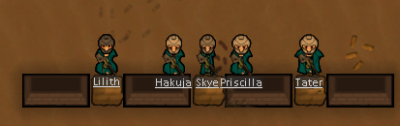
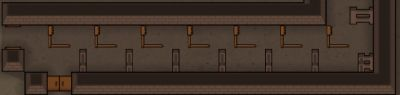
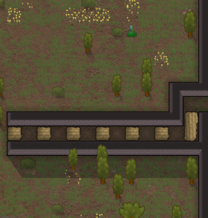
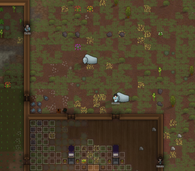
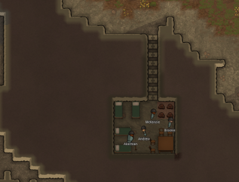
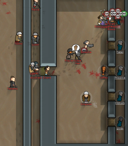
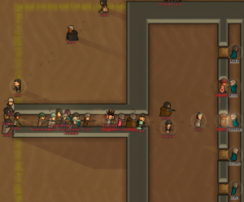
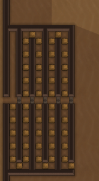

# RimWorld Wiki - Defense Structures

Source: https://rimworldwiki.com/wiki/Defense_structures  
Retrieved: 2026-05-21  
Source license: CC BY-SA 3.0 unless otherwise noted  
Attribution: RimWorld Wiki contributors, "Defense structures"  
Note: Original RimBob summary. This is not a verbatim copy of the source.

## RimBob Use

Primary source for Defense and Construction interaction: natural chokepoints, wall topology, trap corridors, cover shaping, killbox entry geometry, and defensive infrastructure placement.

## Layout Heuristics

- Read the map before building. Water, marsh, mountains, ruins, and map-edge constraints can shape defense better than raw wall spam.
- Use walls as pathing tools. Normal raiders prefer reachable open paths, so one deliberate entrance can funnel threats.
- Keep perimeter doors and airlocks for repairs, hauling, colonist movement, and breach response.
- Mix walls with barricades or sandbags for defenders. Walls give high cover but block line of fire; low cover lets pawns fire.
- Remove enemy cover near the fight. Haul chunks, cut vegetation, and avoid letting crop or hauling patterns create cover lines for raiders.
- Put traps where pathing already forces traffic, and preserve safer maintenance paths for colonists.
- Chokepoints should break line of sight and slow movement with alternating obstacles. Continuous obstacle lines are less effective.
- Multi-layer walls without gaps resist random wall targeting; gaps help repair access and explosion spacing.
- Pillboxes work as early and midgame fallback posts, especially when converted from ruins, but can be flanked or captured.
- Killboxes need a funnel, cover-free killzone, protected defenders, non-straight entry geometry, and backup plans for sappers, breachers, drop pods, and unusual raids.
- Turrets support defenders. They need cover, spacing to avoid chain explosions, power switching, and contingency plans for EMP, smoke, solar flares, and explosive weapons.
- Panic rooms and protected power/generator rooms are wipe-prevention infrastructure, not just decoration.

## Images

Source image: https://rimworldwiki.com/images/thumb/c/c8/Moats.png/500px-Moats.png

Source image: https://rimworldwiki.com/images/thumb/2/2b/Cover_fire_wall.png/400px-Cover_fire_wall.png

Source image: https://rimworldwiki.com/images/thumb/b/be/Trap_choke_14.jpg/400px-Trap_choke_14.jpg

Source image: https://rimworldwiki.com/images/thumb/1/13/Slowing_tunnel.png/300px-Slowing_tunnel.png

Source image: https://rimworldwiki.com/images/thumb/8/8e/Flanking_example.png/400px-Flanking_example.png

Source image: https://rimworldwiki.com/images/thumb/f/f8/Makeshift_pillbox.png/320px-Makeshift_pillbox.png

Source image: https://rimworldwiki.com/images/thumb/2/2f/Panic_room_example.png/400px-Panic_room_example.png

Source image: https://rimworldwiki.com/images/thumb/0/00/Killzone.png/500px-Killzone.png

Source image: https://rimworldwiki.com/images/thumb/5/50/Killbox_right.png/264px-Killbox_right.png

Source image: https://rimworldwiki.com/images/thumb/3/3c/Killbox_wrong.png/300px-Killbox_wrong.png

Source image: https://rimworldwiki.com/images/thumb/1/14/Slowing_tunnel_long.png/165px-Slowing_tunnel_long.png

Source image: https://rimworldwiki.com/images/thumb/a/a9/Killhall.png/500px-Killhall.png

## Caution

The source page itself warns that parts need updates and some images reflect older game versions. Use these as topology examples and verify exact mechanics against current RimWorld behavior before turning them into rules.

