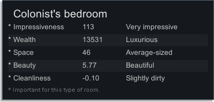

# RimWorld Wiki - Rooms

Source: https://rimworldwiki.com/wiki/Rooms  
Retrieved: 2026-05-21  
Source license: CC BY-SA 3.0 unless otherwise noted  
Attribution: RimWorld Wiki contributors, "Rooms"  
Note: Original RimBob summary. This is not a verbatim copy of the source.

## RimBob Use

Mechanics reference for Construction and Welfare layout checks. This source is less about example floor plans and more about how the game detects rooms, assigns room roles, and computes impressiveness.

## Layout Heuristics

- A room is a fully enclosed space. Walls, doors, vents, coolers, natural rock, and similar boundaries can all define the enclosure.
- Corners do not need to be filled to make a room count as enclosed.
- Very large or complex room shapes can stop behaving as rooms once they exceed the map-region limit.
- Indoor temperature is separate from outdoor temperature, but missing roof tiles, open doors, and open vents increase exchange.
- The game has multiple "outdoor" concepts. A room can use outdoor temperature, count as outdoors for work stats, or be psychologically outdoors under different thresholds.
- At 25 percent or more unroofed, a room uses outdoor temperature and affects deterioration and indoor/outdoor needs.
- More than 25 percent unroofed or more than 100 unroofed tiles can make workstations count as outdoors for surgery, research, and similar work-stat mechanics.
- Extremely large unroofed rooms can become psychologically outdoors, affecting beauty, some recreation, rituals, cleaning orders, and other systems.
- Room role comes from the buildings inside. The displayed role is the highest scored role, but a combined room can still provide multiple role moodlets when used for those activities.
- Impressiveness depends on wealth, beauty, space, and cleanliness.
- The weakest impressiveness stat matters heavily, so filth or cramped size can erase the value of expensive decor.
- Very small bedrooms are hard to make impressive. Around 5x5 or 4x6 is a more practical quality target than 4x4.

## Images

The source page has no embedded base-layout screenshots. It does include a room-stat UI preview, saved here because it is useful for dashboard/state-store interpretation.

Source image: https://rimworldwiki.com/images/7/73/Quality_preview.png

## Caution

The image is a RimWorld UI/game screenshot hosted by the wiki. Treat it as source-attributed reference material, not freely reusable original art.

