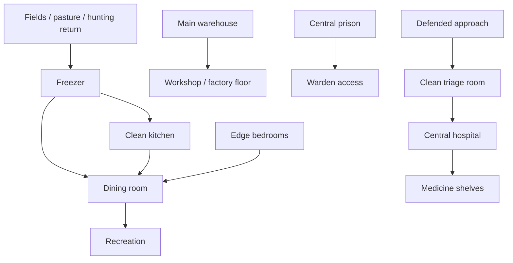

# Source: https://rimworldwiki.com/wiki/Colony_Building_Guide
# Permanent source revision: https://rimworldwiki.com/index.php?title=Colony_Building_Guide&oldid=180495
# Retrieved: 2026-05-21
# Source license: CC BY-SA 3.0
# Attribution: RimWorld Wiki contributors, "Colony Building Guide"
# Note: This is an original summarized derivative for RimBob's guide corpus, not a verbatim copy of the source page.

# RimWorld Colony Building Guide

## RimBob Relevance

This guide is useful for Mayor, Construction, Food, Defense, Medical, Welfare, Industry, and Economy reasoning. It turns base-building advice into retrievable heuristics about layout, room placement, traffic, freezing, storage, production, power, defense, and temperature control.

## Core Rule: Always Have A Plan

Good colonies keep a visible next objective. Avoid letting colonists spend whole days on low-value hauling, cleaning, and shuffling while the base stops progressing.

Use large plans, but build them in small usable phases:

- Start with "good enough" rooms that can be remodeled later.
- Build the freezer first if food preservation is urgent, then use part of it temporarily as barracks, storage, or workspace until proper rooms exist.
- Partition oversized future rooms with cheap temporary walls, then remove the partitions once the colony has labor and materials.
- Reserve expansion room around bedrooms, freezers, warehouses, and workshops before surrounding them with other structures.
- Early layouts should solve immediate survival while keeping a path toward the intended permanent base.

## General Colony Design Principles

An efficient base reduces walking, protects important work, and keeps colonists comfortable enough to avoid avoidable mood pressure.

### Lower Foot Traffic

Not every room can be central. Put high-traffic and job-critical rooms near one another, and move low-traffic rooms out of the way.

- Bedrooms belong near the edge of the base, not in the center.
- Bedrooms are used mostly at night and become hard to expand if surrounded.
- Losing bedrooms in a breach is usually better than losing fabrication, freezer, hospital, or workshop infrastructure.
- Dining and recreation can also be off-center, often near sleeping quarters, because pawns mostly use them in morning and evening.
- Hospitals and prisons are exceptions: keep them more central because doctors, wardens, patients, and prisoners need frequent access.
- Keep related logistics close: freezer, kitchen, warehouse, and workshop should minimize ingredient and material trips.
- Give the freezer a short route to outside production sources such as fields, hunting returns, and pasture products.

### Make The Base Pleasant

Mood and work throughput improve when colonists spend less time in ugly, dirty, uncomfortable spaces.

- Avoid routing main traffic through ugly utility areas, dumping stockpiles, or geothermal clutter.
- Use sculptures to offset unavoidable ugliness in stockpiles or utility spaces.
- Smooth stone, carpets, good floors, and attractive walls increase room beauty but cost work or resources.
- Good beds and chairs matter. Skilled constructors should make quality-sensitive furniture.
- Put dining chairs or armchairs at workstations for comfort; they do not speed work directly, but they can provide comfort mood gains.
- Let skilled constructors handle furniture. Less-skilled builders can handle walls, smoothing, and flooring where quality does not apply.

### Safety First

Compact bases are easier to secure. Walls, controlled entrances, and useful internal corridors can carry the colony through many threats before advanced defenses exist.

- Surround the complex with walls when possible.
- Leave one or two deliberate weak approaches rather than many uncontrolled doors.
- Long hallways can become defensive lanes if shooters use doorways as cover.
- Fight attackers near prepared positions instead of in the open.
- Lure sieges or lone fire starters toward the base before engaging when safe.
- Higher difficulties may require killboxes, traps, turret support, or other advanced defense structures.

## Base Type Tradeoffs

### Superstructure Base

A superstructure puts most facilities inside one or two large buildings.

Pros:

- Short walking paths.
- Lower material cost than many detached structures.
- Strong toxic fallout and manhunter protection.
- Easier temperature control than a town.
- Convenient central logistics.

Cons:

- Fire can spread through the whole base if flammable materials are used.
- Needs a large continuous buildable area.
- Can become less flexible as the layout fills in.
- Gives fewer outdoors opportunities.
- More vulnerable to mortars and drop pods than mountain bases.

### Town-Like Settlement

A town base uses separate buildings like a small settlement.

Pros:

- Flexible and expandable.
- Works when terrain does not provide one large buildable area.
- Satisfies outdoors needs well.
- Can look and feel good to the player and colonists.

Cons:

- Uses the most space and building materials overall.
- Has the longest walk paths.
- Has the worst temperature control.
- Needs more defensive planning.
- Has the weakest toxic fallout protection.

### Mountain Base

A mountain base is carved into rock.

Pros:

- Best natural temperature control.
- Easy to defend.
- Immune to mortar strikes and drop pods in roofed mountain areas.
- Leaves more outdoor soil free for crops.
- Can use fewer construction materials if floors and walls are smoothed.
- Strong toxic fallout protection.

Cons:

- Infestations can occur inside the base.
- Least flexible once carved.
- Slow to set up because mining and chunk clearing take time.
- Harder to satisfy outdoors needs.
- Rough walls and floors hurt mood until smoothed or replaced.
- Smoothing takes heavy labor.
- Main power sources usually remain outside unless the mountain contains useful rivers or geysers.

## Base Layout Map

## Base Structures

### Storage

The first real room is usually dry storage because items deteriorate outdoors or when exposed.

- Put stockpile zones inside roofed storage.
- Keep tiles next to doors clear so pawns do not drop items in doorways and hold them open.
- Use multiple smaller stockpiles or shelves to separate item categories.
- Place the warehouse near workshops to reduce raw material travel.
- Store explosives such as chemfuel and mortar shells in stone compartments away from the outer wall.
- Consider firefoam near munitions and fuel storage.
- Add orbital trade beacons in midgame storage zones for trade ship selling.

### Barracks

Barracks are efficient early shared bedrooms, but they carry mood and sleep penalties.

- Use barracks early to get colonists indoors quickly.
- Beds and bedrolls improve comfort and rest quality.
- Convert the barracks later into a hospital, prison barracks, overflow room, or utility space.
- Improve barracks with sculptures, flooring, temperature control, dressers, end tables, and good beds.
- An impressive barracks can offset some mood pressure, but disturbed sleep remains a problem.
- Avoid permanent dining in the barracks because morning eaters wake sleepers.

### Bedrooms

Private bedrooms remove disturbed-sleep pressure and scale better with room impressiveness.

- Couples need double beds.
- Around 25 floor tiles is a practical room size: enough for bedroom quality and temporary production use without wasting too much flooring.
- Add end tables and dressers for comfort.
- Higher-quality beds improve rest effectiveness.
- Add beauty through flower pots, sculptures, quality floors, carpets, smoothed stone, or smoothed walls.
- Heat or cool hallways and connect bedrooms with vents instead of placing separate temperature devices in every small bedroom.
- Lamps are optional for pure bedrooms; sleeping pawns do not mind darkness.
- Provide breakfast access near bedrooms through a nearby dining room or outdoor table/chair clusters.
- If a table is inside a bedroom, turn off its gathering spot to prevent recreation visitors from disturbing sleep.

Special cases:

- Ascetic colonists prefer unimpressive bedrooms; use small simple rooms without beauty items or flooring, while still allowing comfort furniture.
- Greedy colonists are harder to please early, but impressive bedrooms solve the issue later.
- Jealous colonists are best handled with standard bedrooms of roughly equal quality for everyone.

### Freezer, Kitchen, Dining, And Recreation Block

The freezer, kitchen, dining room, and recreation room are best planned together.

- Keep the kitchen separate and clean.
- Connect dining and kitchen to the freezer without requiring meal traffic through the kitchen.
- Dining and recreation can share adjacency because social events happen around gathering spots and meal access matters.
- Combined dining and recreation rooms can create strong room-quality mood gains with efficient furniture and decorations.

#### Freezer

Freezers preserve raw food, plant matter, animal corpses, and meals. They are hard to move because coolers and stockpile routes are structural.

- Set freezer coolers below freezing; about -4 C gives buffer for door openings.
- Cold biomes can sometimes use vents to admit outside cold instead of running coolers.
- Butcher spots or butcher tables can be inside the freezer because butchering is short and intermittent.
- Keep stoves outside the freezer because cooking needs cleanliness and normal work speed.
- Use high-priority stockpiles or shelves near the entrance for meals, meat, and vegetables to speed retrieval.
- Nutrient paste dispensers can act as walls with hoppers in or near the freezer and the interaction point in the dining room.
- Protect coolers because they have low hit points and can become wall weak points.
- Vent cooler heat into unroofed areas, protected columns, mountainside gaps, or living spaces in cold biomes.
- Use double walls and airlocks to reduce temperature exchange.
- Use autodoors when available because the freezer is high-traffic.
- Perimeter placement is practical because freezers need expansion room and short routes from fields, pasture, and hunting returns.
- Direct perimeter access is not strictly required; one unroofed exhaust tile can vent up to four coolers when surrounded by wall-like tiles.
- A single accidental wall gap can push the freezer above freezing without an obvious visual warning, so inspect freezer walls carefully after construction or mining.
- Mountain freezers can suffer infestations, but freezer infestations are tactically manageable and leave insect corpses in a useful cold-storage location after cleanup.

Freezers need three practical entrances:

- Outside route for animals, harvests, and pasture products.
- Kitchen route for cooking.
- Warehouse route for leather and slow-spoiling goods such as corn, smokeleaf, and healroot.

Leave one side free for expansion. Avoid making the freezer too large before it is needed because extra volume costs power and walking time.

#### Kitchen

Kitchens should be clean, small enough to maintain, and close to both freezer and dining.

- Keep the kitchen isolated from dirty traffic.
- Do not route everyone through the kitchen.
- Keep butchering separate or in the freezer to avoid blood and dirt near cooking.
- Use shelves or nearby ingredient storage to reduce cook walking.
- Kitchen cleanliness affects food poisoning risk, so flooring and cleaning are more important here than in most workrooms.
- Zone colony animals out of the kitchen.
- Sterile tile is best, but not mandatory early. Frequent cleaning or even plain dirt can be acceptable before sterile tile is affordable because the food-poisoning threshold has some buffer.
- Place doors so freezer-to-dining traffic is shorter than routing through the kitchen.
- Keep butcher tables out of the kitchen because they are inherently dirty and butchering creates filth.
- Put the butcher table near the freezer, ideally by the warehouse/freezer edge, to reduce corpse, meat, and leather hauling.
- If making a lot of kibble, consider a separate butcher table outside the freezer so cold work speed penalties do not slow the task.
- Use high-priority shelves or small stockpiles next to stoves for meat, berries, and vegetables.
- Stove bills can drop meals on the floor so haulers move stacks in bulk to the freezer or dining-area fridge.
- Add art and temperature control because cooks spend long periods in the room.
- Plant-ingredient stations such as breweries, drug labs, or biofuel refineries can fit near the kitchen/freezer block when the layout supports it.

#### Dining Room

Dining rooms prevent ate-without-table penalties and can provide room impressiveness mood bonuses.

- Place dining near bedrooms and freezer access.
- Good chairs matter because pawns sit there frequently.
- Dining tables can support parties and ceremonies when set as gathering spots.
- If dining is far from bedrooms, colonists may eat carried meals on the floor after waking.
- Colonists and visitors search only a limited radius for a table; the source guide calls out 20 tiles.
- A pawn who gives up and eats on the floor takes an ate-without-table mood penalty.
- Meal-time and ceremony traffic can crowd the room, so provide chairs for at least about half the colony.
- Sculptures, plant pots, quality furniture, and room impressiveness improve the mood benefit of eating there.

#### Recreation Room

Recreation rooms should be near dining and bedrooms because recreation happens mostly outside work hours.

- Combine with dining when room impressiveness and pathing benefit.
- Put enough recreation variety for the colony stage.
- Avoid forcing recreation traffic through bedrooms or hospitals.
- Early colonies can start with a horseshoe pin.
- Midgame colonies should add varied recreation such as chess, billiards, televisions, telescopes, or better televisions from traders.
- Room impressiveness gives a mood benefit after recreation use.
- Recreation variety matters because repeated use of one recreation type becomes boring.

#### Combined Dining And Recreation

Combining dining and recreation is usually efficient.

- Furniture and beauty investments improve both room roles at once.
- Colonists can receive separate dining-room and recreation-room mood benefits from the same physical room.
- A combined room can need fewer sculptures, floors, and decorations to reach useful impressiveness than two separate rooms.
- With Royalty, a throne room can sometimes be combined too, but noble furniture and fine-flooring requirements still apply and can make the room expensive.

### Courtyard

Courtyards are outdoor spaces inside or near the base perimeter.

- They support outdoors need without sending colonists far away.
- They can hold recreation, paths, gardens, or safe traffic shortcuts.
- They should not create uncontrolled raid access into the base core.
- In superstructure bases, an unroofed courtyard can serve as an outdoor dining and recreation room.
- Mortars can be placed in a courtyard so central placement reduces their minimum-range blind spot.
- Transport pods can also be stored outdoors, but keep ugly pod areas separate from beauty-sensitive common spaces.

### Laboratory

Research benches need clean, lit, safe space and good chair comfort.

- Put the lab near general living areas, not necessarily in the production core.
- Protect expensive research benches and high-tech structures from breach paths.
- Keep research walking low if the same pawn also handles crafting or medical duties.
- Hi-tech research benches, multi-analyzers, and sterile flooring belong together when available.
- Cleanliness affects research speed.
- Restricting lab access to researchers and janitors reduces dirt.
- Add art and a comfortable chair because researchers spend long stretches there.

### Workshop

Workshops are the industrial core for crafting, machining, smithing, tailoring, stonecutting, and later fabrication.

- Place workshops near the warehouse.
- Put frequently consumed raw materials close to benches.
- Give every long-use bench a good chair.
- Keep workshop paths broad enough for haulers.
- Separate dirty or noisy functions only when they harm cleanliness or traffic.
- Keep workshop and warehouse separate enough that raw-material beauty penalties do not dominate the room.
- Tool cabinets increase craft speed; many benches can benefit from up to two cabinets.
- Workshop beauty can improve mood and productivity for crafters who spend all day there.

### Armory

Armories collect weapons, armor, shells, utility packs, and combat equipment.

- Put the armory near defensive rally points.
- Keep explosive shells away from ordinary stockpiles and outer walls.
- Stone walls and firefoam are appropriate around munitions.
- Shelves help keep weapons and armor organized.
- Keep weapons and armor away from prisons so escaping prisoners cannot arm themselves easily.
- Put combat gear near the entrance or defensive rally route so colonists can equip while moving to defend.
- Store ammunition deeper in the base and away from other valuables because fire or explosions can cascade.

### Hospital

Hospitals should be central, clean, fast to access, and close to medicine.

- Use sterile tile when affordable for cleanliness, surgery success, and infection reduction.
- Hospital beds improve treatment quality, immunity gain speed, and healing speed.
- Vitals monitors improve treatment and immunity further when placed to cover hospital beds.
- Build hospitals where downed colonists can be carried quickly.
- Use open doors or autodoors where speed matters.
- Assign cleaning after combat because bleeding patients quickly dirty rooms.
- Straw matting can be better in rough field hospitals where dirt cannot be cleaned frequently; sterile or steel tiles can sit under beds, shelves, monitors, or sculptures where pawns do not walk.
- Store medicine on shelves in or next to the hospital.
- End tables and dressers improve patient comfort but do not improve treatment.
- Vitals monitor coverage can be blocked by furniture, so optimize furniture only when bed density is not critical.
- Beauty and recreation matter because patients may remain in hospital for long periods.
- TVs can entertain bedridden patients inside viewing range.

Hospital subrooms:

- Triage: small clean room near the killbox; around 6x5 per bed keeps cleanliness manageable.
- Patient rooms: private rooms reduce disturbed rest and dirt issues in late game.
- Operating theater: separate clean surgery room; forbid it except during operations to keep traffic out.
- Vet area: animal sleeping spots near medicine let doctors treat wounded animals quickly; cleanliness matters for animals too, though animal care does not benefit from hospital beds or vitals monitors.

### Prison

Prisons should be reachable by wardens and controllable during breaks.

- Early prisons can be converted ruins, simple huts, or temporary marked bedrooms.
- Do not put prisons too far from the base or escaping prisoners become harder to stop.
- Tables and chairs improve prisoner mood and recruitment speed.
- Prisoners held together suffer shared-room mood issues.
- Prison barracks are dangerous because a break often involves many prisoners at once.
- Prison cells generally reduce the number of prisoners involved in a break.
- Genes and low movement speed can alter break intervals.
- Each cell needs at minimum a bed, light, table, and chair.
- Larger and more decorated cells improve recruitment mood.
- Prison doors should face into the base, forcing escapees toward wardens and defenders.
- Multiple doors slow work but also slow escapes.
- Overflow holding cells can hold low-value prisoners; save private cells for important recruits.
- Turrets inside holding cells can help against large breaks but increase the chance of killing or maiming prisoners.

### Multipurpose Rooms

Keep a flexible empty room for early and midgame surprises.

- Use it as overflow storage, emergency hospital, prison overflow, guest room, or temporary workshop.
- Add temperature control.
- Install beds only when needed; uninstall and store them afterward.

### Backup Structures

Emergency fallback infrastructure can prevent colony death.

- Small shelters with supplies can save colonists from enraged animals or sudden outdoor danger.
- Very thick shelter walls, about four layers, can resist raids long enough for hiding colonists.
- Nutrient paste dispensers stretch raw food during shortages.
- Forbidden wood stockpiles in strategic locations support heating during solar flares or cold snaps.

## Production

### Crops

Crop fields are simple mechanically but planning matters.

- Mark growing zones and choose crops.
- Check fertility before placing fields.
- Stony soil is easy to mistake for dirt but has poor fertility.
- Rich soil accelerates slow crops such as devilstrand.
- Keep tamed animals zoned away from crops.
- Fence or wall fields against wild animals.
- Watch automatic roofing if walls turn a field into a room.

Greenhouses use enclosed temperature control, sun lamps, and sometimes hydroponics.

- Greenhouses keep crops growing through bad weather, poor soil, or bad seasons.
- Hydroponics and sun lamps are power-dependent.
- Solar flares or grid failures can shut down lamps, heaters, and basins.
- Hydroponic plants lose health without power and may die if the outage lasts.
- A sun lamp can cover a dense hydroponics pattern; the source example uses 24 basins under one lamp for 96 plants.

### Mining

Early mining uses visible ore deposits. Later mining needs deliberate methods.

- Mine visible outcrops first.
- Strip mine mountains with long tunnels and two tiles between tunnels to reveal all hidden tiles along the pattern.
- Seal old mines with cheap walls to reduce infestation exposure, or defend the mine entrance if farming insects is intended.
- Deep drilling requires ground-penetrating scanner work first; drilling without scanned deposits mostly yields stone chunks.
- Deposits under the base may require relocating buildings.
- Avoid drilling in bedrooms if possible because mining and access can disturb sleep.
- Turn off the scanner when not placing new drills.
- Deep drills can attract infestations, so prepare defenses.

Biotech tunneler mechanoids:

- A mechanitor with Standard mechtech and a large mech gestator can make tunnelers.
- Tunnelers mine resources but cannot operate deep drills.
- Tunnelers are useful for distant or map-edge mining where colonists would face animals, weather, or raids.

### Animals

Animals provide food, wool, caravan value, combat support, hauling labor, and breeding value.

- Temperature-controlled barns matter when the biome gets too hot or too cold.
- Animal sleeping spots are often sufficient.
- Animal beds and boxes improve rest but are usually not cost-effective.

Boomalope chemfuel:

- Boomalopes produce chemfuel for generators, pod fuel, and shell production.
- Predators usually avoid them because they explode on death.
- Confining boomalopes can be dangerous because one death can trigger a chain explosion.
- Free-grazing boomalopes can be efficient power support.
- If animals must eat grown food for much of the year, refining the food or wood into chemfuel can be more efficient than feeding boomalopes.

## Power

Plan power as part of every expansion. Freezers, production benches, hydroponics, heaters, coolers, turrets, and labs all create new demand.

### Fueled Generation

Wood-fired and chemfuel generators each provide 1000 W.

- Fueled generators are useful as backups or main power in wood-rich biomes.
- Roughly two trees can power a wood-fired generator for about three days.
- Chemfuel becomes more efficient than direct wood fuel once refining is available.
- Fueled generators burn fuel at full rate even when no power is used.
- Use batteries, switches, or manual shutdown to avoid wasting fuel.

Chemfuel setups:

- A boomalope can support meaningful chemfuel generation.
- The source example says three boomalopes can continuously fuel four generators for 4000 W before accounting for animal feed costs.
- A hydroponic greenhouse can produce more chemfuel input than it consumes, creating a large power surplus or supporting food/drug crops.
- Infinite chemreactors produce enough chemfuel to power a generator that outproduces the reactor's own demand.
- The source example says three infinite chemreactors can fuel five generators for about 4100 W surplus.
- Infinite chemreactors are rare quest rewards, so do not plan the whole colony around guaranteed access.

### Solar

Solar generators provide 1700 W during daytime and no power during eclipses or night.

- Daytime output matches the colony's main work schedule.
- Solar should be paired with batteries.
- Do not rely on solar alone without storage or backup.

### Wind

Wind turbines are cheap in advanced materials and can work day or night, but output is unstable.

- Maximum output is 3450 W, but real output varies and often drops far below peak.
- Keep the turbine exclusion zone clear.
- Stop trees from growing in the blocked zone with floors, crops, or solar panels.

### Geothermal

Geothermal generators provide 3600 W from steam geysers after research.

- They are strong midgame power because output is constant.
- They are expensive and require significant research.
- A basic midsized colony can be sustained by several geothermal generators; the source uses five as an example.
- Protect remote generators because geysers may be far from the base.
- Walling generators helps; walling the full conduit route is usually too expensive and disruptive.
- Roofed geothermal enclosures get dangerously hot, so remove roofs unless intentionally using the heat in a cold-biome design.

### Batteries

Batteries store surplus and cover gaps when demand exceeds generation.

- Renewable-heavy grids need batteries.
- Keep batteries roofed to prevent short circuits.
- Protect batteries from raids and mortars because losing storage can cripple the grid.
- Avoid putting every reserve on the live circuit.

### Emergency Power

Prepare for conduit explosions, renewable dips, grid damage, and raiders cutting generator links.

- Keep backup battery banks behind switches.
- Disconnect charged reserves from the main grid until needed.
- Reconnect reserves when the main bank is empty or when reserves need recharging.
- Keep fueled backup generators ready but switched off to save fuel.

### Vanometric Power Cell

Vanometric power cells provide 1000 W constantly and can be reinstalled.

- They are excellent portable power for caravans, mining, or long relocation routes.
- They are rare quest rewards.
- If not needed for live load, one can maintain a battery reserve directly adjacent without conduits, avoiding short-circuit risk.
- Do not connect a vanometric reserve array to the main grid unless needed.

### Power Network

Avoid a single conduit spine.

- Build redundant paths so one break does not isolate large base sections.
- Hide exposed indoor conduits under doors or other beauty-neutral placements when possible.
- Link geothermal sites to one another so one remote break is less likely to cut all geothermal power.
- Conduit-free base designs are possible but require building appliances around geysers and generators from the beginning.
- With conduit-free clusters, appliances mostly lose power only if the local generator is destroyed.

## Defenses

Every non-Peaceful colony eventually needs prepared defenses.

- Preparation is the colony's main advantage.
- Give colonists cover while denying enemies good cover.
- Clear chunks, trees, and cover from enemy approach lanes when possible.
- Use walls, sandbags, traps, turrets, and controlled approaches.
- One or two fortified entrances are easier to defend than many equal doors.
- Turrets are important when colonist count is low or colony wealth has outgrown available defenders.

## Temperature Control

Rooms need heat or cooling to keep colonists functional and protect against heat waves, cold snaps, and seasonal extremes.

- Large rooms such as dining and recreation often need their own heaters and coolers.
- Connected rooms can exchange temperature through open doors, but close doors during fires.
- Bedrooms and small rooms can use vents to share conditioned air from a hall or central room.
- Place heaters and coolers outside bedrooms when possible to reduce device count.
- Prepare for extreme temperature events; inadequate devices can lead to hypothermia or heatstroke.

### Cooler Gap Prevention

Coolers require a wall tile, so construction temporarily opens a temperature leak.

- Build a cheap temporary wooden wall in front of or behind the cooler blueprint before work begins.
- Deconstruct the temporary wall after the cooler is finished.

### Protected Coolers

Coolers are fragile wall weak points.

- Wall off the hot side while leaving unroofed vent space.
- Protected hot-side pockets can preserve defense integrity.
- In cold but not freezing biomes, cooler exhaust can heat living spaces.

Cooler columns:

- Put several coolers in a line with hot sides facing a narrow unroofed vent strip.
- The vent strip can be inside a larger roofed structure if the vent tiles themselves remain unroofed.
- This is space-efficient for large freezers needing many coolers.

### Temporary Temperature Control

Campfires and passive coolers are fallback tools before electricity or during outages.

- Campfires heat but cannot raise a room above 30 C.
- Passive coolers cool but cannot lower a room below 15 C.
- Neither gives precise throttled control.
- Gear can make colonists too hot even in a campfire-heated room.
- If seasonal discomfort repeats, upgrade the permanent heater/cooler system.

## Miscellaneous Construction Notes

### Dirt Floors

Early on, no flooring can be better than bad flooring.

- Dirt tracked onto constructed floors creates worse cleanliness and beauty penalties than plain natural floor in some early rooms.
- Until cleaning labor is available, leave low-priority rooms unfloored.
- Hospitals remain an exception; sterile tiles plus manual cleaning are worth it there.

### Outdoor Flooring

Flooring high-traffic outdoor paths can reduce dirt dragged inside.

- Pave common routes used by colonists and animals.
- This moves dirt formation outside where it matters less.
- Do this only when the colony has enough cleaning labor; otherwise fewer floors can mean less mess management.

### Bridges

Bridges improve movement and partial construction over shallow rivers and marshes.

- Useful for river-spanning colonies.
- Helpful in swampy biomes.
- Some structures and items cannot be placed on bridges.

### Moisture Pumps

Moisture pumps convert wet ground into buildable dry ground.

- They clear shallow water, marshy soil, and mud.
- They are especially useful in swamp biomes.
- The dry-ground effect is permanent, so pumps can be removed after the area is converted.

## Minister And Dashboard Hints

- Construction should reason about bedroom edge placement, freezer expansion space, central hospital/prison placement, warehouse-workshop adjacency, and redundant power routing.
- Food should reason about freezer access, kitchen cleanliness, crop protection, greenhouse power risk, nutrient paste emergency use, and meal shelf placement.
- Defense should reason about controlled approaches, cover denial, protected coolers, prison escape direction, and remote generator exposure.
- Medical should reason about triage proximity, hospital cleanliness, medicine shelves, operating theater traffic, and animal treatment areas.
- Welfare should reason about bedroom quality, barracks penalties, dining access, beauty, comfort, recreation adjacency, outdoors access, and prison mood.
- Industry should reason about workshop storage adjacency, bench chairs, deep drilling infestation risk, and explosive stockpile separation.
- Economy should reason about orbital trade beacon storage, chemfuel generation, battery reserve strategy, and rare power rewards.
- Dashboard evidence should show which live rooms or map facts triggered these heuristics: freezer temperature/access, kitchen cleanliness, bedroom placement, stockpile safety, power redundancy, path length, and defense choke readiness.
